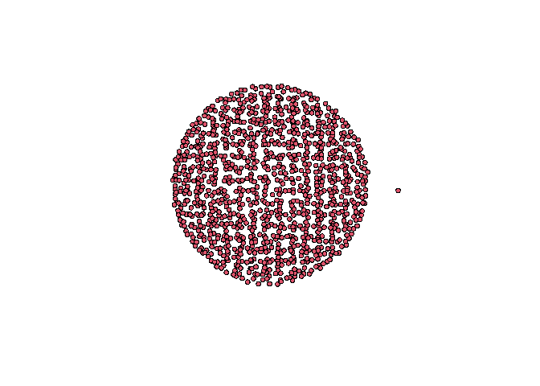
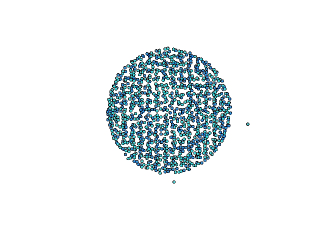
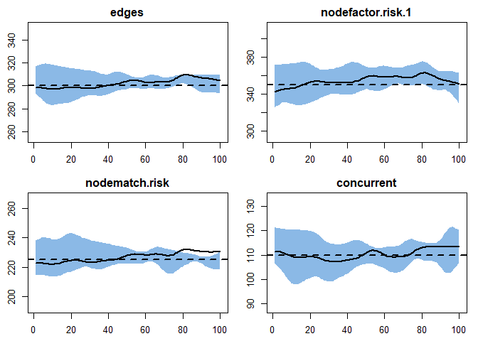
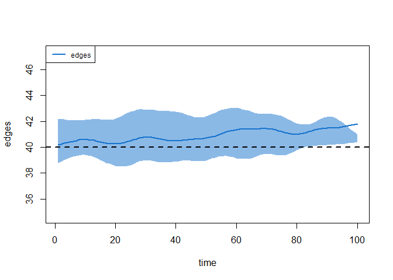
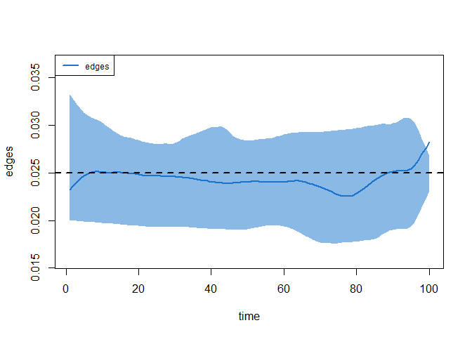
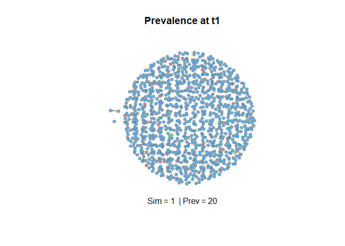
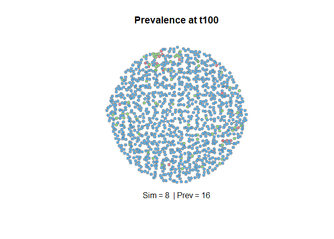

Dynamic Network (SIR) Model in infectious disease
================
Joshua Edefo
2024-01-10

Library

``` r
library(EpiModel) 
```

    ## Warning: package 'EpiModel' was built under R version 4.3.2

    ## Warning: package 'networkDynamic' was built under R version 4.3.2

    ## Warning: package 'network' was built under R version 4.3.2

    ## Warning: package 'tergm' was built under R version 4.3.2

    ## Warning: package 'ergm' was built under R version 4.3.2

    ## Warning: package 'statnet.common' was built under R version 4.3.2

Network and its simulation

``` r
nw <- network.initialize(n=1100, directed = FALSE)

# set node attribute

nw<- set.vertex.attribute(nw, "risk", rep (0:1, each = 550))

plot (nw)
```

<!-- -->

``` r
# color the node by "risk" attribute
myrisk<-get.vertex.attribute(nw, "risk")

myrisk
```

    ##    [1] 0 0 0 0 0 0 0 0 0 0 0 0 0 0 0 0 0 0 0 0 0 0 0 0 0 0 0 0 0 0 0 0 0 0 0 0 0
    ##   [38] 0 0 0 0 0 0 0 0 0 0 0 0 0 0 0 0 0 0 0 0 0 0 0 0 0 0 0 0 0 0 0 0 0 0 0 0 0
    ##   [75] 0 0 0 0 0 0 0 0 0 0 0 0 0 0 0 0 0 0 0 0 0 0 0 0 0 0 0 0 0 0 0 0 0 0 0 0 0
    ##  [112] 0 0 0 0 0 0 0 0 0 0 0 0 0 0 0 0 0 0 0 0 0 0 0 0 0 0 0 0 0 0 0 0 0 0 0 0 0
    ##  [149] 0 0 0 0 0 0 0 0 0 0 0 0 0 0 0 0 0 0 0 0 0 0 0 0 0 0 0 0 0 0 0 0 0 0 0 0 0
    ##  [186] 0 0 0 0 0 0 0 0 0 0 0 0 0 0 0 0 0 0 0 0 0 0 0 0 0 0 0 0 0 0 0 0 0 0 0 0 0
    ##  [223] 0 0 0 0 0 0 0 0 0 0 0 0 0 0 0 0 0 0 0 0 0 0 0 0 0 0 0 0 0 0 0 0 0 0 0 0 0
    ##  [260] 0 0 0 0 0 0 0 0 0 0 0 0 0 0 0 0 0 0 0 0 0 0 0 0 0 0 0 0 0 0 0 0 0 0 0 0 0
    ##  [297] 0 0 0 0 0 0 0 0 0 0 0 0 0 0 0 0 0 0 0 0 0 0 0 0 0 0 0 0 0 0 0 0 0 0 0 0 0
    ##  [334] 0 0 0 0 0 0 0 0 0 0 0 0 0 0 0 0 0 0 0 0 0 0 0 0 0 0 0 0 0 0 0 0 0 0 0 0 0
    ##  [371] 0 0 0 0 0 0 0 0 0 0 0 0 0 0 0 0 0 0 0 0 0 0 0 0 0 0 0 0 0 0 0 0 0 0 0 0 0
    ##  [408] 0 0 0 0 0 0 0 0 0 0 0 0 0 0 0 0 0 0 0 0 0 0 0 0 0 0 0 0 0 0 0 0 0 0 0 0 0
    ##  [445] 0 0 0 0 0 0 0 0 0 0 0 0 0 0 0 0 0 0 0 0 0 0 0 0 0 0 0 0 0 0 0 0 0 0 0 0 0
    ##  [482] 0 0 0 0 0 0 0 0 0 0 0 0 0 0 0 0 0 0 0 0 0 0 0 0 0 0 0 0 0 0 0 0 0 0 0 0 0
    ##  [519] 0 0 0 0 0 0 0 0 0 0 0 0 0 0 0 0 0 0 0 0 0 0 0 0 0 0 0 0 0 0 0 0 1 1 1 1 1
    ##  [556] 1 1 1 1 1 1 1 1 1 1 1 1 1 1 1 1 1 1 1 1 1 1 1 1 1 1 1 1 1 1 1 1 1 1 1 1 1
    ##  [593] 1 1 1 1 1 1 1 1 1 1 1 1 1 1 1 1 1 1 1 1 1 1 1 1 1 1 1 1 1 1 1 1 1 1 1 1 1
    ##  [630] 1 1 1 1 1 1 1 1 1 1 1 1 1 1 1 1 1 1 1 1 1 1 1 1 1 1 1 1 1 1 1 1 1 1 1 1 1
    ##  [667] 1 1 1 1 1 1 1 1 1 1 1 1 1 1 1 1 1 1 1 1 1 1 1 1 1 1 1 1 1 1 1 1 1 1 1 1 1
    ##  [704] 1 1 1 1 1 1 1 1 1 1 1 1 1 1 1 1 1 1 1 1 1 1 1 1 1 1 1 1 1 1 1 1 1 1 1 1 1
    ##  [741] 1 1 1 1 1 1 1 1 1 1 1 1 1 1 1 1 1 1 1 1 1 1 1 1 1 1 1 1 1 1 1 1 1 1 1 1 1
    ##  [778] 1 1 1 1 1 1 1 1 1 1 1 1 1 1 1 1 1 1 1 1 1 1 1 1 1 1 1 1 1 1 1 1 1 1 1 1 1
    ##  [815] 1 1 1 1 1 1 1 1 1 1 1 1 1 1 1 1 1 1 1 1 1 1 1 1 1 1 1 1 1 1 1 1 1 1 1 1 1
    ##  [852] 1 1 1 1 1 1 1 1 1 1 1 1 1 1 1 1 1 1 1 1 1 1 1 1 1 1 1 1 1 1 1 1 1 1 1 1 1
    ##  [889] 1 1 1 1 1 1 1 1 1 1 1 1 1 1 1 1 1 1 1 1 1 1 1 1 1 1 1 1 1 1 1 1 1 1 1 1 1
    ##  [926] 1 1 1 1 1 1 1 1 1 1 1 1 1 1 1 1 1 1 1 1 1 1 1 1 1 1 1 1 1 1 1 1 1 1 1 1 1
    ##  [963] 1 1 1 1 1 1 1 1 1 1 1 1 1 1 1 1 1 1 1 1 1 1 1 1 1 1 1 1 1 1 1 1 1 1 1 1 1
    ## [1000] 1 1 1 1 1 1 1 1 1 1 1 1 1 1 1 1 1 1 1 1 1 1 1 1 1 1 1 1 1 1 1 1 1 1 1 1 1
    ## [1037] 1 1 1 1 1 1 1 1 1 1 1 1 1 1 1 1 1 1 1 1 1 1 1 1 1 1 1 1 1 1 1 1 1 1 1 1 1
    ## [1074] 1 1 1 1 1 1 1 1 1 1 1 1 1 1 1 1 1 1 1 1 1 1 1 1 1 1 1

``` r
plot(nw, vertex.col=myrisk+4)
```

<!-- -->

``` r
# Network model estimation and diagnostics
# The network formation and dissolution formulas specify how persons in the form and dissolve partnership over time

# predictors of formation
formation <- ~edges + nodefactor ("risk") + nodematch("risk") + concurrent

# target statistics represent the expected values of the network staistics for each crossectional slice of the dynamic network time series 
target.stats <- c(300, 350, 225, 110)

#dissolution
# specify a mean duration of 70 time steps thus the dissolution rate will be 1/40 = 0.025 which is 2.5% risk of dissolving
coef.diss <- dissolution_coefs(dissolution=~offset(edges), 
                               duration = 40)

coef.diss
```

    ## Dissolution Coefficients
    ## =======================
    ## Dissolution Model: ~offset(edges)
    ## Target Statistics: 40
    ## Crude Coefficient: 3.663562
    ## Mortality/Exit Rate: 0
    ## Adjusted Coefficient: 3.663562

``` r
# The output from this function indicates both an adjusted and crude coefficient which are equivalent i.e closed network but open network differs

# The nearest function calls for the estimation routines to estimate the coefficients for the
# formation and dissolution model
##inputs are the base network
##the formation formula
##target statistics
## the dissolution coefficients
est1 <- netest(nw, formation, target.stats, coef.diss)
```

    ## Unable to match target stats. Using MCMLE estimation.

    ## Starting maximum pseudolikelihood estimation (MPLE):

    ## Obtaining the responsible dyads.

    ## Evaluating the predictor and response matrix.

    ## Maximizing the pseudolikelihood.

    ## Finished MPLE.

    ## Starting Monte Carlo maximum likelihood estimation (MCMLE):

    ## Iteration 1 of at most 60:

    ## Warning: 'glpk' selected as the solver, but package 'Rglpk' is not available;
    ## falling back to 'lpSolveAPI'. This should be fine unless the sample size and/or
    ## the number of parameters is very big.

    ## Optimizing with step length 1.0000.

    ## The log-likelihood improved by 0.1041.

    ## Estimating equations are not within tolerance region.

    ## Iteration 2 of at most 60:

    ## Optimizing with step length 1.0000.

    ## The log-likelihood improved by 0.0267.

    ## Convergence test p-value: 0.3153. Not converged with 99% confidence; increasing sample size.
    ## Iteration 3 of at most 60:
    ## Optimizing with step length 1.0000.
    ## The log-likelihood improved by 0.0281.
    ## Convergence test p-value: 0.0519. Not converged with 99% confidence; increasing sample size.
    ## Iteration 4 of at most 60:
    ## Optimizing with step length 1.0000.
    ## The log-likelihood improved by 0.0311.
    ## Convergence test p-value: 0.0352. Not converged with 99% confidence; increasing sample size.
    ## Iteration 5 of at most 60:
    ## Optimizing with step length 1.0000.
    ## The log-likelihood improved by 0.0079.
    ## Convergence test p-value: 0.0043. Converged with 99% confidence.
    ## Finished MCMLE.
    ## This model was fit using MCMC.  To examine model diagnostics and check
    ## for degeneracy, use the mcmc.diagnostics() function.

``` r
# After the model fit completes, it is crucial to diagnose the output

## 2 types of diagnostic: static an d dynamic but we will use dynamic diagnostic
# simulates from the model fit object returned by netest, we simulate from the model 100 times over 100 time steps

dx<-netdx(est1, nsim=10, nsteps=100)
```

    ## 
    ## Network Diagnostics
    ## -----------------------
    ## - Simulating 10 networks
    ##  |**********|
    ## - Calculating formation statistics

``` r
dx
```

    ## EpiModel Network Diagnostics
    ## =======================
    ## Diagnostic Method: Dynamic
    ## Simulations: 10
    ## Time Steps per Sim: 100
    ## 
    ## Formation Diagnostics
    ## ----------------------- 
    ##                   Target Sim Mean Pct Diff Sim SE Z Score SD(Sim Means)
    ## edges                300  302.197    0.732  2.336   0.940         8.533
    ## nodefactor.risk.1    350  354.464    1.275  3.963   1.126        18.029
    ## nodematch.risk       225  226.731    0.769  1.932   0.896         8.726
    ## concurrent           110  110.377    0.343  1.326   0.284         5.653
    ##                   SD(Statistic)
    ## edges                    14.901
    ## nodefactor.risk.1        25.631
    ## nodematch.risk           13.071
    ## concurrent               10.790
    ## 
    ## Duration Diagnostics
    ## ----------------------- 
    ##       Target Sim Mean Pct Diff Sim SE Z Score SD(Sim Means) SD(Statistic)
    ## edges     40    40.91    2.275  0.414   2.201         2.265         2.632
    ## 
    ## Dissolution Diagnostics
    ## ----------------------- 
    ##       Target Sim Mean Pct Diff Sim SE Z Score SD(Sim Means) SD(Statistic)
    ## edges  0.025    0.024   -2.264      0  -2.076         0.001         0.009

``` r
plot (dx)
```

<!-- -->

``` r
# Lets plot duration and dissolution

plot(dx, type = "duration")
abline(v=200, col=2)
```

<!-- -->

``` r
plot (dx, type = "dissolution")
```

<!-- -->

``` r
# For initial conditions, we use the i.num to set the initial number infected at the start, this will use a starting prevalence of 7% which is 0.07 *1100 = 77
#initial number of recovered is 2
init <- init.net(i.num = 20, r.num = 2)


# The generic SIR model requires  4 paramaters

# 1. ds which is 0.05 which is infection probability
# 2. dI which is 0.03 which is recovery rate
# 3. Act rate - that is contact rate within active partnership


# in an SIR model,
# they are set using the function param.net
param <- param.net(inf.prob = 0.1,rec.rate = 0.03, act.rate = 7)

# the value used for the recovery rate implies that the avaerage duration of infection is 100 steps

control<- control.net (type = "SIR", nsteps = 100, nsims = 10, epi.by = "risk", recovery.FUN = NULL)

sim1 <- netsim(est1, param, init, control)
```

    ## 
    ## Starting Network Simulation...
    ## Epidemic Simulation
    ## ----------------------------
    ## Simulation: 1/10
    ## Timestep: 2/100
    ## Prevalence: 25
    ## Population Size: 1100
    ## ----------------------------
    ## Epidemic Simulation
    ## ----------------------------
    ## Simulation: 1/10
    ## Timestep: 3/100
    ## Prevalence: 27
    ## Population Size: 1100
    ## ----------------------------
    ## Epidemic Simulation
    ## ----------------------------
    ## Simulation: 1/10
    ## Timestep: 4/100
    ## Prevalence: 29
    ## Population Size: 1100
    ## ----------------------------
    ## Epidemic Simulation
    ## ----------------------------
    ## Simulation: 1/10
    ## Timestep: 5/100
    ## Prevalence: 30
    ## Population Size: 1100
    ## ----------------------------
    ## Epidemic Simulation
    ## ----------------------------
    ## Simulation: 1/10
    ## Timestep: 6/100
    ## Prevalence: 32
    ## Population Size: 1100
    ## ----------------------------
    ## Epidemic Simulation
    ## ----------------------------
    ## Simulation: 1/10
    ## Timestep: 7/100
    ## Prevalence: 30
    ## Population Size: 1100
    ## ----------------------------
    ## Epidemic Simulation
    ## ----------------------------
    ## Simulation: 1/10
    ## Timestep: 8/100
    ## Prevalence: 31
    ## Population Size: 1100
    ## ----------------------------
    ## Epidemic Simulation
    ## ----------------------------
    ## Simulation: 1/10
    ## Timestep: 9/100
    ## Prevalence: 31
    ## Population Size: 1100
    ## ----------------------------
    ## Epidemic Simulation
    ## ----------------------------
    ## Simulation: 1/10
    ## Timestep: 10/100
    ## Prevalence: 31
    ## Population Size: 1100
    ## ----------------------------
    ## Epidemic Simulation
    ## ----------------------------
    ## Simulation: 1/10
    ## Timestep: 11/100
    ## Prevalence: 31
    ## Population Size: 1100
    ## ----------------------------
    ## Epidemic Simulation
    ## ----------------------------
    ## Simulation: 1/10
    ## Timestep: 12/100
    ## Prevalence: 31
    ## Population Size: 1100
    ## ----------------------------
    ## Epidemic Simulation
    ## ----------------------------
    ## Simulation: 1/10
    ## Timestep: 13/100
    ## Prevalence: 32
    ## Population Size: 1100
    ## ----------------------------
    ## Epidemic Simulation
    ## ----------------------------
    ## Simulation: 1/10
    ## Timestep: 14/100
    ## Prevalence: 31
    ## Population Size: 1100
    ## ----------------------------
    ## Epidemic Simulation
    ## ----------------------------
    ## Simulation: 1/10
    ## Timestep: 15/100
    ## Prevalence: 32
    ## Population Size: 1100
    ## ----------------------------
    ## Epidemic Simulation
    ## ----------------------------
    ## Simulation: 1/10
    ## Timestep: 16/100
    ## Prevalence: 31
    ## Population Size: 1100
    ## ----------------------------
    ## Epidemic Simulation
    ## ----------------------------
    ## Simulation: 1/10
    ## Timestep: 17/100
    ## Prevalence: 31
    ## Population Size: 1100
    ## ----------------------------
    ## Epidemic Simulation
    ## ----------------------------
    ## Simulation: 1/10
    ## Timestep: 18/100
    ## Prevalence: 30
    ## Population Size: 1100
    ## ----------------------------
    ## Epidemic Simulation
    ## ----------------------------
    ## Simulation: 1/10
    ## Timestep: 19/100
    ## Prevalence: 30
    ## Population Size: 1100
    ## ----------------------------
    ## Epidemic Simulation
    ## ----------------------------
    ## Simulation: 1/10
    ## Timestep: 20/100
    ## Prevalence: 26
    ## Population Size: 1100
    ## ----------------------------
    ## Epidemic Simulation
    ## ----------------------------
    ## Simulation: 1/10
    ## Timestep: 21/100
    ## Prevalence: 23
    ## Population Size: 1100
    ## ----------------------------
    ## Epidemic Simulation
    ## ----------------------------
    ## Simulation: 1/10
    ## Timestep: 22/100
    ## Prevalence: 23
    ## Population Size: 1100
    ## ----------------------------
    ## Epidemic Simulation
    ## ----------------------------
    ## Simulation: 1/10
    ## Timestep: 23/100
    ## Prevalence: 25
    ## Population Size: 1100
    ## ----------------------------
    ## Epidemic Simulation
    ## ----------------------------
    ## Simulation: 1/10
    ## Timestep: 24/100
    ## Prevalence: 27
    ## Population Size: 1100
    ## ----------------------------
    ## Epidemic Simulation
    ## ----------------------------
    ## Simulation: 1/10
    ## Timestep: 25/100
    ## Prevalence: 29
    ## Population Size: 1100
    ## ----------------------------
    ## Epidemic Simulation
    ## ----------------------------
    ## Simulation: 1/10
    ## Timestep: 26/100
    ## Prevalence: 29
    ## Population Size: 1100
    ## ----------------------------
    ## Epidemic Simulation
    ## ----------------------------
    ## Simulation: 1/10
    ## Timestep: 27/100
    ## Prevalence: 31
    ## Population Size: 1100
    ## ----------------------------
    ## Epidemic Simulation
    ## ----------------------------
    ## Simulation: 1/10
    ## Timestep: 28/100
    ## Prevalence: 30
    ## Population Size: 1100
    ## ----------------------------
    ## Epidemic Simulation
    ## ----------------------------
    ## Simulation: 1/10
    ## Timestep: 29/100
    ## Prevalence: 27
    ## Population Size: 1100
    ## ----------------------------
    ## Epidemic Simulation
    ## ----------------------------
    ## Simulation: 1/10
    ## Timestep: 30/100
    ## Prevalence: 28
    ## Population Size: 1100
    ## ----------------------------
    ## Epidemic Simulation
    ## ----------------------------
    ## Simulation: 1/10
    ## Timestep: 31/100
    ## Prevalence: 28
    ## Population Size: 1100
    ## ----------------------------
    ## Epidemic Simulation
    ## ----------------------------
    ## Simulation: 1/10
    ## Timestep: 32/100
    ## Prevalence: 25
    ## Population Size: 1100
    ## ----------------------------
    ## Epidemic Simulation
    ## ----------------------------
    ## Simulation: 1/10
    ## Timestep: 33/100
    ## Prevalence: 27
    ## Population Size: 1100
    ## ----------------------------
    ## Epidemic Simulation
    ## ----------------------------
    ## Simulation: 1/10
    ## Timestep: 34/100
    ## Prevalence: 29
    ## Population Size: 1100
    ## ----------------------------
    ## Epidemic Simulation
    ## ----------------------------
    ## Simulation: 1/10
    ## Timestep: 35/100
    ## Prevalence: 29
    ## Population Size: 1100
    ## ----------------------------
    ## Epidemic Simulation
    ## ----------------------------
    ## Simulation: 1/10
    ## Timestep: 36/100
    ## Prevalence: 29
    ## Population Size: 1100
    ## ----------------------------
    ## Epidemic Simulation
    ## ----------------------------
    ## Simulation: 1/10
    ## Timestep: 37/100
    ## Prevalence: 29
    ## Population Size: 1100
    ## ----------------------------
    ## Epidemic Simulation
    ## ----------------------------
    ## Simulation: 1/10
    ## Timestep: 38/100
    ## Prevalence: 28
    ## Population Size: 1100
    ## ----------------------------
    ## Epidemic Simulation
    ## ----------------------------
    ## Simulation: 1/10
    ## Timestep: 39/100
    ## Prevalence: 28
    ## Population Size: 1100
    ## ----------------------------
    ## Epidemic Simulation
    ## ----------------------------
    ## Simulation: 1/10
    ## Timestep: 40/100
    ## Prevalence: 31
    ## Population Size: 1100
    ## ----------------------------
    ## Epidemic Simulation
    ## ----------------------------
    ## Simulation: 1/10
    ## Timestep: 41/100
    ## Prevalence: 30
    ## Population Size: 1100
    ## ----------------------------
    ## Epidemic Simulation
    ## ----------------------------
    ## Simulation: 1/10
    ## Timestep: 42/100
    ## Prevalence: 28
    ## Population Size: 1100
    ## ----------------------------
    ## Epidemic Simulation
    ## ----------------------------
    ## Simulation: 1/10
    ## Timestep: 43/100
    ## Prevalence: 27
    ## Population Size: 1100
    ## ----------------------------
    ## Epidemic Simulation
    ## ----------------------------
    ## Simulation: 1/10
    ## Timestep: 44/100
    ## Prevalence: 26
    ## Population Size: 1100
    ## ----------------------------
    ## Epidemic Simulation
    ## ----------------------------
    ## Simulation: 1/10
    ## Timestep: 45/100
    ## Prevalence: 25
    ## Population Size: 1100
    ## ----------------------------
    ## Epidemic Simulation
    ## ----------------------------
    ## Simulation: 1/10
    ## Timestep: 46/100
    ## Prevalence: 25
    ## Population Size: 1100
    ## ----------------------------
    ## Epidemic Simulation
    ## ----------------------------
    ## Simulation: 1/10
    ## Timestep: 47/100
    ## Prevalence: 27
    ## Population Size: 1100
    ## ----------------------------
    ## Epidemic Simulation
    ## ----------------------------
    ## Simulation: 1/10
    ## Timestep: 48/100
    ## Prevalence: 28
    ## Population Size: 1100
    ## ----------------------------
    ## Epidemic Simulation
    ## ----------------------------
    ## Simulation: 1/10
    ## Timestep: 49/100
    ## Prevalence: 26
    ## Population Size: 1100
    ## ----------------------------
    ## Epidemic Simulation
    ## ----------------------------
    ## Simulation: 1/10
    ## Timestep: 50/100
    ## Prevalence: 27
    ## Population Size: 1100
    ## ----------------------------
    ## Epidemic Simulation
    ## ----------------------------
    ## Simulation: 1/10
    ## Timestep: 51/100
    ## Prevalence: 27
    ## Population Size: 1100
    ## ----------------------------
    ## Epidemic Simulation
    ## ----------------------------
    ## Simulation: 1/10
    ## Timestep: 52/100
    ## Prevalence: 29
    ## Population Size: 1100
    ## ----------------------------
    ## Epidemic Simulation
    ## ----------------------------
    ## Simulation: 1/10
    ## Timestep: 53/100
    ## Prevalence: 28
    ## Population Size: 1100
    ## ----------------------------
    ## Epidemic Simulation
    ## ----------------------------
    ## Simulation: 1/10
    ## Timestep: 54/100
    ## Prevalence: 29
    ## Population Size: 1100
    ## ----------------------------
    ## Epidemic Simulation
    ## ----------------------------
    ## Simulation: 1/10
    ## Timestep: 55/100
    ## Prevalence: 28
    ## Population Size: 1100
    ## ----------------------------
    ## Epidemic Simulation
    ## ----------------------------
    ## Simulation: 1/10
    ## Timestep: 56/100
    ## Prevalence: 28
    ## Population Size: 1100
    ## ----------------------------
    ## Epidemic Simulation
    ## ----------------------------
    ## Simulation: 1/10
    ## Timestep: 57/100
    ## Prevalence: 30
    ## Population Size: 1100
    ## ----------------------------
    ## Epidemic Simulation
    ## ----------------------------
    ## Simulation: 1/10
    ## Timestep: 58/100
    ## Prevalence: 31
    ## Population Size: 1100
    ## ----------------------------
    ## Epidemic Simulation
    ## ----------------------------
    ## Simulation: 1/10
    ## Timestep: 59/100
    ## Prevalence: 33
    ## Population Size: 1100
    ## ----------------------------
    ## Epidemic Simulation
    ## ----------------------------
    ## Simulation: 1/10
    ## Timestep: 60/100
    ## Prevalence: 31
    ## Population Size: 1100
    ## ----------------------------
    ## Epidemic Simulation
    ## ----------------------------
    ## Simulation: 1/10
    ## Timestep: 61/100
    ## Prevalence: 31
    ## Population Size: 1100
    ## ----------------------------
    ## Epidemic Simulation
    ## ----------------------------
    ## Simulation: 1/10
    ## Timestep: 62/100
    ## Prevalence: 28
    ## Population Size: 1100
    ## ----------------------------
    ## Epidemic Simulation
    ## ----------------------------
    ## Simulation: 1/10
    ## Timestep: 63/100
    ## Prevalence: 24
    ## Population Size: 1100
    ## ----------------------------
    ## Epidemic Simulation
    ## ----------------------------
    ## Simulation: 1/10
    ## Timestep: 64/100
    ## Prevalence: 24
    ## Population Size: 1100
    ## ----------------------------
    ## Epidemic Simulation
    ## ----------------------------
    ## Simulation: 1/10
    ## Timestep: 65/100
    ## Prevalence: 24
    ## Population Size: 1100
    ## ----------------------------
    ## Epidemic Simulation
    ## ----------------------------
    ## Simulation: 1/10
    ## Timestep: 66/100
    ## Prevalence: 23
    ## Population Size: 1100
    ## ----------------------------
    ## Epidemic Simulation
    ## ----------------------------
    ## Simulation: 1/10
    ## Timestep: 67/100
    ## Prevalence: 23
    ## Population Size: 1100
    ## ----------------------------
    ## Epidemic Simulation
    ## ----------------------------
    ## Simulation: 1/10
    ## Timestep: 68/100
    ## Prevalence: 23
    ## Population Size: 1100
    ## ----------------------------
    ## Epidemic Simulation
    ## ----------------------------
    ## Simulation: 1/10
    ## Timestep: 69/100
    ## Prevalence: 23
    ## Population Size: 1100
    ## ----------------------------
    ## Epidemic Simulation
    ## ----------------------------
    ## Simulation: 1/10
    ## Timestep: 70/100
    ## Prevalence: 23
    ## Population Size: 1100
    ## ----------------------------
    ## Epidemic Simulation
    ## ----------------------------
    ## Simulation: 1/10
    ## Timestep: 71/100
    ## Prevalence: 23
    ## Population Size: 1100
    ## ----------------------------
    ## Epidemic Simulation
    ## ----------------------------
    ## Simulation: 1/10
    ## Timestep: 72/100
    ## Prevalence: 23
    ## Population Size: 1100
    ## ----------------------------
    ## Epidemic Simulation
    ## ----------------------------
    ## Simulation: 1/10
    ## Timestep: 73/100
    ## Prevalence: 22
    ## Population Size: 1100
    ## ----------------------------
    ## Epidemic Simulation
    ## ----------------------------
    ## Simulation: 1/10
    ## Timestep: 74/100
    ## Prevalence: 22
    ## Population Size: 1100
    ## ----------------------------
    ## Epidemic Simulation
    ## ----------------------------
    ## Simulation: 1/10
    ## Timestep: 75/100
    ## Prevalence: 21
    ## Population Size: 1100
    ## ----------------------------
    ## Epidemic Simulation
    ## ----------------------------
    ## Simulation: 1/10
    ## Timestep: 76/100
    ## Prevalence: 19
    ## Population Size: 1100
    ## ----------------------------
    ## Epidemic Simulation
    ## ----------------------------
    ## Simulation: 1/10
    ## Timestep: 77/100
    ## Prevalence: 20
    ## Population Size: 1100
    ## ----------------------------
    ## Epidemic Simulation
    ## ----------------------------
    ## Simulation: 1/10
    ## Timestep: 78/100
    ## Prevalence: 19
    ## Population Size: 1100
    ## ----------------------------
    ## Epidemic Simulation
    ## ----------------------------
    ## Simulation: 1/10
    ## Timestep: 79/100
    ## Prevalence: 19
    ## Population Size: 1100
    ## ----------------------------
    ## Epidemic Simulation
    ## ----------------------------
    ## Simulation: 1/10
    ## Timestep: 80/100
    ## Prevalence: 20
    ## Population Size: 1100
    ## ----------------------------
    ## Epidemic Simulation
    ## ----------------------------
    ## Simulation: 1/10
    ## Timestep: 81/100
    ## Prevalence: 20
    ## Population Size: 1100
    ## ----------------------------
    ## Epidemic Simulation
    ## ----------------------------
    ## Simulation: 1/10
    ## Timestep: 82/100
    ## Prevalence: 20
    ## Population Size: 1100
    ## ----------------------------
    ## Epidemic Simulation
    ## ----------------------------
    ## Simulation: 1/10
    ## Timestep: 83/100
    ## Prevalence: 20
    ## Population Size: 1100
    ## ----------------------------
    ## Epidemic Simulation
    ## ----------------------------
    ## Simulation: 1/10
    ## Timestep: 84/100
    ## Prevalence: 20
    ## Population Size: 1100
    ## ----------------------------
    ## Epidemic Simulation
    ## ----------------------------
    ## Simulation: 1/10
    ## Timestep: 85/100
    ## Prevalence: 20
    ## Population Size: 1100
    ## ----------------------------
    ## Epidemic Simulation
    ## ----------------------------
    ## Simulation: 1/10
    ## Timestep: 86/100
    ## Prevalence: 20
    ## Population Size: 1100
    ## ----------------------------
    ## Epidemic Simulation
    ## ----------------------------
    ## Simulation: 1/10
    ## Timestep: 87/100
    ## Prevalence: 20
    ## Population Size: 1100
    ## ----------------------------
    ## Epidemic Simulation
    ## ----------------------------
    ## Simulation: 1/10
    ## Timestep: 88/100
    ## Prevalence: 21
    ## Population Size: 1100
    ## ----------------------------
    ## Epidemic Simulation
    ## ----------------------------
    ## Simulation: 1/10
    ## Timestep: 89/100
    ## Prevalence: 21
    ## Population Size: 1100
    ## ----------------------------
    ## Epidemic Simulation
    ## ----------------------------
    ## Simulation: 1/10
    ## Timestep: 90/100
    ## Prevalence: 20
    ## Population Size: 1100
    ## ----------------------------
    ## Epidemic Simulation
    ## ----------------------------
    ## Simulation: 1/10
    ## Timestep: 91/100
    ## Prevalence: 20
    ## Population Size: 1100
    ## ----------------------------
    ## Epidemic Simulation
    ## ----------------------------
    ## Simulation: 1/10
    ## Timestep: 92/100
    ## Prevalence: 20
    ## Population Size: 1100
    ## ----------------------------
    ## Epidemic Simulation
    ## ----------------------------
    ## Simulation: 1/10
    ## Timestep: 93/100
    ## Prevalence: 20
    ## Population Size: 1100
    ## ----------------------------
    ## Epidemic Simulation
    ## ----------------------------
    ## Simulation: 1/10
    ## Timestep: 94/100
    ## Prevalence: 20
    ## Population Size: 1100
    ## ----------------------------
    ## Epidemic Simulation
    ## ----------------------------
    ## Simulation: 1/10
    ## Timestep: 95/100
    ## Prevalence: 20
    ## Population Size: 1100
    ## ----------------------------
    ## Epidemic Simulation
    ## ----------------------------
    ## Simulation: 1/10
    ## Timestep: 96/100
    ## Prevalence: 19
    ## Population Size: 1100
    ## ----------------------------
    ## Epidemic Simulation
    ## ----------------------------
    ## Simulation: 1/10
    ## Timestep: 97/100
    ## Prevalence: 19
    ## Population Size: 1100
    ## ----------------------------
    ## Epidemic Simulation
    ## ----------------------------
    ## Simulation: 1/10
    ## Timestep: 98/100
    ## Prevalence: 19
    ## Population Size: 1100
    ## ----------------------------
    ## Epidemic Simulation
    ## ----------------------------
    ## Simulation: 1/10
    ## Timestep: 99/100
    ## Prevalence: 19
    ## Population Size: 1100
    ## ----------------------------
    ## Epidemic Simulation
    ## ----------------------------
    ## Simulation: 1/10
    ## Timestep: 100/100
    ## Prevalence: 19
    ## Population Size: 1100
    ## ----------------------------
    ## Epidemic Simulation
    ## ----------------------------
    ## Simulation: 2/10
    ## Timestep: 2/100
    ## Prevalence: 25
    ## Population Size: 1100
    ## ----------------------------
    ## Epidemic Simulation
    ## ----------------------------
    ## Simulation: 2/10
    ## Timestep: 3/100
    ## Prevalence: 27
    ## Population Size: 1100
    ## ----------------------------
    ## Epidemic Simulation
    ## ----------------------------
    ## Simulation: 2/10
    ## Timestep: 4/100
    ## Prevalence: 29
    ## Population Size: 1100
    ## ----------------------------
    ## Epidemic Simulation
    ## ----------------------------
    ## Simulation: 2/10
    ## Timestep: 5/100
    ## Prevalence: 29
    ## Population Size: 1100
    ## ----------------------------
    ## Epidemic Simulation
    ## ----------------------------
    ## Simulation: 2/10
    ## Timestep: 6/100
    ## Prevalence: 31
    ## Population Size: 1100
    ## ----------------------------
    ## Epidemic Simulation
    ## ----------------------------
    ## Simulation: 2/10
    ## Timestep: 7/100
    ## Prevalence: 32
    ## Population Size: 1100
    ## ----------------------------
    ## Epidemic Simulation
    ## ----------------------------
    ## Simulation: 2/10
    ## Timestep: 8/100
    ## Prevalence: 32
    ## Population Size: 1100
    ## ----------------------------
    ## Epidemic Simulation
    ## ----------------------------
    ## Simulation: 2/10
    ## Timestep: 9/100
    ## Prevalence: 33
    ## Population Size: 1100
    ## ----------------------------
    ## Epidemic Simulation
    ## ----------------------------
    ## Simulation: 2/10
    ## Timestep: 10/100
    ## Prevalence: 34
    ## Population Size: 1100
    ## ----------------------------
    ## Epidemic Simulation
    ## ----------------------------
    ## Simulation: 2/10
    ## Timestep: 11/100
    ## Prevalence: 34
    ## Population Size: 1100
    ## ----------------------------
    ## Epidemic Simulation
    ## ----------------------------
    ## Simulation: 2/10
    ## Timestep: 12/100
    ## Prevalence: 34
    ## Population Size: 1100
    ## ----------------------------
    ## Epidemic Simulation
    ## ----------------------------
    ## Simulation: 2/10
    ## Timestep: 13/100
    ## Prevalence: 32
    ## Population Size: 1100
    ## ----------------------------
    ## Epidemic Simulation
    ## ----------------------------
    ## Simulation: 2/10
    ## Timestep: 14/100
    ## Prevalence: 32
    ## Population Size: 1100
    ## ----------------------------
    ## Epidemic Simulation
    ## ----------------------------
    ## Simulation: 2/10
    ## Timestep: 15/100
    ## Prevalence: 34
    ## Population Size: 1100
    ## ----------------------------
    ## Epidemic Simulation
    ## ----------------------------
    ## Simulation: 2/10
    ## Timestep: 16/100
    ## Prevalence: 35
    ## Population Size: 1100
    ## ----------------------------
    ## Epidemic Simulation
    ## ----------------------------
    ## Simulation: 2/10
    ## Timestep: 17/100
    ## Prevalence: 37
    ## Population Size: 1100
    ## ----------------------------
    ## Epidemic Simulation
    ## ----------------------------
    ## Simulation: 2/10
    ## Timestep: 18/100
    ## Prevalence: 36
    ## Population Size: 1100
    ## ----------------------------
    ## Epidemic Simulation
    ## ----------------------------
    ## Simulation: 2/10
    ## Timestep: 19/100
    ## Prevalence: 34
    ## Population Size: 1100
    ## ----------------------------
    ## Epidemic Simulation
    ## ----------------------------
    ## Simulation: 2/10
    ## Timestep: 20/100
    ## Prevalence: 34
    ## Population Size: 1100
    ## ----------------------------
    ## Epidemic Simulation
    ## ----------------------------
    ## Simulation: 2/10
    ## Timestep: 21/100
    ## Prevalence: 33
    ## Population Size: 1100
    ## ----------------------------
    ## Epidemic Simulation
    ## ----------------------------
    ## Simulation: 2/10
    ## Timestep: 22/100
    ## Prevalence: 33
    ## Population Size: 1100
    ## ----------------------------
    ## Epidemic Simulation
    ## ----------------------------
    ## Simulation: 2/10
    ## Timestep: 23/100
    ## Prevalence: 33
    ## Population Size: 1100
    ## ----------------------------
    ## Epidemic Simulation
    ## ----------------------------
    ## Simulation: 2/10
    ## Timestep: 24/100
    ## Prevalence: 33
    ## Population Size: 1100
    ## ----------------------------
    ## Epidemic Simulation
    ## ----------------------------
    ## Simulation: 2/10
    ## Timestep: 25/100
    ## Prevalence: 32
    ## Population Size: 1100
    ## ----------------------------
    ## Epidemic Simulation
    ## ----------------------------
    ## Simulation: 2/10
    ## Timestep: 26/100
    ## Prevalence: 32
    ## Population Size: 1100
    ## ----------------------------
    ## Epidemic Simulation
    ## ----------------------------
    ## Simulation: 2/10
    ## Timestep: 27/100
    ## Prevalence: 32
    ## Population Size: 1100
    ## ----------------------------
    ## Epidemic Simulation
    ## ----------------------------
    ## Simulation: 2/10
    ## Timestep: 28/100
    ## Prevalence: 35
    ## Population Size: 1100
    ## ----------------------------
    ## Epidemic Simulation
    ## ----------------------------
    ## Simulation: 2/10
    ## Timestep: 29/100
    ## Prevalence: 34
    ## Population Size: 1100
    ## ----------------------------
    ## Epidemic Simulation
    ## ----------------------------
    ## Simulation: 2/10
    ## Timestep: 30/100
    ## Prevalence: 34
    ## Population Size: 1100
    ## ----------------------------
    ## Epidemic Simulation
    ## ----------------------------
    ## Simulation: 2/10
    ## Timestep: 31/100
    ## Prevalence: 32
    ## Population Size: 1100
    ## ----------------------------
    ## Epidemic Simulation
    ## ----------------------------
    ## Simulation: 2/10
    ## Timestep: 32/100
    ## Prevalence: 29
    ## Population Size: 1100
    ## ----------------------------
    ## Epidemic Simulation
    ## ----------------------------
    ## Simulation: 2/10
    ## Timestep: 33/100
    ## Prevalence: 29
    ## Population Size: 1100
    ## ----------------------------
    ## Epidemic Simulation
    ## ----------------------------
    ## Simulation: 2/10
    ## Timestep: 34/100
    ## Prevalence: 29
    ## Population Size: 1100
    ## ----------------------------
    ## Epidemic Simulation
    ## ----------------------------
    ## Simulation: 2/10
    ## Timestep: 35/100
    ## Prevalence: 29
    ## Population Size: 1100
    ## ----------------------------
    ## Epidemic Simulation
    ## ----------------------------
    ## Simulation: 2/10
    ## Timestep: 36/100
    ## Prevalence: 27
    ## Population Size: 1100
    ## ----------------------------
    ## Epidemic Simulation
    ## ----------------------------
    ## Simulation: 2/10
    ## Timestep: 37/100
    ## Prevalence: 26
    ## Population Size: 1100
    ## ----------------------------
    ## Epidemic Simulation
    ## ----------------------------
    ## Simulation: 2/10
    ## Timestep: 38/100
    ## Prevalence: 26
    ## Population Size: 1100
    ## ----------------------------
    ## Epidemic Simulation
    ## ----------------------------
    ## Simulation: 2/10
    ## Timestep: 39/100
    ## Prevalence: 26
    ## Population Size: 1100
    ## ----------------------------
    ## Epidemic Simulation
    ## ----------------------------
    ## Simulation: 2/10
    ## Timestep: 40/100
    ## Prevalence: 28
    ## Population Size: 1100
    ## ----------------------------
    ## Epidemic Simulation
    ## ----------------------------
    ## Simulation: 2/10
    ## Timestep: 41/100
    ## Prevalence: 24
    ## Population Size: 1100
    ## ----------------------------
    ## Epidemic Simulation
    ## ----------------------------
    ## Simulation: 2/10
    ## Timestep: 42/100
    ## Prevalence: 24
    ## Population Size: 1100
    ## ----------------------------
    ## Epidemic Simulation
    ## ----------------------------
    ## Simulation: 2/10
    ## Timestep: 43/100
    ## Prevalence: 24
    ## Population Size: 1100
    ## ----------------------------
    ## Epidemic Simulation
    ## ----------------------------
    ## Simulation: 2/10
    ## Timestep: 44/100
    ## Prevalence: 24
    ## Population Size: 1100
    ## ----------------------------
    ## Epidemic Simulation
    ## ----------------------------
    ## Simulation: 2/10
    ## Timestep: 45/100
    ## Prevalence: 25
    ## Population Size: 1100
    ## ----------------------------
    ## Epidemic Simulation
    ## ----------------------------
    ## Simulation: 2/10
    ## Timestep: 46/100
    ## Prevalence: 24
    ## Population Size: 1100
    ## ----------------------------
    ## Epidemic Simulation
    ## ----------------------------
    ## Simulation: 2/10
    ## Timestep: 47/100
    ## Prevalence: 22
    ## Population Size: 1100
    ## ----------------------------
    ## Epidemic Simulation
    ## ----------------------------
    ## Simulation: 2/10
    ## Timestep: 48/100
    ## Prevalence: 19
    ## Population Size: 1100
    ## ----------------------------
    ## Epidemic Simulation
    ## ----------------------------
    ## Simulation: 2/10
    ## Timestep: 49/100
    ## Prevalence: 19
    ## Population Size: 1100
    ## ----------------------------
    ## Epidemic Simulation
    ## ----------------------------
    ## Simulation: 2/10
    ## Timestep: 50/100
    ## Prevalence: 20
    ## Population Size: 1100
    ## ----------------------------
    ## Epidemic Simulation
    ## ----------------------------
    ## Simulation: 2/10
    ## Timestep: 51/100
    ## Prevalence: 22
    ## Population Size: 1100
    ## ----------------------------
    ## Epidemic Simulation
    ## ----------------------------
    ## Simulation: 2/10
    ## Timestep: 52/100
    ## Prevalence: 22
    ## Population Size: 1100
    ## ----------------------------
    ## Epidemic Simulation
    ## ----------------------------
    ## Simulation: 2/10
    ## Timestep: 53/100
    ## Prevalence: 21
    ## Population Size: 1100
    ## ----------------------------
    ## Epidemic Simulation
    ## ----------------------------
    ## Simulation: 2/10
    ## Timestep: 54/100
    ## Prevalence: 21
    ## Population Size: 1100
    ## ----------------------------
    ## Epidemic Simulation
    ## ----------------------------
    ## Simulation: 2/10
    ## Timestep: 55/100
    ## Prevalence: 21
    ## Population Size: 1100
    ## ----------------------------
    ## Epidemic Simulation
    ## ----------------------------
    ## Simulation: 2/10
    ## Timestep: 56/100
    ## Prevalence: 19
    ## Population Size: 1100
    ## ----------------------------
    ## Epidemic Simulation
    ## ----------------------------
    ## Simulation: 2/10
    ## Timestep: 57/100
    ## Prevalence: 19
    ## Population Size: 1100
    ## ----------------------------
    ## Epidemic Simulation
    ## ----------------------------
    ## Simulation: 2/10
    ## Timestep: 58/100
    ## Prevalence: 20
    ## Population Size: 1100
    ## ----------------------------
    ## Epidemic Simulation
    ## ----------------------------
    ## Simulation: 2/10
    ## Timestep: 59/100
    ## Prevalence: 21
    ## Population Size: 1100
    ## ----------------------------
    ## Epidemic Simulation
    ## ----------------------------
    ## Simulation: 2/10
    ## Timestep: 60/100
    ## Prevalence: 18
    ## Population Size: 1100
    ## ----------------------------
    ## Epidemic Simulation
    ## ----------------------------
    ## Simulation: 2/10
    ## Timestep: 61/100
    ## Prevalence: 18
    ## Population Size: 1100
    ## ----------------------------
    ## Epidemic Simulation
    ## ----------------------------
    ## Simulation: 2/10
    ## Timestep: 62/100
    ## Prevalence: 18
    ## Population Size: 1100
    ## ----------------------------
    ## Epidemic Simulation
    ## ----------------------------
    ## Simulation: 2/10
    ## Timestep: 63/100
    ## Prevalence: 18
    ## Population Size: 1100
    ## ----------------------------
    ## Epidemic Simulation
    ## ----------------------------
    ## Simulation: 2/10
    ## Timestep: 64/100
    ## Prevalence: 18
    ## Population Size: 1100
    ## ----------------------------
    ## Epidemic Simulation
    ## ----------------------------
    ## Simulation: 2/10
    ## Timestep: 65/100
    ## Prevalence: 18
    ## Population Size: 1100
    ## ----------------------------
    ## Epidemic Simulation
    ## ----------------------------
    ## Simulation: 2/10
    ## Timestep: 66/100
    ## Prevalence: 18
    ## Population Size: 1100
    ## ----------------------------
    ## Epidemic Simulation
    ## ----------------------------
    ## Simulation: 2/10
    ## Timestep: 67/100
    ## Prevalence: 16
    ## Population Size: 1100
    ## ----------------------------
    ## Epidemic Simulation
    ## ----------------------------
    ## Simulation: 2/10
    ## Timestep: 68/100
    ## Prevalence: 17
    ## Population Size: 1100
    ## ----------------------------
    ## Epidemic Simulation
    ## ----------------------------
    ## Simulation: 2/10
    ## Timestep: 69/100
    ## Prevalence: 18
    ## Population Size: 1100
    ## ----------------------------
    ## Epidemic Simulation
    ## ----------------------------
    ## Simulation: 2/10
    ## Timestep: 70/100
    ## Prevalence: 19
    ## Population Size: 1100
    ## ----------------------------
    ## Epidemic Simulation
    ## ----------------------------
    ## Simulation: 2/10
    ## Timestep: 71/100
    ## Prevalence: 22
    ## Population Size: 1100
    ## ----------------------------
    ## Epidemic Simulation
    ## ----------------------------
    ## Simulation: 2/10
    ## Timestep: 72/100
    ## Prevalence: 22
    ## Population Size: 1100
    ## ----------------------------
    ## Epidemic Simulation
    ## ----------------------------
    ## Simulation: 2/10
    ## Timestep: 73/100
    ## Prevalence: 22
    ## Population Size: 1100
    ## ----------------------------
    ## Epidemic Simulation
    ## ----------------------------
    ## Simulation: 2/10
    ## Timestep: 74/100
    ## Prevalence: 24
    ## Population Size: 1100
    ## ----------------------------
    ## Epidemic Simulation
    ## ----------------------------
    ## Simulation: 2/10
    ## Timestep: 75/100
    ## Prevalence: 22
    ## Population Size: 1100
    ## ----------------------------
    ## Epidemic Simulation
    ## ----------------------------
    ## Simulation: 2/10
    ## Timestep: 76/100
    ## Prevalence: 22
    ## Population Size: 1100
    ## ----------------------------
    ## Epidemic Simulation
    ## ----------------------------
    ## Simulation: 2/10
    ## Timestep: 77/100
    ## Prevalence: 22
    ## Population Size: 1100
    ## ----------------------------
    ## Epidemic Simulation
    ## ----------------------------
    ## Simulation: 2/10
    ## Timestep: 78/100
    ## Prevalence: 21
    ## Population Size: 1100
    ## ----------------------------
    ## Epidemic Simulation
    ## ----------------------------
    ## Simulation: 2/10
    ## Timestep: 79/100
    ## Prevalence: 21
    ## Population Size: 1100
    ## ----------------------------
    ## Epidemic Simulation
    ## ----------------------------
    ## Simulation: 2/10
    ## Timestep: 80/100
    ## Prevalence: 21
    ## Population Size: 1100
    ## ----------------------------
    ## Epidemic Simulation
    ## ----------------------------
    ## Simulation: 2/10
    ## Timestep: 81/100
    ## Prevalence: 20
    ## Population Size: 1100
    ## ----------------------------
    ## Epidemic Simulation
    ## ----------------------------
    ## Simulation: 2/10
    ## Timestep: 82/100
    ## Prevalence: 20
    ## Population Size: 1100
    ## ----------------------------
    ## Epidemic Simulation
    ## ----------------------------
    ## Simulation: 2/10
    ## Timestep: 83/100
    ## Prevalence: 19
    ## Population Size: 1100
    ## ----------------------------
    ## Epidemic Simulation
    ## ----------------------------
    ## Simulation: 2/10
    ## Timestep: 84/100
    ## Prevalence: 18
    ## Population Size: 1100
    ## ----------------------------
    ## Epidemic Simulation
    ## ----------------------------
    ## Simulation: 2/10
    ## Timestep: 85/100
    ## Prevalence: 20
    ## Population Size: 1100
    ## ----------------------------
    ## Epidemic Simulation
    ## ----------------------------
    ## Simulation: 2/10
    ## Timestep: 86/100
    ## Prevalence: 20
    ## Population Size: 1100
    ## ----------------------------
    ## Epidemic Simulation
    ## ----------------------------
    ## Simulation: 2/10
    ## Timestep: 87/100
    ## Prevalence: 19
    ## Population Size: 1100
    ## ----------------------------
    ## Epidemic Simulation
    ## ----------------------------
    ## Simulation: 2/10
    ## Timestep: 88/100
    ## Prevalence: 19
    ## Population Size: 1100
    ## ----------------------------
    ## Epidemic Simulation
    ## ----------------------------
    ## Simulation: 2/10
    ## Timestep: 89/100
    ## Prevalence: 18
    ## Population Size: 1100
    ## ----------------------------
    ## Epidemic Simulation
    ## ----------------------------
    ## Simulation: 2/10
    ## Timestep: 90/100
    ## Prevalence: 18
    ## Population Size: 1100
    ## ----------------------------
    ## Epidemic Simulation
    ## ----------------------------
    ## Simulation: 2/10
    ## Timestep: 91/100
    ## Prevalence: 17
    ## Population Size: 1100
    ## ----------------------------
    ## Epidemic Simulation
    ## ----------------------------
    ## Simulation: 2/10
    ## Timestep: 92/100
    ## Prevalence: 17
    ## Population Size: 1100
    ## ----------------------------
    ## Epidemic Simulation
    ## ----------------------------
    ## Simulation: 2/10
    ## Timestep: 93/100
    ## Prevalence: 16
    ## Population Size: 1100
    ## ----------------------------
    ## Epidemic Simulation
    ## ----------------------------
    ## Simulation: 2/10
    ## Timestep: 94/100
    ## Prevalence: 15
    ## Population Size: 1100
    ## ----------------------------
    ## Epidemic Simulation
    ## ----------------------------
    ## Simulation: 2/10
    ## Timestep: 95/100
    ## Prevalence: 15
    ## Population Size: 1100
    ## ----------------------------
    ## Epidemic Simulation
    ## ----------------------------
    ## Simulation: 2/10
    ## Timestep: 96/100
    ## Prevalence: 15
    ## Population Size: 1100
    ## ----------------------------
    ## Epidemic Simulation
    ## ----------------------------
    ## Simulation: 2/10
    ## Timestep: 97/100
    ## Prevalence: 15
    ## Population Size: 1100
    ## ----------------------------
    ## Epidemic Simulation
    ## ----------------------------
    ## Simulation: 2/10
    ## Timestep: 98/100
    ## Prevalence: 16
    ## Population Size: 1100
    ## ----------------------------
    ## Epidemic Simulation
    ## ----------------------------
    ## Simulation: 2/10
    ## Timestep: 99/100
    ## Prevalence: 17
    ## Population Size: 1100
    ## ----------------------------
    ## Epidemic Simulation
    ## ----------------------------
    ## Simulation: 2/10
    ## Timestep: 100/100
    ## Prevalence: 19
    ## Population Size: 1100
    ## ----------------------------
    ## Epidemic Simulation
    ## ----------------------------
    ## Simulation: 3/10
    ## Timestep: 2/100
    ## Prevalence: 22
    ## Population Size: 1100
    ## ----------------------------
    ## Epidemic Simulation
    ## ----------------------------
    ## Simulation: 3/10
    ## Timestep: 3/100
    ## Prevalence: 24
    ## Population Size: 1100
    ## ----------------------------
    ## Epidemic Simulation
    ## ----------------------------
    ## Simulation: 3/10
    ## Timestep: 4/100
    ## Prevalence: 24
    ## Population Size: 1100
    ## ----------------------------
    ## Epidemic Simulation
    ## ----------------------------
    ## Simulation: 3/10
    ## Timestep: 5/100
    ## Prevalence: 26
    ## Population Size: 1100
    ## ----------------------------
    ## Epidemic Simulation
    ## ----------------------------
    ## Simulation: 3/10
    ## Timestep: 6/100
    ## Prevalence: 27
    ## Population Size: 1100
    ## ----------------------------
    ## Epidemic Simulation
    ## ----------------------------
    ## Simulation: 3/10
    ## Timestep: 7/100
    ## Prevalence: 30
    ## Population Size: 1100
    ## ----------------------------
    ## Epidemic Simulation
    ## ----------------------------
    ## Simulation: 3/10
    ## Timestep: 8/100
    ## Prevalence: 31
    ## Population Size: 1100
    ## ----------------------------
    ## Epidemic Simulation
    ## ----------------------------
    ## Simulation: 3/10
    ## Timestep: 9/100
    ## Prevalence: 32
    ## Population Size: 1100
    ## ----------------------------
    ## Epidemic Simulation
    ## ----------------------------
    ## Simulation: 3/10
    ## Timestep: 10/100
    ## Prevalence: 34
    ## Population Size: 1100
    ## ----------------------------
    ## Epidemic Simulation
    ## ----------------------------
    ## Simulation: 3/10
    ## Timestep: 11/100
    ## Prevalence: 31
    ## Population Size: 1100
    ## ----------------------------
    ## Epidemic Simulation
    ## ----------------------------
    ## Simulation: 3/10
    ## Timestep: 12/100
    ## Prevalence: 28
    ## Population Size: 1100
    ## ----------------------------
    ## Epidemic Simulation
    ## ----------------------------
    ## Simulation: 3/10
    ## Timestep: 13/100
    ## Prevalence: 27
    ## Population Size: 1100
    ## ----------------------------
    ## Epidemic Simulation
    ## ----------------------------
    ## Simulation: 3/10
    ## Timestep: 14/100
    ## Prevalence: 29
    ## Population Size: 1100
    ## ----------------------------
    ## Epidemic Simulation
    ## ----------------------------
    ## Simulation: 3/10
    ## Timestep: 15/100
    ## Prevalence: 31
    ## Population Size: 1100
    ## ----------------------------
    ## Epidemic Simulation
    ## ----------------------------
    ## Simulation: 3/10
    ## Timestep: 16/100
    ## Prevalence: 28
    ## Population Size: 1100
    ## ----------------------------
    ## Epidemic Simulation
    ## ----------------------------
    ## Simulation: 3/10
    ## Timestep: 17/100
    ## Prevalence: 28
    ## Population Size: 1100
    ## ----------------------------
    ## Epidemic Simulation
    ## ----------------------------
    ## Simulation: 3/10
    ## Timestep: 18/100
    ## Prevalence: 28
    ## Population Size: 1100
    ## ----------------------------
    ## Epidemic Simulation
    ## ----------------------------
    ## Simulation: 3/10
    ## Timestep: 19/100
    ## Prevalence: 27
    ## Population Size: 1100
    ## ----------------------------
    ## Epidemic Simulation
    ## ----------------------------
    ## Simulation: 3/10
    ## Timestep: 20/100
    ## Prevalence: 26
    ## Population Size: 1100
    ## ----------------------------
    ## Epidemic Simulation
    ## ----------------------------
    ## Simulation: 3/10
    ## Timestep: 21/100
    ## Prevalence: 25
    ## Population Size: 1100
    ## ----------------------------
    ## Epidemic Simulation
    ## ----------------------------
    ## Simulation: 3/10
    ## Timestep: 22/100
    ## Prevalence: 24
    ## Population Size: 1100
    ## ----------------------------
    ## Epidemic Simulation
    ## ----------------------------
    ## Simulation: 3/10
    ## Timestep: 23/100
    ## Prevalence: 22
    ## Population Size: 1100
    ## ----------------------------
    ## Epidemic Simulation
    ## ----------------------------
    ## Simulation: 3/10
    ## Timestep: 24/100
    ## Prevalence: 20
    ## Population Size: 1100
    ## ----------------------------
    ## Epidemic Simulation
    ## ----------------------------
    ## Simulation: 3/10
    ## Timestep: 25/100
    ## Prevalence: 20
    ## Population Size: 1100
    ## ----------------------------
    ## Epidemic Simulation
    ## ----------------------------
    ## Simulation: 3/10
    ## Timestep: 26/100
    ## Prevalence: 20
    ## Population Size: 1100
    ## ----------------------------
    ## Epidemic Simulation
    ## ----------------------------
    ## Simulation: 3/10
    ## Timestep: 27/100
    ## Prevalence: 20
    ## Population Size: 1100
    ## ----------------------------
    ## Epidemic Simulation
    ## ----------------------------
    ## Simulation: 3/10
    ## Timestep: 28/100
    ## Prevalence: 21
    ## Population Size: 1100
    ## ----------------------------
    ## Epidemic Simulation
    ## ----------------------------
    ## Simulation: 3/10
    ## Timestep: 29/100
    ## Prevalence: 22
    ## Population Size: 1100
    ## ----------------------------
    ## Epidemic Simulation
    ## ----------------------------
    ## Simulation: 3/10
    ## Timestep: 30/100
    ## Prevalence: 23
    ## Population Size: 1100
    ## ----------------------------
    ## Epidemic Simulation
    ## ----------------------------
    ## Simulation: 3/10
    ## Timestep: 31/100
    ## Prevalence: 23
    ## Population Size: 1100
    ## ----------------------------
    ## Epidemic Simulation
    ## ----------------------------
    ## Simulation: 3/10
    ## Timestep: 32/100
    ## Prevalence: 23
    ## Population Size: 1100
    ## ----------------------------
    ## Epidemic Simulation
    ## ----------------------------
    ## Simulation: 3/10
    ## Timestep: 33/100
    ## Prevalence: 23
    ## Population Size: 1100
    ## ----------------------------
    ## Epidemic Simulation
    ## ----------------------------
    ## Simulation: 3/10
    ## Timestep: 34/100
    ## Prevalence: 24
    ## Population Size: 1100
    ## ----------------------------
    ## Epidemic Simulation
    ## ----------------------------
    ## Simulation: 3/10
    ## Timestep: 35/100
    ## Prevalence: 24
    ## Population Size: 1100
    ## ----------------------------
    ## Epidemic Simulation
    ## ----------------------------
    ## Simulation: 3/10
    ## Timestep: 36/100
    ## Prevalence: 24
    ## Population Size: 1100
    ## ----------------------------
    ## Epidemic Simulation
    ## ----------------------------
    ## Simulation: 3/10
    ## Timestep: 37/100
    ## Prevalence: 23
    ## Population Size: 1100
    ## ----------------------------
    ## Epidemic Simulation
    ## ----------------------------
    ## Simulation: 3/10
    ## Timestep: 38/100
    ## Prevalence: 23
    ## Population Size: 1100
    ## ----------------------------
    ## Epidemic Simulation
    ## ----------------------------
    ## Simulation: 3/10
    ## Timestep: 39/100
    ## Prevalence: 21
    ## Population Size: 1100
    ## ----------------------------
    ## Epidemic Simulation
    ## ----------------------------
    ## Simulation: 3/10
    ## Timestep: 40/100
    ## Prevalence: 19
    ## Population Size: 1100
    ## ----------------------------
    ## Epidemic Simulation
    ## ----------------------------
    ## Simulation: 3/10
    ## Timestep: 41/100
    ## Prevalence: 19
    ## Population Size: 1100
    ## ----------------------------
    ## Epidemic Simulation
    ## ----------------------------
    ## Simulation: 3/10
    ## Timestep: 42/100
    ## Prevalence: 19
    ## Population Size: 1100
    ## ----------------------------
    ## Epidemic Simulation
    ## ----------------------------
    ## Simulation: 3/10
    ## Timestep: 43/100
    ## Prevalence: 19
    ## Population Size: 1100
    ## ----------------------------
    ## Epidemic Simulation
    ## ----------------------------
    ## Simulation: 3/10
    ## Timestep: 44/100
    ## Prevalence: 18
    ## Population Size: 1100
    ## ----------------------------
    ## Epidemic Simulation
    ## ----------------------------
    ## Simulation: 3/10
    ## Timestep: 45/100
    ## Prevalence: 17
    ## Population Size: 1100
    ## ----------------------------
    ## Epidemic Simulation
    ## ----------------------------
    ## Simulation: 3/10
    ## Timestep: 46/100
    ## Prevalence: 16
    ## Population Size: 1100
    ## ----------------------------
    ## Epidemic Simulation
    ## ----------------------------
    ## Simulation: 3/10
    ## Timestep: 47/100
    ## Prevalence: 14
    ## Population Size: 1100
    ## ----------------------------
    ## Epidemic Simulation
    ## ----------------------------
    ## Simulation: 3/10
    ## Timestep: 48/100
    ## Prevalence: 14
    ## Population Size: 1100
    ## ----------------------------
    ## Epidemic Simulation
    ## ----------------------------
    ## Simulation: 3/10
    ## Timestep: 49/100
    ## Prevalence: 14
    ## Population Size: 1100
    ## ----------------------------
    ## Epidemic Simulation
    ## ----------------------------
    ## Simulation: 3/10
    ## Timestep: 50/100
    ## Prevalence: 14
    ## Population Size: 1100
    ## ----------------------------
    ## Epidemic Simulation
    ## ----------------------------
    ## Simulation: 3/10
    ## Timestep: 51/100
    ## Prevalence: 15
    ## Population Size: 1100
    ## ----------------------------
    ## Epidemic Simulation
    ## ----------------------------
    ## Simulation: 3/10
    ## Timestep: 52/100
    ## Prevalence: 15
    ## Population Size: 1100
    ## ----------------------------
    ## Epidemic Simulation
    ## ----------------------------
    ## Simulation: 3/10
    ## Timestep: 53/100
    ## Prevalence: 14
    ## Population Size: 1100
    ## ----------------------------
    ## Epidemic Simulation
    ## ----------------------------
    ## Simulation: 3/10
    ## Timestep: 54/100
    ## Prevalence: 12
    ## Population Size: 1100
    ## ----------------------------
    ## Epidemic Simulation
    ## ----------------------------
    ## Simulation: 3/10
    ## Timestep: 55/100
    ## Prevalence: 12
    ## Population Size: 1100
    ## ----------------------------
    ## Epidemic Simulation
    ## ----------------------------
    ## Simulation: 3/10
    ## Timestep: 56/100
    ## Prevalence: 12
    ## Population Size: 1100
    ## ----------------------------
    ## Epidemic Simulation
    ## ----------------------------
    ## Simulation: 3/10
    ## Timestep: 57/100
    ## Prevalence: 12
    ## Population Size: 1100
    ## ----------------------------
    ## Epidemic Simulation
    ## ----------------------------
    ## Simulation: 3/10
    ## Timestep: 58/100
    ## Prevalence: 12
    ## Population Size: 1100
    ## ----------------------------
    ## Epidemic Simulation
    ## ----------------------------
    ## Simulation: 3/10
    ## Timestep: 59/100
    ## Prevalence: 12
    ## Population Size: 1100
    ## ----------------------------
    ## Epidemic Simulation
    ## ----------------------------
    ## Simulation: 3/10
    ## Timestep: 60/100
    ## Prevalence: 12
    ## Population Size: 1100
    ## ----------------------------
    ## Epidemic Simulation
    ## ----------------------------
    ## Simulation: 3/10
    ## Timestep: 61/100
    ## Prevalence: 12
    ## Population Size: 1100
    ## ----------------------------
    ## Epidemic Simulation
    ## ----------------------------
    ## Simulation: 3/10
    ## Timestep: 62/100
    ## Prevalence: 12
    ## Population Size: 1100
    ## ----------------------------
    ## Epidemic Simulation
    ## ----------------------------
    ## Simulation: 3/10
    ## Timestep: 63/100
    ## Prevalence: 12
    ## Population Size: 1100
    ## ----------------------------
    ## Epidemic Simulation
    ## ----------------------------
    ## Simulation: 3/10
    ## Timestep: 64/100
    ## Prevalence: 12
    ## Population Size: 1100
    ## ----------------------------
    ## Epidemic Simulation
    ## ----------------------------
    ## Simulation: 3/10
    ## Timestep: 65/100
    ## Prevalence: 11
    ## Population Size: 1100
    ## ----------------------------
    ## Epidemic Simulation
    ## ----------------------------
    ## Simulation: 3/10
    ## Timestep: 66/100
    ## Prevalence: 11
    ## Population Size: 1100
    ## ----------------------------
    ## Epidemic Simulation
    ## ----------------------------
    ## Simulation: 3/10
    ## Timestep: 67/100
    ## Prevalence: 11
    ## Population Size: 1100
    ## ----------------------------
    ## Epidemic Simulation
    ## ----------------------------
    ## Simulation: 3/10
    ## Timestep: 68/100
    ## Prevalence: 11
    ## Population Size: 1100
    ## ----------------------------
    ## Epidemic Simulation
    ## ----------------------------
    ## Simulation: 3/10
    ## Timestep: 69/100
    ## Prevalence: 11
    ## Population Size: 1100
    ## ----------------------------
    ## Epidemic Simulation
    ## ----------------------------
    ## Simulation: 3/10
    ## Timestep: 70/100
    ## Prevalence: 11
    ## Population Size: 1100
    ## ----------------------------
    ## Epidemic Simulation
    ## ----------------------------
    ## Simulation: 3/10
    ## Timestep: 71/100
    ## Prevalence: 11
    ## Population Size: 1100
    ## ----------------------------
    ## Epidemic Simulation
    ## ----------------------------
    ## Simulation: 3/10
    ## Timestep: 72/100
    ## Prevalence: 10
    ## Population Size: 1100
    ## ----------------------------
    ## Epidemic Simulation
    ## ----------------------------
    ## Simulation: 3/10
    ## Timestep: 73/100
    ## Prevalence: 10
    ## Population Size: 1100
    ## ----------------------------
    ## Epidemic Simulation
    ## ----------------------------
    ## Simulation: 3/10
    ## Timestep: 74/100
    ## Prevalence: 8
    ## Population Size: 1100
    ## ----------------------------
    ## Epidemic Simulation
    ## ----------------------------
    ## Simulation: 3/10
    ## Timestep: 75/100
    ## Prevalence: 7
    ## Population Size: 1100
    ## ----------------------------
    ## Epidemic Simulation
    ## ----------------------------
    ## Simulation: 3/10
    ## Timestep: 76/100
    ## Prevalence: 7
    ## Population Size: 1100
    ## ----------------------------
    ## Epidemic Simulation
    ## ----------------------------
    ## Simulation: 3/10
    ## Timestep: 77/100
    ## Prevalence: 7
    ## Population Size: 1100
    ## ----------------------------
    ## Epidemic Simulation
    ## ----------------------------
    ## Simulation: 3/10
    ## Timestep: 78/100
    ## Prevalence: 7
    ## Population Size: 1100
    ## ----------------------------
    ## Epidemic Simulation
    ## ----------------------------
    ## Simulation: 3/10
    ## Timestep: 79/100
    ## Prevalence: 7
    ## Population Size: 1100
    ## ----------------------------
    ## Epidemic Simulation
    ## ----------------------------
    ## Simulation: 3/10
    ## Timestep: 80/100
    ## Prevalence: 7
    ## Population Size: 1100
    ## ----------------------------
    ## Epidemic Simulation
    ## ----------------------------
    ## Simulation: 3/10
    ## Timestep: 81/100
    ## Prevalence: 7
    ## Population Size: 1100
    ## ----------------------------
    ## Epidemic Simulation
    ## ----------------------------
    ## Simulation: 3/10
    ## Timestep: 82/100
    ## Prevalence: 7
    ## Population Size: 1100
    ## ----------------------------
    ## Epidemic Simulation
    ## ----------------------------
    ## Simulation: 3/10
    ## Timestep: 83/100
    ## Prevalence: 5
    ## Population Size: 1100
    ## ----------------------------
    ## Epidemic Simulation
    ## ----------------------------
    ## Simulation: 3/10
    ## Timestep: 84/100
    ## Prevalence: 5
    ## Population Size: 1100
    ## ----------------------------
    ## Epidemic Simulation
    ## ----------------------------
    ## Simulation: 3/10
    ## Timestep: 85/100
    ## Prevalence: 4
    ## Population Size: 1100
    ## ----------------------------
    ## Epidemic Simulation
    ## ----------------------------
    ## Simulation: 3/10
    ## Timestep: 86/100
    ## Prevalence: 4
    ## Population Size: 1100
    ## ----------------------------
    ## Epidemic Simulation
    ## ----------------------------
    ## Simulation: 3/10
    ## Timestep: 87/100
    ## Prevalence: 4
    ## Population Size: 1100
    ## ----------------------------
    ## Epidemic Simulation
    ## ----------------------------
    ## Simulation: 3/10
    ## Timestep: 88/100
    ## Prevalence: 4
    ## Population Size: 1100
    ## ----------------------------
    ## Epidemic Simulation
    ## ----------------------------
    ## Simulation: 3/10
    ## Timestep: 89/100
    ## Prevalence: 4
    ## Population Size: 1100
    ## ----------------------------
    ## Epidemic Simulation
    ## ----------------------------
    ## Simulation: 3/10
    ## Timestep: 90/100
    ## Prevalence: 4
    ## Population Size: 1100
    ## ----------------------------
    ## Epidemic Simulation
    ## ----------------------------
    ## Simulation: 3/10
    ## Timestep: 91/100
    ## Prevalence: 3
    ## Population Size: 1100
    ## ----------------------------
    ## Epidemic Simulation
    ## ----------------------------
    ## Simulation: 3/10
    ## Timestep: 92/100
    ## Prevalence: 3
    ## Population Size: 1100
    ## ----------------------------
    ## Epidemic Simulation
    ## ----------------------------
    ## Simulation: 3/10
    ## Timestep: 93/100
    ## Prevalence: 3
    ## Population Size: 1100
    ## ----------------------------
    ## Epidemic Simulation
    ## ----------------------------
    ## Simulation: 3/10
    ## Timestep: 94/100
    ## Prevalence: 2
    ## Population Size: 1100
    ## ----------------------------
    ## Epidemic Simulation
    ## ----------------------------
    ## Simulation: 3/10
    ## Timestep: 95/100
    ## Prevalence: 1
    ## Population Size: 1100
    ## ----------------------------
    ## Epidemic Simulation
    ## ----------------------------
    ## Simulation: 3/10
    ## Timestep: 96/100
    ## Prevalence: 1
    ## Population Size: 1100
    ## ----------------------------
    ## Epidemic Simulation
    ## ----------------------------
    ## Simulation: 3/10
    ## Timestep: 97/100
    ## Prevalence: 1
    ## Population Size: 1100
    ## ----------------------------
    ## Epidemic Simulation
    ## ----------------------------
    ## Simulation: 3/10
    ## Timestep: 98/100
    ## Prevalence: 1
    ## Population Size: 1100
    ## ----------------------------
    ## Epidemic Simulation
    ## ----------------------------
    ## Simulation: 3/10
    ## Timestep: 99/100
    ## Prevalence: 1
    ## Population Size: 1100
    ## ----------------------------
    ## Epidemic Simulation
    ## ----------------------------
    ## Simulation: 3/10
    ## Timestep: 100/100
    ## Prevalence: 1
    ## Population Size: 1100
    ## ----------------------------
    ## Epidemic Simulation
    ## ----------------------------
    ## Simulation: 4/10
    ## Timestep: 2/100
    ## Prevalence: 24
    ## Population Size: 1100
    ## ----------------------------
    ## Epidemic Simulation
    ## ----------------------------
    ## Simulation: 4/10
    ## Timestep: 3/100
    ## Prevalence: 29
    ## Population Size: 1100
    ## ----------------------------
    ## Epidemic Simulation
    ## ----------------------------
    ## Simulation: 4/10
    ## Timestep: 4/100
    ## Prevalence: 31
    ## Population Size: 1100
    ## ----------------------------
    ## Epidemic Simulation
    ## ----------------------------
    ## Simulation: 4/10
    ## Timestep: 5/100
    ## Prevalence: 32
    ## Population Size: 1100
    ## ----------------------------
    ## Epidemic Simulation
    ## ----------------------------
    ## Simulation: 4/10
    ## Timestep: 6/100
    ## Prevalence: 30
    ## Population Size: 1100
    ## ----------------------------
    ## Epidemic Simulation
    ## ----------------------------
    ## Simulation: 4/10
    ## Timestep: 7/100
    ## Prevalence: 29
    ## Population Size: 1100
    ## ----------------------------
    ## Epidemic Simulation
    ## ----------------------------
    ## Simulation: 4/10
    ## Timestep: 8/100
    ## Prevalence: 28
    ## Population Size: 1100
    ## ----------------------------
    ## Epidemic Simulation
    ## ----------------------------
    ## Simulation: 4/10
    ## Timestep: 9/100
    ## Prevalence: 28
    ## Population Size: 1100
    ## ----------------------------
    ## Epidemic Simulation
    ## ----------------------------
    ## Simulation: 4/10
    ## Timestep: 10/100
    ## Prevalence: 27
    ## Population Size: 1100
    ## ----------------------------
    ## Epidemic Simulation
    ## ----------------------------
    ## Simulation: 4/10
    ## Timestep: 11/100
    ## Prevalence: 28
    ## Population Size: 1100
    ## ----------------------------
    ## Epidemic Simulation
    ## ----------------------------
    ## Simulation: 4/10
    ## Timestep: 12/100
    ## Prevalence: 28
    ## Population Size: 1100
    ## ----------------------------
    ## Epidemic Simulation
    ## ----------------------------
    ## Simulation: 4/10
    ## Timestep: 13/100
    ## Prevalence: 29
    ## Population Size: 1100
    ## ----------------------------
    ## Epidemic Simulation
    ## ----------------------------
    ## Simulation: 4/10
    ## Timestep: 14/100
    ## Prevalence: 30
    ## Population Size: 1100
    ## ----------------------------
    ## Epidemic Simulation
    ## ----------------------------
    ## Simulation: 4/10
    ## Timestep: 15/100
    ## Prevalence: 30
    ## Population Size: 1100
    ## ----------------------------
    ## Epidemic Simulation
    ## ----------------------------
    ## Simulation: 4/10
    ## Timestep: 16/100
    ## Prevalence: 30
    ## Population Size: 1100
    ## ----------------------------
    ## Epidemic Simulation
    ## ----------------------------
    ## Simulation: 4/10
    ## Timestep: 17/100
    ## Prevalence: 29
    ## Population Size: 1100
    ## ----------------------------
    ## Epidemic Simulation
    ## ----------------------------
    ## Simulation: 4/10
    ## Timestep: 18/100
    ## Prevalence: 28
    ## Population Size: 1100
    ## ----------------------------
    ## Epidemic Simulation
    ## ----------------------------
    ## Simulation: 4/10
    ## Timestep: 19/100
    ## Prevalence: 28
    ## Population Size: 1100
    ## ----------------------------
    ## Epidemic Simulation
    ## ----------------------------
    ## Simulation: 4/10
    ## Timestep: 20/100
    ## Prevalence: 26
    ## Population Size: 1100
    ## ----------------------------
    ## Epidemic Simulation
    ## ----------------------------
    ## Simulation: 4/10
    ## Timestep: 21/100
    ## Prevalence: 27
    ## Population Size: 1100
    ## ----------------------------
    ## Epidemic Simulation
    ## ----------------------------
    ## Simulation: 4/10
    ## Timestep: 22/100
    ## Prevalence: 27
    ## Population Size: 1100
    ## ----------------------------
    ## Epidemic Simulation
    ## ----------------------------
    ## Simulation: 4/10
    ## Timestep: 23/100
    ## Prevalence: 28
    ## Population Size: 1100
    ## ----------------------------
    ## Epidemic Simulation
    ## ----------------------------
    ## Simulation: 4/10
    ## Timestep: 24/100
    ## Prevalence: 30
    ## Population Size: 1100
    ## ----------------------------
    ## Epidemic Simulation
    ## ----------------------------
    ## Simulation: 4/10
    ## Timestep: 25/100
    ## Prevalence: 29
    ## Population Size: 1100
    ## ----------------------------
    ## Epidemic Simulation
    ## ----------------------------
    ## Simulation: 4/10
    ## Timestep: 26/100
    ## Prevalence: 30
    ## Population Size: 1100
    ## ----------------------------
    ## Epidemic Simulation
    ## ----------------------------
    ## Simulation: 4/10
    ## Timestep: 27/100
    ## Prevalence: 30
    ## Population Size: 1100
    ## ----------------------------
    ## Epidemic Simulation
    ## ----------------------------
    ## Simulation: 4/10
    ## Timestep: 28/100
    ## Prevalence: 29
    ## Population Size: 1100
    ## ----------------------------
    ## Epidemic Simulation
    ## ----------------------------
    ## Simulation: 4/10
    ## Timestep: 29/100
    ## Prevalence: 29
    ## Population Size: 1100
    ## ----------------------------
    ## Epidemic Simulation
    ## ----------------------------
    ## Simulation: 4/10
    ## Timestep: 30/100
    ## Prevalence: 28
    ## Population Size: 1100
    ## ----------------------------
    ## Epidemic Simulation
    ## ----------------------------
    ## Simulation: 4/10
    ## Timestep: 31/100
    ## Prevalence: 29
    ## Population Size: 1100
    ## ----------------------------
    ## Epidemic Simulation
    ## ----------------------------
    ## Simulation: 4/10
    ## Timestep: 32/100
    ## Prevalence: 28
    ## Population Size: 1100
    ## ----------------------------
    ## Epidemic Simulation
    ## ----------------------------
    ## Simulation: 4/10
    ## Timestep: 33/100
    ## Prevalence: 29
    ## Population Size: 1100
    ## ----------------------------
    ## Epidemic Simulation
    ## ----------------------------
    ## Simulation: 4/10
    ## Timestep: 34/100
    ## Prevalence: 30
    ## Population Size: 1100
    ## ----------------------------
    ## Epidemic Simulation
    ## ----------------------------
    ## Simulation: 4/10
    ## Timestep: 35/100
    ## Prevalence: 30
    ## Population Size: 1100
    ## ----------------------------
    ## Epidemic Simulation
    ## ----------------------------
    ## Simulation: 4/10
    ## Timestep: 36/100
    ## Prevalence: 30
    ## Population Size: 1100
    ## ----------------------------
    ## Epidemic Simulation
    ## ----------------------------
    ## Simulation: 4/10
    ## Timestep: 37/100
    ## Prevalence: 32
    ## Population Size: 1100
    ## ----------------------------
    ## Epidemic Simulation
    ## ----------------------------
    ## Simulation: 4/10
    ## Timestep: 38/100
    ## Prevalence: 33
    ## Population Size: 1100
    ## ----------------------------
    ## Epidemic Simulation
    ## ----------------------------
    ## Simulation: 4/10
    ## Timestep: 39/100
    ## Prevalence: 35
    ## Population Size: 1100
    ## ----------------------------
    ## Epidemic Simulation
    ## ----------------------------
    ## Simulation: 4/10
    ## Timestep: 40/100
    ## Prevalence: 35
    ## Population Size: 1100
    ## ----------------------------
    ## Epidemic Simulation
    ## ----------------------------
    ## Simulation: 4/10
    ## Timestep: 41/100
    ## Prevalence: 34
    ## Population Size: 1100
    ## ----------------------------
    ## Epidemic Simulation
    ## ----------------------------
    ## Simulation: 4/10
    ## Timestep: 42/100
    ## Prevalence: 33
    ## Population Size: 1100
    ## ----------------------------
    ## Epidemic Simulation
    ## ----------------------------
    ## Simulation: 4/10
    ## Timestep: 43/100
    ## Prevalence: 32
    ## Population Size: 1100
    ## ----------------------------
    ## Epidemic Simulation
    ## ----------------------------
    ## Simulation: 4/10
    ## Timestep: 44/100
    ## Prevalence: 31
    ## Population Size: 1100
    ## ----------------------------
    ## Epidemic Simulation
    ## ----------------------------
    ## Simulation: 4/10
    ## Timestep: 45/100
    ## Prevalence: 30
    ## Population Size: 1100
    ## ----------------------------
    ## Epidemic Simulation
    ## ----------------------------
    ## Simulation: 4/10
    ## Timestep: 46/100
    ## Prevalence: 30
    ## Population Size: 1100
    ## ----------------------------
    ## Epidemic Simulation
    ## ----------------------------
    ## Simulation: 4/10
    ## Timestep: 47/100
    ## Prevalence: 30
    ## Population Size: 1100
    ## ----------------------------
    ## Epidemic Simulation
    ## ----------------------------
    ## Simulation: 4/10
    ## Timestep: 48/100
    ## Prevalence: 30
    ## Population Size: 1100
    ## ----------------------------
    ## Epidemic Simulation
    ## ----------------------------
    ## Simulation: 4/10
    ## Timestep: 49/100
    ## Prevalence: 29
    ## Population Size: 1100
    ## ----------------------------
    ## Epidemic Simulation
    ## ----------------------------
    ## Simulation: 4/10
    ## Timestep: 50/100
    ## Prevalence: 27
    ## Population Size: 1100
    ## ----------------------------
    ## Epidemic Simulation
    ## ----------------------------
    ## Simulation: 4/10
    ## Timestep: 51/100
    ## Prevalence: 26
    ## Population Size: 1100
    ## ----------------------------
    ## Epidemic Simulation
    ## ----------------------------
    ## Simulation: 4/10
    ## Timestep: 52/100
    ## Prevalence: 25
    ## Population Size: 1100
    ## ----------------------------
    ## Epidemic Simulation
    ## ----------------------------
    ## Simulation: 4/10
    ## Timestep: 53/100
    ## Prevalence: 24
    ## Population Size: 1100
    ## ----------------------------
    ## Epidemic Simulation
    ## ----------------------------
    ## Simulation: 4/10
    ## Timestep: 54/100
    ## Prevalence: 26
    ## Population Size: 1100
    ## ----------------------------
    ## Epidemic Simulation
    ## ----------------------------
    ## Simulation: 4/10
    ## Timestep: 55/100
    ## Prevalence: 29
    ## Population Size: 1100
    ## ----------------------------
    ## Epidemic Simulation
    ## ----------------------------
    ## Simulation: 4/10
    ## Timestep: 56/100
    ## Prevalence: 31
    ## Population Size: 1100
    ## ----------------------------
    ## Epidemic Simulation
    ## ----------------------------
    ## Simulation: 4/10
    ## Timestep: 57/100
    ## Prevalence: 30
    ## Population Size: 1100
    ## ----------------------------
    ## Epidemic Simulation
    ## ----------------------------
    ## Simulation: 4/10
    ## Timestep: 58/100
    ## Prevalence: 30
    ## Population Size: 1100
    ## ----------------------------
    ## Epidemic Simulation
    ## ----------------------------
    ## Simulation: 4/10
    ## Timestep: 59/100
    ## Prevalence: 29
    ## Population Size: 1100
    ## ----------------------------
    ## Epidemic Simulation
    ## ----------------------------
    ## Simulation: 4/10
    ## Timestep: 60/100
    ## Prevalence: 31
    ## Population Size: 1100
    ## ----------------------------
    ## Epidemic Simulation
    ## ----------------------------
    ## Simulation: 4/10
    ## Timestep: 61/100
    ## Prevalence: 30
    ## Population Size: 1100
    ## ----------------------------
    ## Epidemic Simulation
    ## ----------------------------
    ## Simulation: 4/10
    ## Timestep: 62/100
    ## Prevalence: 31
    ## Population Size: 1100
    ## ----------------------------
    ## Epidemic Simulation
    ## ----------------------------
    ## Simulation: 4/10
    ## Timestep: 63/100
    ## Prevalence: 31
    ## Population Size: 1100
    ## ----------------------------
    ## Epidemic Simulation
    ## ----------------------------
    ## Simulation: 4/10
    ## Timestep: 64/100
    ## Prevalence: 30
    ## Population Size: 1100
    ## ----------------------------
    ## Epidemic Simulation
    ## ----------------------------
    ## Simulation: 4/10
    ## Timestep: 65/100
    ## Prevalence: 27
    ## Population Size: 1100
    ## ----------------------------
    ## Epidemic Simulation
    ## ----------------------------
    ## Simulation: 4/10
    ## Timestep: 66/100
    ## Prevalence: 28
    ## Population Size: 1100
    ## ----------------------------
    ## Epidemic Simulation
    ## ----------------------------
    ## Simulation: 4/10
    ## Timestep: 67/100
    ## Prevalence: 29
    ## Population Size: 1100
    ## ----------------------------
    ## Epidemic Simulation
    ## ----------------------------
    ## Simulation: 4/10
    ## Timestep: 68/100
    ## Prevalence: 31
    ## Population Size: 1100
    ## ----------------------------
    ## Epidemic Simulation
    ## ----------------------------
    ## Simulation: 4/10
    ## Timestep: 69/100
    ## Prevalence: 28
    ## Population Size: 1100
    ## ----------------------------
    ## Epidemic Simulation
    ## ----------------------------
    ## Simulation: 4/10
    ## Timestep: 70/100
    ## Prevalence: 27
    ## Population Size: 1100
    ## ----------------------------
    ## Epidemic Simulation
    ## ----------------------------
    ## Simulation: 4/10
    ## Timestep: 71/100
    ## Prevalence: 27
    ## Population Size: 1100
    ## ----------------------------
    ## Epidemic Simulation
    ## ----------------------------
    ## Simulation: 4/10
    ## Timestep: 72/100
    ## Prevalence: 26
    ## Population Size: 1100
    ## ----------------------------
    ## Epidemic Simulation
    ## ----------------------------
    ## Simulation: 4/10
    ## Timestep: 73/100
    ## Prevalence: 26
    ## Population Size: 1100
    ## ----------------------------
    ## Epidemic Simulation
    ## ----------------------------
    ## Simulation: 4/10
    ## Timestep: 74/100
    ## Prevalence: 27
    ## Population Size: 1100
    ## ----------------------------
    ## Epidemic Simulation
    ## ----------------------------
    ## Simulation: 4/10
    ## Timestep: 75/100
    ## Prevalence: 28
    ## Population Size: 1100
    ## ----------------------------
    ## Epidemic Simulation
    ## ----------------------------
    ## Simulation: 4/10
    ## Timestep: 76/100
    ## Prevalence: 28
    ## Population Size: 1100
    ## ----------------------------
    ## Epidemic Simulation
    ## ----------------------------
    ## Simulation: 4/10
    ## Timestep: 77/100
    ## Prevalence: 26
    ## Population Size: 1100
    ## ----------------------------
    ## Epidemic Simulation
    ## ----------------------------
    ## Simulation: 4/10
    ## Timestep: 78/100
    ## Prevalence: 26
    ## Population Size: 1100
    ## ----------------------------
    ## Epidemic Simulation
    ## ----------------------------
    ## Simulation: 4/10
    ## Timestep: 79/100
    ## Prevalence: 24
    ## Population Size: 1100
    ## ----------------------------
    ## Epidemic Simulation
    ## ----------------------------
    ## Simulation: 4/10
    ## Timestep: 80/100
    ## Prevalence: 23
    ## Population Size: 1100
    ## ----------------------------
    ## Epidemic Simulation
    ## ----------------------------
    ## Simulation: 4/10
    ## Timestep: 81/100
    ## Prevalence: 23
    ## Population Size: 1100
    ## ----------------------------
    ## Epidemic Simulation
    ## ----------------------------
    ## Simulation: 4/10
    ## Timestep: 82/100
    ## Prevalence: 23
    ## Population Size: 1100
    ## ----------------------------
    ## Epidemic Simulation
    ## ----------------------------
    ## Simulation: 4/10
    ## Timestep: 83/100
    ## Prevalence: 22
    ## Population Size: 1100
    ## ----------------------------
    ## Epidemic Simulation
    ## ----------------------------
    ## Simulation: 4/10
    ## Timestep: 84/100
    ## Prevalence: 22
    ## Population Size: 1100
    ## ----------------------------
    ## Epidemic Simulation
    ## ----------------------------
    ## Simulation: 4/10
    ## Timestep: 85/100
    ## Prevalence: 21
    ## Population Size: 1100
    ## ----------------------------
    ## Epidemic Simulation
    ## ----------------------------
    ## Simulation: 4/10
    ## Timestep: 86/100
    ## Prevalence: 22
    ## Population Size: 1100
    ## ----------------------------
    ## Epidemic Simulation
    ## ----------------------------
    ## Simulation: 4/10
    ## Timestep: 87/100
    ## Prevalence: 23
    ## Population Size: 1100
    ## ----------------------------
    ## Epidemic Simulation
    ## ----------------------------
    ## Simulation: 4/10
    ## Timestep: 88/100
    ## Prevalence: 23
    ## Population Size: 1100
    ## ----------------------------
    ## Epidemic Simulation
    ## ----------------------------
    ## Simulation: 4/10
    ## Timestep: 89/100
    ## Prevalence: 27
    ## Population Size: 1100
    ## ----------------------------
    ## Epidemic Simulation
    ## ----------------------------
    ## Simulation: 4/10
    ## Timestep: 90/100
    ## Prevalence: 28
    ## Population Size: 1100
    ## ----------------------------
    ## Epidemic Simulation
    ## ----------------------------
    ## Simulation: 4/10
    ## Timestep: 91/100
    ## Prevalence: 30
    ## Population Size: 1100
    ## ----------------------------
    ## Epidemic Simulation
    ## ----------------------------
    ## Simulation: 4/10
    ## Timestep: 92/100
    ## Prevalence: 30
    ## Population Size: 1100
    ## ----------------------------
    ## Epidemic Simulation
    ## ----------------------------
    ## Simulation: 4/10
    ## Timestep: 93/100
    ## Prevalence: 31
    ## Population Size: 1100
    ## ----------------------------
    ## Epidemic Simulation
    ## ----------------------------
    ## Simulation: 4/10
    ## Timestep: 94/100
    ## Prevalence: 32
    ## Population Size: 1100
    ## ----------------------------
    ## Epidemic Simulation
    ## ----------------------------
    ## Simulation: 4/10
    ## Timestep: 95/100
    ## Prevalence: 31
    ## Population Size: 1100
    ## ----------------------------
    ## Epidemic Simulation
    ## ----------------------------
    ## Simulation: 4/10
    ## Timestep: 96/100
    ## Prevalence: 33
    ## Population Size: 1100
    ## ----------------------------
    ## Epidemic Simulation
    ## ----------------------------
    ## Simulation: 4/10
    ## Timestep: 97/100
    ## Prevalence: 33
    ## Population Size: 1100
    ## ----------------------------
    ## Epidemic Simulation
    ## ----------------------------
    ## Simulation: 4/10
    ## Timestep: 98/100
    ## Prevalence: 32
    ## Population Size: 1100
    ## ----------------------------
    ## Epidemic Simulation
    ## ----------------------------
    ## Simulation: 4/10
    ## Timestep: 99/100
    ## Prevalence: 31
    ## Population Size: 1100
    ## ----------------------------
    ## Epidemic Simulation
    ## ----------------------------
    ## Simulation: 4/10
    ## Timestep: 100/100
    ## Prevalence: 31
    ## Population Size: 1100
    ## ----------------------------
    ## Epidemic Simulation
    ## ----------------------------
    ## Simulation: 5/10
    ## Timestep: 2/100
    ## Prevalence: 24
    ## Population Size: 1100
    ## ----------------------------
    ## Epidemic Simulation
    ## ----------------------------
    ## Simulation: 5/10
    ## Timestep: 3/100
    ## Prevalence: 23
    ## Population Size: 1100
    ## ----------------------------
    ## Epidemic Simulation
    ## ----------------------------
    ## Simulation: 5/10
    ## Timestep: 4/100
    ## Prevalence: 23
    ## Population Size: 1100
    ## ----------------------------
    ## Epidemic Simulation
    ## ----------------------------
    ## Simulation: 5/10
    ## Timestep: 5/100
    ## Prevalence: 24
    ## Population Size: 1100
    ## ----------------------------
    ## Epidemic Simulation
    ## ----------------------------
    ## Simulation: 5/10
    ## Timestep: 6/100
    ## Prevalence: 26
    ## Population Size: 1100
    ## ----------------------------
    ## Epidemic Simulation
    ## ----------------------------
    ## Simulation: 5/10
    ## Timestep: 7/100
    ## Prevalence: 28
    ## Population Size: 1100
    ## ----------------------------
    ## Epidemic Simulation
    ## ----------------------------
    ## Simulation: 5/10
    ## Timestep: 8/100
    ## Prevalence: 30
    ## Population Size: 1100
    ## ----------------------------
    ## Epidemic Simulation
    ## ----------------------------
    ## Simulation: 5/10
    ## Timestep: 9/100
    ## Prevalence: 29
    ## Population Size: 1100
    ## ----------------------------
    ## Epidemic Simulation
    ## ----------------------------
    ## Simulation: 5/10
    ## Timestep: 10/100
    ## Prevalence: 29
    ## Population Size: 1100
    ## ----------------------------
    ## Epidemic Simulation
    ## ----------------------------
    ## Simulation: 5/10
    ## Timestep: 11/100
    ## Prevalence: 26
    ## Population Size: 1100
    ## ----------------------------
    ## Epidemic Simulation
    ## ----------------------------
    ## Simulation: 5/10
    ## Timestep: 12/100
    ## Prevalence: 25
    ## Population Size: 1100
    ## ----------------------------
    ## Epidemic Simulation
    ## ----------------------------
    ## Simulation: 5/10
    ## Timestep: 13/100
    ## Prevalence: 25
    ## Population Size: 1100
    ## ----------------------------
    ## Epidemic Simulation
    ## ----------------------------
    ## Simulation: 5/10
    ## Timestep: 14/100
    ## Prevalence: 22
    ## Population Size: 1100
    ## ----------------------------
    ## Epidemic Simulation
    ## ----------------------------
    ## Simulation: 5/10
    ## Timestep: 15/100
    ## Prevalence: 21
    ## Population Size: 1100
    ## ----------------------------
    ## Epidemic Simulation
    ## ----------------------------
    ## Simulation: 5/10
    ## Timestep: 16/100
    ## Prevalence: 21
    ## Population Size: 1100
    ## ----------------------------
    ## Epidemic Simulation
    ## ----------------------------
    ## Simulation: 5/10
    ## Timestep: 17/100
    ## Prevalence: 21
    ## Population Size: 1100
    ## ----------------------------
    ## Epidemic Simulation
    ## ----------------------------
    ## Simulation: 5/10
    ## Timestep: 18/100
    ## Prevalence: 20
    ## Population Size: 1100
    ## ----------------------------
    ## Epidemic Simulation
    ## ----------------------------
    ## Simulation: 5/10
    ## Timestep: 19/100
    ## Prevalence: 20
    ## Population Size: 1100
    ## ----------------------------
    ## Epidemic Simulation
    ## ----------------------------
    ## Simulation: 5/10
    ## Timestep: 20/100
    ## Prevalence: 20
    ## Population Size: 1100
    ## ----------------------------
    ## Epidemic Simulation
    ## ----------------------------
    ## Simulation: 5/10
    ## Timestep: 21/100
    ## Prevalence: 20
    ## Population Size: 1100
    ## ----------------------------
    ## Epidemic Simulation
    ## ----------------------------
    ## Simulation: 5/10
    ## Timestep: 22/100
    ## Prevalence: 20
    ## Population Size: 1100
    ## ----------------------------
    ## Epidemic Simulation
    ## ----------------------------
    ## Simulation: 5/10
    ## Timestep: 23/100
    ## Prevalence: 20
    ## Population Size: 1100
    ## ----------------------------
    ## Epidemic Simulation
    ## ----------------------------
    ## Simulation: 5/10
    ## Timestep: 24/100
    ## Prevalence: 19
    ## Population Size: 1100
    ## ----------------------------
    ## Epidemic Simulation
    ## ----------------------------
    ## Simulation: 5/10
    ## Timestep: 25/100
    ## Prevalence: 19
    ## Population Size: 1100
    ## ----------------------------
    ## Epidemic Simulation
    ## ----------------------------
    ## Simulation: 5/10
    ## Timestep: 26/100
    ## Prevalence: 18
    ## Population Size: 1100
    ## ----------------------------
    ## Epidemic Simulation
    ## ----------------------------
    ## Simulation: 5/10
    ## Timestep: 27/100
    ## Prevalence: 17
    ## Population Size: 1100
    ## ----------------------------
    ## Epidemic Simulation
    ## ----------------------------
    ## Simulation: 5/10
    ## Timestep: 28/100
    ## Prevalence: 17
    ## Population Size: 1100
    ## ----------------------------
    ## Epidemic Simulation
    ## ----------------------------
    ## Simulation: 5/10
    ## Timestep: 29/100
    ## Prevalence: 16
    ## Population Size: 1100
    ## ----------------------------
    ## Epidemic Simulation
    ## ----------------------------
    ## Simulation: 5/10
    ## Timestep: 30/100
    ## Prevalence: 15
    ## Population Size: 1100
    ## ----------------------------
    ## Epidemic Simulation
    ## ----------------------------
    ## Simulation: 5/10
    ## Timestep: 31/100
    ## Prevalence: 16
    ## Population Size: 1100
    ## ----------------------------
    ## Epidemic Simulation
    ## ----------------------------
    ## Simulation: 5/10
    ## Timestep: 32/100
    ## Prevalence: 17
    ## Population Size: 1100
    ## ----------------------------
    ## Epidemic Simulation
    ## ----------------------------
    ## Simulation: 5/10
    ## Timestep: 33/100
    ## Prevalence: 18
    ## Population Size: 1100
    ## ----------------------------
    ## Epidemic Simulation
    ## ----------------------------
    ## Simulation: 5/10
    ## Timestep: 34/100
    ## Prevalence: 18
    ## Population Size: 1100
    ## ----------------------------
    ## Epidemic Simulation
    ## ----------------------------
    ## Simulation: 5/10
    ## Timestep: 35/100
    ## Prevalence: 18
    ## Population Size: 1100
    ## ----------------------------
    ## Epidemic Simulation
    ## ----------------------------
    ## Simulation: 5/10
    ## Timestep: 36/100
    ## Prevalence: 17
    ## Population Size: 1100
    ## ----------------------------
    ## Epidemic Simulation
    ## ----------------------------
    ## Simulation: 5/10
    ## Timestep: 37/100
    ## Prevalence: 17
    ## Population Size: 1100
    ## ----------------------------
    ## Epidemic Simulation
    ## ----------------------------
    ## Simulation: 5/10
    ## Timestep: 38/100
    ## Prevalence: 17
    ## Population Size: 1100
    ## ----------------------------
    ## Epidemic Simulation
    ## ----------------------------
    ## Simulation: 5/10
    ## Timestep: 39/100
    ## Prevalence: 16
    ## Population Size: 1100
    ## ----------------------------
    ## Epidemic Simulation
    ## ----------------------------
    ## Simulation: 5/10
    ## Timestep: 40/100
    ## Prevalence: 16
    ## Population Size: 1100
    ## ----------------------------
    ## Epidemic Simulation
    ## ----------------------------
    ## Simulation: 5/10
    ## Timestep: 41/100
    ## Prevalence: 16
    ## Population Size: 1100
    ## ----------------------------
    ## Epidemic Simulation
    ## ----------------------------
    ## Simulation: 5/10
    ## Timestep: 42/100
    ## Prevalence: 15
    ## Population Size: 1100
    ## ----------------------------
    ## Epidemic Simulation
    ## ----------------------------
    ## Simulation: 5/10
    ## Timestep: 43/100
    ## Prevalence: 16
    ## Population Size: 1100
    ## ----------------------------
    ## Epidemic Simulation
    ## ----------------------------
    ## Simulation: 5/10
    ## Timestep: 44/100
    ## Prevalence: 17
    ## Population Size: 1100
    ## ----------------------------
    ## Epidemic Simulation
    ## ----------------------------
    ## Simulation: 5/10
    ## Timestep: 45/100
    ## Prevalence: 18
    ## Population Size: 1100
    ## ----------------------------
    ## Epidemic Simulation
    ## ----------------------------
    ## Simulation: 5/10
    ## Timestep: 46/100
    ## Prevalence: 19
    ## Population Size: 1100
    ## ----------------------------
    ## Epidemic Simulation
    ## ----------------------------
    ## Simulation: 5/10
    ## Timestep: 47/100
    ## Prevalence: 20
    ## Population Size: 1100
    ## ----------------------------
    ## Epidemic Simulation
    ## ----------------------------
    ## Simulation: 5/10
    ## Timestep: 48/100
    ## Prevalence: 21
    ## Population Size: 1100
    ## ----------------------------
    ## Epidemic Simulation
    ## ----------------------------
    ## Simulation: 5/10
    ## Timestep: 49/100
    ## Prevalence: 20
    ## Population Size: 1100
    ## ----------------------------
    ## Epidemic Simulation
    ## ----------------------------
    ## Simulation: 5/10
    ## Timestep: 50/100
    ## Prevalence: 20
    ## Population Size: 1100
    ## ----------------------------
    ## Epidemic Simulation
    ## ----------------------------
    ## Simulation: 5/10
    ## Timestep: 51/100
    ## Prevalence: 19
    ## Population Size: 1100
    ## ----------------------------
    ## Epidemic Simulation
    ## ----------------------------
    ## Simulation: 5/10
    ## Timestep: 52/100
    ## Prevalence: 17
    ## Population Size: 1100
    ## ----------------------------
    ## Epidemic Simulation
    ## ----------------------------
    ## Simulation: 5/10
    ## Timestep: 53/100
    ## Prevalence: 15
    ## Population Size: 1100
    ## ----------------------------
    ## Epidemic Simulation
    ## ----------------------------
    ## Simulation: 5/10
    ## Timestep: 54/100
    ## Prevalence: 15
    ## Population Size: 1100
    ## ----------------------------
    ## Epidemic Simulation
    ## ----------------------------
    ## Simulation: 5/10
    ## Timestep: 55/100
    ## Prevalence: 14
    ## Population Size: 1100
    ## ----------------------------
    ## Epidemic Simulation
    ## ----------------------------
    ## Simulation: 5/10
    ## Timestep: 56/100
    ## Prevalence: 12
    ## Population Size: 1100
    ## ----------------------------
    ## Epidemic Simulation
    ## ----------------------------
    ## Simulation: 5/10
    ## Timestep: 57/100
    ## Prevalence: 11
    ## Population Size: 1100
    ## ----------------------------
    ## Epidemic Simulation
    ## ----------------------------
    ## Simulation: 5/10
    ## Timestep: 58/100
    ## Prevalence: 11
    ## Population Size: 1100
    ## ----------------------------
    ## Epidemic Simulation
    ## ----------------------------
    ## Simulation: 5/10
    ## Timestep: 59/100
    ## Prevalence: 12
    ## Population Size: 1100
    ## ----------------------------
    ## Epidemic Simulation
    ## ----------------------------
    ## Simulation: 5/10
    ## Timestep: 60/100
    ## Prevalence: 11
    ## Population Size: 1100
    ## ----------------------------
    ## Epidemic Simulation
    ## ----------------------------
    ## Simulation: 5/10
    ## Timestep: 61/100
    ## Prevalence: 11
    ## Population Size: 1100
    ## ----------------------------
    ## Epidemic Simulation
    ## ----------------------------
    ## Simulation: 5/10
    ## Timestep: 62/100
    ## Prevalence: 11
    ## Population Size: 1100
    ## ----------------------------
    ## Epidemic Simulation
    ## ----------------------------
    ## Simulation: 5/10
    ## Timestep: 63/100
    ## Prevalence: 10
    ## Population Size: 1100
    ## ----------------------------
    ## Epidemic Simulation
    ## ----------------------------
    ## Simulation: 5/10
    ## Timestep: 64/100
    ## Prevalence: 10
    ## Population Size: 1100
    ## ----------------------------
    ## Epidemic Simulation
    ## ----------------------------
    ## Simulation: 5/10
    ## Timestep: 65/100
    ## Prevalence: 10
    ## Population Size: 1100
    ## ----------------------------
    ## Epidemic Simulation
    ## ----------------------------
    ## Simulation: 5/10
    ## Timestep: 66/100
    ## Prevalence: 10
    ## Population Size: 1100
    ## ----------------------------
    ## Epidemic Simulation
    ## ----------------------------
    ## Simulation: 5/10
    ## Timestep: 67/100
    ## Prevalence: 10
    ## Population Size: 1100
    ## ----------------------------
    ## Epidemic Simulation
    ## ----------------------------
    ## Simulation: 5/10
    ## Timestep: 68/100
    ## Prevalence: 10
    ## Population Size: 1100
    ## ----------------------------
    ## Epidemic Simulation
    ## ----------------------------
    ## Simulation: 5/10
    ## Timestep: 69/100
    ## Prevalence: 10
    ## Population Size: 1100
    ## ----------------------------
    ## Epidemic Simulation
    ## ----------------------------
    ## Simulation: 5/10
    ## Timestep: 70/100
    ## Prevalence: 10
    ## Population Size: 1100
    ## ----------------------------
    ## Epidemic Simulation
    ## ----------------------------
    ## Simulation: 5/10
    ## Timestep: 71/100
    ## Prevalence: 10
    ## Population Size: 1100
    ## ----------------------------
    ## Epidemic Simulation
    ## ----------------------------
    ## Simulation: 5/10
    ## Timestep: 72/100
    ## Prevalence: 10
    ## Population Size: 1100
    ## ----------------------------
    ## Epidemic Simulation
    ## ----------------------------
    ## Simulation: 5/10
    ## Timestep: 73/100
    ## Prevalence: 10
    ## Population Size: 1100
    ## ----------------------------
    ## Epidemic Simulation
    ## ----------------------------
    ## Simulation: 5/10
    ## Timestep: 74/100
    ## Prevalence: 10
    ## Population Size: 1100
    ## ----------------------------
    ## Epidemic Simulation
    ## ----------------------------
    ## Simulation: 5/10
    ## Timestep: 75/100
    ## Prevalence: 10
    ## Population Size: 1100
    ## ----------------------------
    ## Epidemic Simulation
    ## ----------------------------
    ## Simulation: 5/10
    ## Timestep: 76/100
    ## Prevalence: 10
    ## Population Size: 1100
    ## ----------------------------
    ## Epidemic Simulation
    ## ----------------------------
    ## Simulation: 5/10
    ## Timestep: 77/100
    ## Prevalence: 9
    ## Population Size: 1100
    ## ----------------------------
    ## Epidemic Simulation
    ## ----------------------------
    ## Simulation: 5/10
    ## Timestep: 78/100
    ## Prevalence: 9
    ## Population Size: 1100
    ## ----------------------------
    ## Epidemic Simulation
    ## ----------------------------
    ## Simulation: 5/10
    ## Timestep: 79/100
    ## Prevalence: 9
    ## Population Size: 1100
    ## ----------------------------
    ## Epidemic Simulation
    ## ----------------------------
    ## Simulation: 5/10
    ## Timestep: 80/100
    ## Prevalence: 9
    ## Population Size: 1100
    ## ----------------------------
    ## Epidemic Simulation
    ## ----------------------------
    ## Simulation: 5/10
    ## Timestep: 81/100
    ## Prevalence: 9
    ## Population Size: 1100
    ## ----------------------------
    ## Epidemic Simulation
    ## ----------------------------
    ## Simulation: 5/10
    ## Timestep: 82/100
    ## Prevalence: 9
    ## Population Size: 1100
    ## ----------------------------
    ## Epidemic Simulation
    ## ----------------------------
    ## Simulation: 5/10
    ## Timestep: 83/100
    ## Prevalence: 9
    ## Population Size: 1100
    ## ----------------------------
    ## Epidemic Simulation
    ## ----------------------------
    ## Simulation: 5/10
    ## Timestep: 84/100
    ## Prevalence: 8
    ## Population Size: 1100
    ## ----------------------------
    ## Epidemic Simulation
    ## ----------------------------
    ## Simulation: 5/10
    ## Timestep: 85/100
    ## Prevalence: 8
    ## Population Size: 1100
    ## ----------------------------
    ## Epidemic Simulation
    ## ----------------------------
    ## Simulation: 5/10
    ## Timestep: 86/100
    ## Prevalence: 8
    ## Population Size: 1100
    ## ----------------------------
    ## Epidemic Simulation
    ## ----------------------------
    ## Simulation: 5/10
    ## Timestep: 87/100
    ## Prevalence: 8
    ## Population Size: 1100
    ## ----------------------------
    ## Epidemic Simulation
    ## ----------------------------
    ## Simulation: 5/10
    ## Timestep: 88/100
    ## Prevalence: 7
    ## Population Size: 1100
    ## ----------------------------
    ## Epidemic Simulation
    ## ----------------------------
    ## Simulation: 5/10
    ## Timestep: 89/100
    ## Prevalence: 7
    ## Population Size: 1100
    ## ----------------------------
    ## Epidemic Simulation
    ## ----------------------------
    ## Simulation: 5/10
    ## Timestep: 90/100
    ## Prevalence: 7
    ## Population Size: 1100
    ## ----------------------------
    ## Epidemic Simulation
    ## ----------------------------
    ## Simulation: 5/10
    ## Timestep: 91/100
    ## Prevalence: 7
    ## Population Size: 1100
    ## ----------------------------
    ## Epidemic Simulation
    ## ----------------------------
    ## Simulation: 5/10
    ## Timestep: 92/100
    ## Prevalence: 7
    ## Population Size: 1100
    ## ----------------------------
    ## Epidemic Simulation
    ## ----------------------------
    ## Simulation: 5/10
    ## Timestep: 93/100
    ## Prevalence: 6
    ## Population Size: 1100
    ## ----------------------------
    ## Epidemic Simulation
    ## ----------------------------
    ## Simulation: 5/10
    ## Timestep: 94/100
    ## Prevalence: 6
    ## Population Size: 1100
    ## ----------------------------
    ## Epidemic Simulation
    ## ----------------------------
    ## Simulation: 5/10
    ## Timestep: 95/100
    ## Prevalence: 6
    ## Population Size: 1100
    ## ----------------------------
    ## Epidemic Simulation
    ## ----------------------------
    ## Simulation: 5/10
    ## Timestep: 96/100
    ## Prevalence: 6
    ## Population Size: 1100
    ## ----------------------------
    ## Epidemic Simulation
    ## ----------------------------
    ## Simulation: 5/10
    ## Timestep: 97/100
    ## Prevalence: 6
    ## Population Size: 1100
    ## ----------------------------
    ## Epidemic Simulation
    ## ----------------------------
    ## Simulation: 5/10
    ## Timestep: 98/100
    ## Prevalence: 6
    ## Population Size: 1100
    ## ----------------------------
    ## Epidemic Simulation
    ## ----------------------------
    ## Simulation: 5/10
    ## Timestep: 99/100
    ## Prevalence: 6
    ## Population Size: 1100
    ## ----------------------------
    ## Epidemic Simulation
    ## ----------------------------
    ## Simulation: 5/10
    ## Timestep: 100/100
    ## Prevalence: 6
    ## Population Size: 1100
    ## ----------------------------
    ## Epidemic Simulation
    ## ----------------------------
    ## Simulation: 6/10
    ## Timestep: 2/100
    ## Prevalence: 22
    ## Population Size: 1100
    ## ----------------------------
    ## Epidemic Simulation
    ## ----------------------------
    ## Simulation: 6/10
    ## Timestep: 3/100
    ## Prevalence: 27
    ## Population Size: 1100
    ## ----------------------------
    ## Epidemic Simulation
    ## ----------------------------
    ## Simulation: 6/10
    ## Timestep: 4/100
    ## Prevalence: 29
    ## Population Size: 1100
    ## ----------------------------
    ## Epidemic Simulation
    ## ----------------------------
    ## Simulation: 6/10
    ## Timestep: 5/100
    ## Prevalence: 30
    ## Population Size: 1100
    ## ----------------------------
    ## Epidemic Simulation
    ## ----------------------------
    ## Simulation: 6/10
    ## Timestep: 6/100
    ## Prevalence: 32
    ## Population Size: 1100
    ## ----------------------------
    ## Epidemic Simulation
    ## ----------------------------
    ## Simulation: 6/10
    ## Timestep: 7/100
    ## Prevalence: 31
    ## Population Size: 1100
    ## ----------------------------
    ## Epidemic Simulation
    ## ----------------------------
    ## Simulation: 6/10
    ## Timestep: 8/100
    ## Prevalence: 31
    ## Population Size: 1100
    ## ----------------------------
    ## Epidemic Simulation
    ## ----------------------------
    ## Simulation: 6/10
    ## Timestep: 9/100
    ## Prevalence: 30
    ## Population Size: 1100
    ## ----------------------------
    ## Epidemic Simulation
    ## ----------------------------
    ## Simulation: 6/10
    ## Timestep: 10/100
    ## Prevalence: 30
    ## Population Size: 1100
    ## ----------------------------
    ## Epidemic Simulation
    ## ----------------------------
    ## Simulation: 6/10
    ## Timestep: 11/100
    ## Prevalence: 32
    ## Population Size: 1100
    ## ----------------------------
    ## Epidemic Simulation
    ## ----------------------------
    ## Simulation: 6/10
    ## Timestep: 12/100
    ## Prevalence: 32
    ## Population Size: 1100
    ## ----------------------------
    ## Epidemic Simulation
    ## ----------------------------
    ## Simulation: 6/10
    ## Timestep: 13/100
    ## Prevalence: 31
    ## Population Size: 1100
    ## ----------------------------
    ## Epidemic Simulation
    ## ----------------------------
    ## Simulation: 6/10
    ## Timestep: 14/100
    ## Prevalence: 32
    ## Population Size: 1100
    ## ----------------------------
    ## Epidemic Simulation
    ## ----------------------------
    ## Simulation: 6/10
    ## Timestep: 15/100
    ## Prevalence: 31
    ## Population Size: 1100
    ## ----------------------------
    ## Epidemic Simulation
    ## ----------------------------
    ## Simulation: 6/10
    ## Timestep: 16/100
    ## Prevalence: 31
    ## Population Size: 1100
    ## ----------------------------
    ## Epidemic Simulation
    ## ----------------------------
    ## Simulation: 6/10
    ## Timestep: 17/100
    ## Prevalence: 33
    ## Population Size: 1100
    ## ----------------------------
    ## Epidemic Simulation
    ## ----------------------------
    ## Simulation: 6/10
    ## Timestep: 18/100
    ## Prevalence: 33
    ## Population Size: 1100
    ## ----------------------------
    ## Epidemic Simulation
    ## ----------------------------
    ## Simulation: 6/10
    ## Timestep: 19/100
    ## Prevalence: 33
    ## Population Size: 1100
    ## ----------------------------
    ## Epidemic Simulation
    ## ----------------------------
    ## Simulation: 6/10
    ## Timestep: 20/100
    ## Prevalence: 32
    ## Population Size: 1100
    ## ----------------------------
    ## Epidemic Simulation
    ## ----------------------------
    ## Simulation: 6/10
    ## Timestep: 21/100
    ## Prevalence: 31
    ## Population Size: 1100
    ## ----------------------------
    ## Epidemic Simulation
    ## ----------------------------
    ## Simulation: 6/10
    ## Timestep: 22/100
    ## Prevalence: 32
    ## Population Size: 1100
    ## ----------------------------
    ## Epidemic Simulation
    ## ----------------------------
    ## Simulation: 6/10
    ## Timestep: 23/100
    ## Prevalence: 31
    ## Population Size: 1100
    ## ----------------------------
    ## Epidemic Simulation
    ## ----------------------------
    ## Simulation: 6/10
    ## Timestep: 24/100
    ## Prevalence: 31
    ## Population Size: 1100
    ## ----------------------------
    ## Epidemic Simulation
    ## ----------------------------
    ## Simulation: 6/10
    ## Timestep: 25/100
    ## Prevalence: 31
    ## Population Size: 1100
    ## ----------------------------
    ## Epidemic Simulation
    ## ----------------------------
    ## Simulation: 6/10
    ## Timestep: 26/100
    ## Prevalence: 30
    ## Population Size: 1100
    ## ----------------------------
    ## Epidemic Simulation
    ## ----------------------------
    ## Simulation: 6/10
    ## Timestep: 27/100
    ## Prevalence: 30
    ## Population Size: 1100
    ## ----------------------------
    ## Epidemic Simulation
    ## ----------------------------
    ## Simulation: 6/10
    ## Timestep: 28/100
    ## Prevalence: 28
    ## Population Size: 1100
    ## ----------------------------
    ## Epidemic Simulation
    ## ----------------------------
    ## Simulation: 6/10
    ## Timestep: 29/100
    ## Prevalence: 31
    ## Population Size: 1100
    ## ----------------------------
    ## Epidemic Simulation
    ## ----------------------------
    ## Simulation: 6/10
    ## Timestep: 30/100
    ## Prevalence: 31
    ## Population Size: 1100
    ## ----------------------------
    ## Epidemic Simulation
    ## ----------------------------
    ## Simulation: 6/10
    ## Timestep: 31/100
    ## Prevalence: 30
    ## Population Size: 1100
    ## ----------------------------
    ## Epidemic Simulation
    ## ----------------------------
    ## Simulation: 6/10
    ## Timestep: 32/100
    ## Prevalence: 30
    ## Population Size: 1100
    ## ----------------------------
    ## Epidemic Simulation
    ## ----------------------------
    ## Simulation: 6/10
    ## Timestep: 33/100
    ## Prevalence: 30
    ## Population Size: 1100
    ## ----------------------------
    ## Epidemic Simulation
    ## ----------------------------
    ## Simulation: 6/10
    ## Timestep: 34/100
    ## Prevalence: 28
    ## Population Size: 1100
    ## ----------------------------
    ## Epidemic Simulation
    ## ----------------------------
    ## Simulation: 6/10
    ## Timestep: 35/100
    ## Prevalence: 25
    ## Population Size: 1100
    ## ----------------------------
    ## Epidemic Simulation
    ## ----------------------------
    ## Simulation: 6/10
    ## Timestep: 36/100
    ## Prevalence: 25
    ## Population Size: 1100
    ## ----------------------------
    ## Epidemic Simulation
    ## ----------------------------
    ## Simulation: 6/10
    ## Timestep: 37/100
    ## Prevalence: 25
    ## Population Size: 1100
    ## ----------------------------
    ## Epidemic Simulation
    ## ----------------------------
    ## Simulation: 6/10
    ## Timestep: 38/100
    ## Prevalence: 26
    ## Population Size: 1100
    ## ----------------------------
    ## Epidemic Simulation
    ## ----------------------------
    ## Simulation: 6/10
    ## Timestep: 39/100
    ## Prevalence: 23
    ## Population Size: 1100
    ## ----------------------------
    ## Epidemic Simulation
    ## ----------------------------
    ## Simulation: 6/10
    ## Timestep: 40/100
    ## Prevalence: 23
    ## Population Size: 1100
    ## ----------------------------
    ## Epidemic Simulation
    ## ----------------------------
    ## Simulation: 6/10
    ## Timestep: 41/100
    ## Prevalence: 22
    ## Population Size: 1100
    ## ----------------------------
    ## Epidemic Simulation
    ## ----------------------------
    ## Simulation: 6/10
    ## Timestep: 42/100
    ## Prevalence: 23
    ## Population Size: 1100
    ## ----------------------------
    ## Epidemic Simulation
    ## ----------------------------
    ## Simulation: 6/10
    ## Timestep: 43/100
    ## Prevalence: 25
    ## Population Size: 1100
    ## ----------------------------
    ## Epidemic Simulation
    ## ----------------------------
    ## Simulation: 6/10
    ## Timestep: 44/100
    ## Prevalence: 25
    ## Population Size: 1100
    ## ----------------------------
    ## Epidemic Simulation
    ## ----------------------------
    ## Simulation: 6/10
    ## Timestep: 45/100
    ## Prevalence: 26
    ## Population Size: 1100
    ## ----------------------------
    ## Epidemic Simulation
    ## ----------------------------
    ## Simulation: 6/10
    ## Timestep: 46/100
    ## Prevalence: 26
    ## Population Size: 1100
    ## ----------------------------
    ## Epidemic Simulation
    ## ----------------------------
    ## Simulation: 6/10
    ## Timestep: 47/100
    ## Prevalence: 26
    ## Population Size: 1100
    ## ----------------------------
    ## Epidemic Simulation
    ## ----------------------------
    ## Simulation: 6/10
    ## Timestep: 48/100
    ## Prevalence: 27
    ## Population Size: 1100
    ## ----------------------------
    ## Epidemic Simulation
    ## ----------------------------
    ## Simulation: 6/10
    ## Timestep: 49/100
    ## Prevalence: 27
    ## Population Size: 1100
    ## ----------------------------
    ## Epidemic Simulation
    ## ----------------------------
    ## Simulation: 6/10
    ## Timestep: 50/100
    ## Prevalence: 27
    ## Population Size: 1100
    ## ----------------------------
    ## Epidemic Simulation
    ## ----------------------------
    ## Simulation: 6/10
    ## Timestep: 51/100
    ## Prevalence: 27
    ## Population Size: 1100
    ## ----------------------------
    ## Epidemic Simulation
    ## ----------------------------
    ## Simulation: 6/10
    ## Timestep: 52/100
    ## Prevalence: 28
    ## Population Size: 1100
    ## ----------------------------
    ## Epidemic Simulation
    ## ----------------------------
    ## Simulation: 6/10
    ## Timestep: 53/100
    ## Prevalence: 28
    ## Population Size: 1100
    ## ----------------------------
    ## Epidemic Simulation
    ## ----------------------------
    ## Simulation: 6/10
    ## Timestep: 54/100
    ## Prevalence: 28
    ## Population Size: 1100
    ## ----------------------------
    ## Epidemic Simulation
    ## ----------------------------
    ## Simulation: 6/10
    ## Timestep: 55/100
    ## Prevalence: 26
    ## Population Size: 1100
    ## ----------------------------
    ## Epidemic Simulation
    ## ----------------------------
    ## Simulation: 6/10
    ## Timestep: 56/100
    ## Prevalence: 25
    ## Population Size: 1100
    ## ----------------------------
    ## Epidemic Simulation
    ## ----------------------------
    ## Simulation: 6/10
    ## Timestep: 57/100
    ## Prevalence: 24
    ## Population Size: 1100
    ## ----------------------------
    ## Epidemic Simulation
    ## ----------------------------
    ## Simulation: 6/10
    ## Timestep: 58/100
    ## Prevalence: 23
    ## Population Size: 1100
    ## ----------------------------
    ## Epidemic Simulation
    ## ----------------------------
    ## Simulation: 6/10
    ## Timestep: 59/100
    ## Prevalence: 22
    ## Population Size: 1100
    ## ----------------------------
    ## Epidemic Simulation
    ## ----------------------------
    ## Simulation: 6/10
    ## Timestep: 60/100
    ## Prevalence: 23
    ## Population Size: 1100
    ## ----------------------------
    ## Epidemic Simulation
    ## ----------------------------
    ## Simulation: 6/10
    ## Timestep: 61/100
    ## Prevalence: 21
    ## Population Size: 1100
    ## ----------------------------
    ## Epidemic Simulation
    ## ----------------------------
    ## Simulation: 6/10
    ## Timestep: 62/100
    ## Prevalence: 20
    ## Population Size: 1100
    ## ----------------------------
    ## Epidemic Simulation
    ## ----------------------------
    ## Simulation: 6/10
    ## Timestep: 63/100
    ## Prevalence: 22
    ## Population Size: 1100
    ## ----------------------------
    ## Epidemic Simulation
    ## ----------------------------
    ## Simulation: 6/10
    ## Timestep: 64/100
    ## Prevalence: 23
    ## Population Size: 1100
    ## ----------------------------
    ## Epidemic Simulation
    ## ----------------------------
    ## Simulation: 6/10
    ## Timestep: 65/100
    ## Prevalence: 24
    ## Population Size: 1100
    ## ----------------------------
    ## Epidemic Simulation
    ## ----------------------------
    ## Simulation: 6/10
    ## Timestep: 66/100
    ## Prevalence: 24
    ## Population Size: 1100
    ## ----------------------------
    ## Epidemic Simulation
    ## ----------------------------
    ## Simulation: 6/10
    ## Timestep: 67/100
    ## Prevalence: 26
    ## Population Size: 1100
    ## ----------------------------
    ## Epidemic Simulation
    ## ----------------------------
    ## Simulation: 6/10
    ## Timestep: 68/100
    ## Prevalence: 25
    ## Population Size: 1100
    ## ----------------------------
    ## Epidemic Simulation
    ## ----------------------------
    ## Simulation: 6/10
    ## Timestep: 69/100
    ## Prevalence: 24
    ## Population Size: 1100
    ## ----------------------------
    ## Epidemic Simulation
    ## ----------------------------
    ## Simulation: 6/10
    ## Timestep: 70/100
    ## Prevalence: 24
    ## Population Size: 1100
    ## ----------------------------
    ## Epidemic Simulation
    ## ----------------------------
    ## Simulation: 6/10
    ## Timestep: 71/100
    ## Prevalence: 23
    ## Population Size: 1100
    ## ----------------------------
    ## Epidemic Simulation
    ## ----------------------------
    ## Simulation: 6/10
    ## Timestep: 72/100
    ## Prevalence: 23
    ## Population Size: 1100
    ## ----------------------------
    ## Epidemic Simulation
    ## ----------------------------
    ## Simulation: 6/10
    ## Timestep: 73/100
    ## Prevalence: 22
    ## Population Size: 1100
    ## ----------------------------
    ## Epidemic Simulation
    ## ----------------------------
    ## Simulation: 6/10
    ## Timestep: 74/100
    ## Prevalence: 20
    ## Population Size: 1100
    ## ----------------------------
    ## Epidemic Simulation
    ## ----------------------------
    ## Simulation: 6/10
    ## Timestep: 75/100
    ## Prevalence: 18
    ## Population Size: 1100
    ## ----------------------------
    ## Epidemic Simulation
    ## ----------------------------
    ## Simulation: 6/10
    ## Timestep: 76/100
    ## Prevalence: 18
    ## Population Size: 1100
    ## ----------------------------
    ## Epidemic Simulation
    ## ----------------------------
    ## Simulation: 6/10
    ## Timestep: 77/100
    ## Prevalence: 18
    ## Population Size: 1100
    ## ----------------------------
    ## Epidemic Simulation
    ## ----------------------------
    ## Simulation: 6/10
    ## Timestep: 78/100
    ## Prevalence: 17
    ## Population Size: 1100
    ## ----------------------------
    ## Epidemic Simulation
    ## ----------------------------
    ## Simulation: 6/10
    ## Timestep: 79/100
    ## Prevalence: 17
    ## Population Size: 1100
    ## ----------------------------
    ## Epidemic Simulation
    ## ----------------------------
    ## Simulation: 6/10
    ## Timestep: 80/100
    ## Prevalence: 17
    ## Population Size: 1100
    ## ----------------------------
    ## Epidemic Simulation
    ## ----------------------------
    ## Simulation: 6/10
    ## Timestep: 81/100
    ## Prevalence: 17
    ## Population Size: 1100
    ## ----------------------------
    ## Epidemic Simulation
    ## ----------------------------
    ## Simulation: 6/10
    ## Timestep: 82/100
    ## Prevalence: 16
    ## Population Size: 1100
    ## ----------------------------
    ## Epidemic Simulation
    ## ----------------------------
    ## Simulation: 6/10
    ## Timestep: 83/100
    ## Prevalence: 15
    ## Population Size: 1100
    ## ----------------------------
    ## Epidemic Simulation
    ## ----------------------------
    ## Simulation: 6/10
    ## Timestep: 84/100
    ## Prevalence: 16
    ## Population Size: 1100
    ## ----------------------------
    ## Epidemic Simulation
    ## ----------------------------
    ## Simulation: 6/10
    ## Timestep: 85/100
    ## Prevalence: 16
    ## Population Size: 1100
    ## ----------------------------
    ## Epidemic Simulation
    ## ----------------------------
    ## Simulation: 6/10
    ## Timestep: 86/100
    ## Prevalence: 16
    ## Population Size: 1100
    ## ----------------------------
    ## Epidemic Simulation
    ## ----------------------------
    ## Simulation: 6/10
    ## Timestep: 87/100
    ## Prevalence: 17
    ## Population Size: 1100
    ## ----------------------------
    ## Epidemic Simulation
    ## ----------------------------
    ## Simulation: 6/10
    ## Timestep: 88/100
    ## Prevalence: 18
    ## Population Size: 1100
    ## ----------------------------
    ## Epidemic Simulation
    ## ----------------------------
    ## Simulation: 6/10
    ## Timestep: 89/100
    ## Prevalence: 17
    ## Population Size: 1100
    ## ----------------------------
    ## Epidemic Simulation
    ## ----------------------------
    ## Simulation: 6/10
    ## Timestep: 90/100
    ## Prevalence: 17
    ## Population Size: 1100
    ## ----------------------------
    ## Epidemic Simulation
    ## ----------------------------
    ## Simulation: 6/10
    ## Timestep: 91/100
    ## Prevalence: 14
    ## Population Size: 1100
    ## ----------------------------
    ## Epidemic Simulation
    ## ----------------------------
    ## Simulation: 6/10
    ## Timestep: 92/100
    ## Prevalence: 15
    ## Population Size: 1100
    ## ----------------------------
    ## Epidemic Simulation
    ## ----------------------------
    ## Simulation: 6/10
    ## Timestep: 93/100
    ## Prevalence: 15
    ## Population Size: 1100
    ## ----------------------------
    ## Epidemic Simulation
    ## ----------------------------
    ## Simulation: 6/10
    ## Timestep: 94/100
    ## Prevalence: 17
    ## Population Size: 1100
    ## ----------------------------
    ## Epidemic Simulation
    ## ----------------------------
    ## Simulation: 6/10
    ## Timestep: 95/100
    ## Prevalence: 16
    ## Population Size: 1100
    ## ----------------------------
    ## Epidemic Simulation
    ## ----------------------------
    ## Simulation: 6/10
    ## Timestep: 96/100
    ## Prevalence: 16
    ## Population Size: 1100
    ## ----------------------------
    ## Epidemic Simulation
    ## ----------------------------
    ## Simulation: 6/10
    ## Timestep: 97/100
    ## Prevalence: 16
    ## Population Size: 1100
    ## ----------------------------
    ## Epidemic Simulation
    ## ----------------------------
    ## Simulation: 6/10
    ## Timestep: 98/100
    ## Prevalence: 14
    ## Population Size: 1100
    ## ----------------------------
    ## Epidemic Simulation
    ## ----------------------------
    ## Simulation: 6/10
    ## Timestep: 99/100
    ## Prevalence: 14
    ## Population Size: 1100
    ## ----------------------------
    ## Epidemic Simulation
    ## ----------------------------
    ## Simulation: 6/10
    ## Timestep: 100/100
    ## Prevalence: 14
    ## Population Size: 1100
    ## ----------------------------
    ## Epidemic Simulation
    ## ----------------------------
    ## Simulation: 7/10
    ## Timestep: 2/100
    ## Prevalence: 24
    ## Population Size: 1100
    ## ----------------------------
    ## Epidemic Simulation
    ## ----------------------------
    ## Simulation: 7/10
    ## Timestep: 3/100
    ## Prevalence: 26
    ## Population Size: 1100
    ## ----------------------------
    ## Epidemic Simulation
    ## ----------------------------
    ## Simulation: 7/10
    ## Timestep: 4/100
    ## Prevalence: 26
    ## Population Size: 1100
    ## ----------------------------
    ## Epidemic Simulation
    ## ----------------------------
    ## Simulation: 7/10
    ## Timestep: 5/100
    ## Prevalence: 25
    ## Population Size: 1100
    ## ----------------------------
    ## Epidemic Simulation
    ## ----------------------------
    ## Simulation: 7/10
    ## Timestep: 6/100
    ## Prevalence: 27
    ## Population Size: 1100
    ## ----------------------------
    ## Epidemic Simulation
    ## ----------------------------
    ## Simulation: 7/10
    ## Timestep: 7/100
    ## Prevalence: 28
    ## Population Size: 1100
    ## ----------------------------
    ## Epidemic Simulation
    ## ----------------------------
    ## Simulation: 7/10
    ## Timestep: 8/100
    ## Prevalence: 27
    ## Population Size: 1100
    ## ----------------------------
    ## Epidemic Simulation
    ## ----------------------------
    ## Simulation: 7/10
    ## Timestep: 9/100
    ## Prevalence: 25
    ## Population Size: 1100
    ## ----------------------------
    ## Epidemic Simulation
    ## ----------------------------
    ## Simulation: 7/10
    ## Timestep: 10/100
    ## Prevalence: 25
    ## Population Size: 1100
    ## ----------------------------
    ## Epidemic Simulation
    ## ----------------------------
    ## Simulation: 7/10
    ## Timestep: 11/100
    ## Prevalence: 25
    ## Population Size: 1100
    ## ----------------------------
    ## Epidemic Simulation
    ## ----------------------------
    ## Simulation: 7/10
    ## Timestep: 12/100
    ## Prevalence: 24
    ## Population Size: 1100
    ## ----------------------------
    ## Epidemic Simulation
    ## ----------------------------
    ## Simulation: 7/10
    ## Timestep: 13/100
    ## Prevalence: 22
    ## Population Size: 1100
    ## ----------------------------
    ## Epidemic Simulation
    ## ----------------------------
    ## Simulation: 7/10
    ## Timestep: 14/100
    ## Prevalence: 21
    ## Population Size: 1100
    ## ----------------------------
    ## Epidemic Simulation
    ## ----------------------------
    ## Simulation: 7/10
    ## Timestep: 15/100
    ## Prevalence: 20
    ## Population Size: 1100
    ## ----------------------------
    ## Epidemic Simulation
    ## ----------------------------
    ## Simulation: 7/10
    ## Timestep: 16/100
    ## Prevalence: 20
    ## Population Size: 1100
    ## ----------------------------
    ## Epidemic Simulation
    ## ----------------------------
    ## Simulation: 7/10
    ## Timestep: 17/100
    ## Prevalence: 19
    ## Population Size: 1100
    ## ----------------------------
    ## Epidemic Simulation
    ## ----------------------------
    ## Simulation: 7/10
    ## Timestep: 18/100
    ## Prevalence: 20
    ## Population Size: 1100
    ## ----------------------------
    ## Epidemic Simulation
    ## ----------------------------
    ## Simulation: 7/10
    ## Timestep: 19/100
    ## Prevalence: 19
    ## Population Size: 1100
    ## ----------------------------
    ## Epidemic Simulation
    ## ----------------------------
    ## Simulation: 7/10
    ## Timestep: 20/100
    ## Prevalence: 20
    ## Population Size: 1100
    ## ----------------------------
    ## Epidemic Simulation
    ## ----------------------------
    ## Simulation: 7/10
    ## Timestep: 21/100
    ## Prevalence: 21
    ## Population Size: 1100
    ## ----------------------------
    ## Epidemic Simulation
    ## ----------------------------
    ## Simulation: 7/10
    ## Timestep: 22/100
    ## Prevalence: 19
    ## Population Size: 1100
    ## ----------------------------
    ## Epidemic Simulation
    ## ----------------------------
    ## Simulation: 7/10
    ## Timestep: 23/100
    ## Prevalence: 18
    ## Population Size: 1100
    ## ----------------------------
    ## Epidemic Simulation
    ## ----------------------------
    ## Simulation: 7/10
    ## Timestep: 24/100
    ## Prevalence: 19
    ## Population Size: 1100
    ## ----------------------------
    ## Epidemic Simulation
    ## ----------------------------
    ## Simulation: 7/10
    ## Timestep: 25/100
    ## Prevalence: 20
    ## Population Size: 1100
    ## ----------------------------
    ## Epidemic Simulation
    ## ----------------------------
    ## Simulation: 7/10
    ## Timestep: 26/100
    ## Prevalence: 22
    ## Population Size: 1100
    ## ----------------------------
    ## Epidemic Simulation
    ## ----------------------------
    ## Simulation: 7/10
    ## Timestep: 27/100
    ## Prevalence: 22
    ## Population Size: 1100
    ## ----------------------------
    ## Epidemic Simulation
    ## ----------------------------
    ## Simulation: 7/10
    ## Timestep: 28/100
    ## Prevalence: 22
    ## Population Size: 1100
    ## ----------------------------
    ## Epidemic Simulation
    ## ----------------------------
    ## Simulation: 7/10
    ## Timestep: 29/100
    ## Prevalence: 20
    ## Population Size: 1100
    ## ----------------------------
    ## Epidemic Simulation
    ## ----------------------------
    ## Simulation: 7/10
    ## Timestep: 30/100
    ## Prevalence: 18
    ## Population Size: 1100
    ## ----------------------------
    ## Epidemic Simulation
    ## ----------------------------
    ## Simulation: 7/10
    ## Timestep: 31/100
    ## Prevalence: 18
    ## Population Size: 1100
    ## ----------------------------
    ## Epidemic Simulation
    ## ----------------------------
    ## Simulation: 7/10
    ## Timestep: 32/100
    ## Prevalence: 18
    ## Population Size: 1100
    ## ----------------------------
    ## Epidemic Simulation
    ## ----------------------------
    ## Simulation: 7/10
    ## Timestep: 33/100
    ## Prevalence: 18
    ## Population Size: 1100
    ## ----------------------------
    ## Epidemic Simulation
    ## ----------------------------
    ## Simulation: 7/10
    ## Timestep: 34/100
    ## Prevalence: 20
    ## Population Size: 1100
    ## ----------------------------
    ## Epidemic Simulation
    ## ----------------------------
    ## Simulation: 7/10
    ## Timestep: 35/100
    ## Prevalence: 21
    ## Population Size: 1100
    ## ----------------------------
    ## Epidemic Simulation
    ## ----------------------------
    ## Simulation: 7/10
    ## Timestep: 36/100
    ## Prevalence: 21
    ## Population Size: 1100
    ## ----------------------------
    ## Epidemic Simulation
    ## ----------------------------
    ## Simulation: 7/10
    ## Timestep: 37/100
    ## Prevalence: 21
    ## Population Size: 1100
    ## ----------------------------
    ## Epidemic Simulation
    ## ----------------------------
    ## Simulation: 7/10
    ## Timestep: 38/100
    ## Prevalence: 22
    ## Population Size: 1100
    ## ----------------------------
    ## Epidemic Simulation
    ## ----------------------------
    ## Simulation: 7/10
    ## Timestep: 39/100
    ## Prevalence: 22
    ## Population Size: 1100
    ## ----------------------------
    ## Epidemic Simulation
    ## ----------------------------
    ## Simulation: 7/10
    ## Timestep: 40/100
    ## Prevalence: 22
    ## Population Size: 1100
    ## ----------------------------
    ## Epidemic Simulation
    ## ----------------------------
    ## Simulation: 7/10
    ## Timestep: 41/100
    ## Prevalence: 23
    ## Population Size: 1100
    ## ----------------------------
    ## Epidemic Simulation
    ## ----------------------------
    ## Simulation: 7/10
    ## Timestep: 42/100
    ## Prevalence: 23
    ## Population Size: 1100
    ## ----------------------------
    ## Epidemic Simulation
    ## ----------------------------
    ## Simulation: 7/10
    ## Timestep: 43/100
    ## Prevalence: 22
    ## Population Size: 1100
    ## ----------------------------
    ## Epidemic Simulation
    ## ----------------------------
    ## Simulation: 7/10
    ## Timestep: 44/100
    ## Prevalence: 22
    ## Population Size: 1100
    ## ----------------------------
    ## Epidemic Simulation
    ## ----------------------------
    ## Simulation: 7/10
    ## Timestep: 45/100
    ## Prevalence: 22
    ## Population Size: 1100
    ## ----------------------------
    ## Epidemic Simulation
    ## ----------------------------
    ## Simulation: 7/10
    ## Timestep: 46/100
    ## Prevalence: 19
    ## Population Size: 1100
    ## ----------------------------
    ## Epidemic Simulation
    ## ----------------------------
    ## Simulation: 7/10
    ## Timestep: 47/100
    ## Prevalence: 18
    ## Population Size: 1100
    ## ----------------------------
    ## Epidemic Simulation
    ## ----------------------------
    ## Simulation: 7/10
    ## Timestep: 48/100
    ## Prevalence: 18
    ## Population Size: 1100
    ## ----------------------------
    ## Epidemic Simulation
    ## ----------------------------
    ## Simulation: 7/10
    ## Timestep: 49/100
    ## Prevalence: 18
    ## Population Size: 1100
    ## ----------------------------
    ## Epidemic Simulation
    ## ----------------------------
    ## Simulation: 7/10
    ## Timestep: 50/100
    ## Prevalence: 17
    ## Population Size: 1100
    ## ----------------------------
    ## Epidemic Simulation
    ## ----------------------------
    ## Simulation: 7/10
    ## Timestep: 51/100
    ## Prevalence: 16
    ## Population Size: 1100
    ## ----------------------------
    ## Epidemic Simulation
    ## ----------------------------
    ## Simulation: 7/10
    ## Timestep: 52/100
    ## Prevalence: 15
    ## Population Size: 1100
    ## ----------------------------
    ## Epidemic Simulation
    ## ----------------------------
    ## Simulation: 7/10
    ## Timestep: 53/100
    ## Prevalence: 13
    ## Population Size: 1100
    ## ----------------------------
    ## Epidemic Simulation
    ## ----------------------------
    ## Simulation: 7/10
    ## Timestep: 54/100
    ## Prevalence: 13
    ## Population Size: 1100
    ## ----------------------------
    ## Epidemic Simulation
    ## ----------------------------
    ## Simulation: 7/10
    ## Timestep: 55/100
    ## Prevalence: 12
    ## Population Size: 1100
    ## ----------------------------
    ## Epidemic Simulation
    ## ----------------------------
    ## Simulation: 7/10
    ## Timestep: 56/100
    ## Prevalence: 11
    ## Population Size: 1100
    ## ----------------------------
    ## Epidemic Simulation
    ## ----------------------------
    ## Simulation: 7/10
    ## Timestep: 57/100
    ## Prevalence: 11
    ## Population Size: 1100
    ## ----------------------------
    ## Epidemic Simulation
    ## ----------------------------
    ## Simulation: 7/10
    ## Timestep: 58/100
    ## Prevalence: 10
    ## Population Size: 1100
    ## ----------------------------
    ## Epidemic Simulation
    ## ----------------------------
    ## Simulation: 7/10
    ## Timestep: 59/100
    ## Prevalence: 10
    ## Population Size: 1100
    ## ----------------------------
    ## Epidemic Simulation
    ## ----------------------------
    ## Simulation: 7/10
    ## Timestep: 60/100
    ## Prevalence: 9
    ## Population Size: 1100
    ## ----------------------------
    ## Epidemic Simulation
    ## ----------------------------
    ## Simulation: 7/10
    ## Timestep: 61/100
    ## Prevalence: 10
    ## Population Size: 1100
    ## ----------------------------
    ## Epidemic Simulation
    ## ----------------------------
    ## Simulation: 7/10
    ## Timestep: 62/100
    ## Prevalence: 10
    ## Population Size: 1100
    ## ----------------------------
    ## Epidemic Simulation
    ## ----------------------------
    ## Simulation: 7/10
    ## Timestep: 63/100
    ## Prevalence: 10
    ## Population Size: 1100
    ## ----------------------------
    ## Epidemic Simulation
    ## ----------------------------
    ## Simulation: 7/10
    ## Timestep: 64/100
    ## Prevalence: 10
    ## Population Size: 1100
    ## ----------------------------
    ## Epidemic Simulation
    ## ----------------------------
    ## Simulation: 7/10
    ## Timestep: 65/100
    ## Prevalence: 10
    ## Population Size: 1100
    ## ----------------------------
    ## Epidemic Simulation
    ## ----------------------------
    ## Simulation: 7/10
    ## Timestep: 66/100
    ## Prevalence: 9
    ## Population Size: 1100
    ## ----------------------------
    ## Epidemic Simulation
    ## ----------------------------
    ## Simulation: 7/10
    ## Timestep: 67/100
    ## Prevalence: 9
    ## Population Size: 1100
    ## ----------------------------
    ## Epidemic Simulation
    ## ----------------------------
    ## Simulation: 7/10
    ## Timestep: 68/100
    ## Prevalence: 9
    ## Population Size: 1100
    ## ----------------------------
    ## Epidemic Simulation
    ## ----------------------------
    ## Simulation: 7/10
    ## Timestep: 69/100
    ## Prevalence: 9
    ## Population Size: 1100
    ## ----------------------------
    ## Epidemic Simulation
    ## ----------------------------
    ## Simulation: 7/10
    ## Timestep: 70/100
    ## Prevalence: 10
    ## Population Size: 1100
    ## ----------------------------
    ## Epidemic Simulation
    ## ----------------------------
    ## Simulation: 7/10
    ## Timestep: 71/100
    ## Prevalence: 11
    ## Population Size: 1100
    ## ----------------------------
    ## Epidemic Simulation
    ## ----------------------------
    ## Simulation: 7/10
    ## Timestep: 72/100
    ## Prevalence: 11
    ## Population Size: 1100
    ## ----------------------------
    ## Epidemic Simulation
    ## ----------------------------
    ## Simulation: 7/10
    ## Timestep: 73/100
    ## Prevalence: 11
    ## Population Size: 1100
    ## ----------------------------
    ## Epidemic Simulation
    ## ----------------------------
    ## Simulation: 7/10
    ## Timestep: 74/100
    ## Prevalence: 11
    ## Population Size: 1100
    ## ----------------------------
    ## Epidemic Simulation
    ## ----------------------------
    ## Simulation: 7/10
    ## Timestep: 75/100
    ## Prevalence: 10
    ## Population Size: 1100
    ## ----------------------------
    ## Epidemic Simulation
    ## ----------------------------
    ## Simulation: 7/10
    ## Timestep: 76/100
    ## Prevalence: 10
    ## Population Size: 1100
    ## ----------------------------
    ## Epidemic Simulation
    ## ----------------------------
    ## Simulation: 7/10
    ## Timestep: 77/100
    ## Prevalence: 11
    ## Population Size: 1100
    ## ----------------------------
    ## Epidemic Simulation
    ## ----------------------------
    ## Simulation: 7/10
    ## Timestep: 78/100
    ## Prevalence: 14
    ## Population Size: 1100
    ## ----------------------------
    ## Epidemic Simulation
    ## ----------------------------
    ## Simulation: 7/10
    ## Timestep: 79/100
    ## Prevalence: 15
    ## Population Size: 1100
    ## ----------------------------
    ## Epidemic Simulation
    ## ----------------------------
    ## Simulation: 7/10
    ## Timestep: 80/100
    ## Prevalence: 16
    ## Population Size: 1100
    ## ----------------------------
    ## Epidemic Simulation
    ## ----------------------------
    ## Simulation: 7/10
    ## Timestep: 81/100
    ## Prevalence: 15
    ## Population Size: 1100
    ## ----------------------------
    ## Epidemic Simulation
    ## ----------------------------
    ## Simulation: 7/10
    ## Timestep: 82/100
    ## Prevalence: 14
    ## Population Size: 1100
    ## ----------------------------
    ## Epidemic Simulation
    ## ----------------------------
    ## Simulation: 7/10
    ## Timestep: 83/100
    ## Prevalence: 14
    ## Population Size: 1100
    ## ----------------------------
    ## Epidemic Simulation
    ## ----------------------------
    ## Simulation: 7/10
    ## Timestep: 84/100
    ## Prevalence: 12
    ## Population Size: 1100
    ## ----------------------------
    ## Epidemic Simulation
    ## ----------------------------
    ## Simulation: 7/10
    ## Timestep: 85/100
    ## Prevalence: 10
    ## Population Size: 1100
    ## ----------------------------
    ## Epidemic Simulation
    ## ----------------------------
    ## Simulation: 7/10
    ## Timestep: 86/100
    ## Prevalence: 9
    ## Population Size: 1100
    ## ----------------------------
    ## Epidemic Simulation
    ## ----------------------------
    ## Simulation: 7/10
    ## Timestep: 87/100
    ## Prevalence: 9
    ## Population Size: 1100
    ## ----------------------------
    ## Epidemic Simulation
    ## ----------------------------
    ## Simulation: 7/10
    ## Timestep: 88/100
    ## Prevalence: 9
    ## Population Size: 1100
    ## ----------------------------
    ## Epidemic Simulation
    ## ----------------------------
    ## Simulation: 7/10
    ## Timestep: 89/100
    ## Prevalence: 9
    ## Population Size: 1100
    ## ----------------------------
    ## Epidemic Simulation
    ## ----------------------------
    ## Simulation: 7/10
    ## Timestep: 90/100
    ## Prevalence: 9
    ## Population Size: 1100
    ## ----------------------------
    ## Epidemic Simulation
    ## ----------------------------
    ## Simulation: 7/10
    ## Timestep: 91/100
    ## Prevalence: 9
    ## Population Size: 1100
    ## ----------------------------
    ## Epidemic Simulation
    ## ----------------------------
    ## Simulation: 7/10
    ## Timestep: 92/100
    ## Prevalence: 8
    ## Population Size: 1100
    ## ----------------------------
    ## Epidemic Simulation
    ## ----------------------------
    ## Simulation: 7/10
    ## Timestep: 93/100
    ## Prevalence: 8
    ## Population Size: 1100
    ## ----------------------------
    ## Epidemic Simulation
    ## ----------------------------
    ## Simulation: 7/10
    ## Timestep: 94/100
    ## Prevalence: 8
    ## Population Size: 1100
    ## ----------------------------
    ## Epidemic Simulation
    ## ----------------------------
    ## Simulation: 7/10
    ## Timestep: 95/100
    ## Prevalence: 7
    ## Population Size: 1100
    ## ----------------------------
    ## Epidemic Simulation
    ## ----------------------------
    ## Simulation: 7/10
    ## Timestep: 96/100
    ## Prevalence: 7
    ## Population Size: 1100
    ## ----------------------------
    ## Epidemic Simulation
    ## ----------------------------
    ## Simulation: 7/10
    ## Timestep: 97/100
    ## Prevalence: 7
    ## Population Size: 1100
    ## ----------------------------
    ## Epidemic Simulation
    ## ----------------------------
    ## Simulation: 7/10
    ## Timestep: 98/100
    ## Prevalence: 7
    ## Population Size: 1100
    ## ----------------------------
    ## Epidemic Simulation
    ## ----------------------------
    ## Simulation: 7/10
    ## Timestep: 99/100
    ## Prevalence: 6
    ## Population Size: 1100
    ## ----------------------------
    ## Epidemic Simulation
    ## ----------------------------
    ## Simulation: 7/10
    ## Timestep: 100/100
    ## Prevalence: 6
    ## Population Size: 1100
    ## ----------------------------
    ## Epidemic Simulation
    ## ----------------------------
    ## Simulation: 8/10
    ## Timestep: 2/100
    ## Prevalence: 21
    ## Population Size: 1100
    ## ----------------------------
    ## Epidemic Simulation
    ## ----------------------------
    ## Simulation: 8/10
    ## Timestep: 3/100
    ## Prevalence: 25
    ## Population Size: 1100
    ## ----------------------------
    ## Epidemic Simulation
    ## ----------------------------
    ## Simulation: 8/10
    ## Timestep: 4/100
    ## Prevalence: 29
    ## Population Size: 1100
    ## ----------------------------
    ## Epidemic Simulation
    ## ----------------------------
    ## Simulation: 8/10
    ## Timestep: 5/100
    ## Prevalence: 30
    ## Population Size: 1100
    ## ----------------------------
    ## Epidemic Simulation
    ## ----------------------------
    ## Simulation: 8/10
    ## Timestep: 6/100
    ## Prevalence: 32
    ## Population Size: 1100
    ## ----------------------------
    ## Epidemic Simulation
    ## ----------------------------
    ## Simulation: 8/10
    ## Timestep: 7/100
    ## Prevalence: 34
    ## Population Size: 1100
    ## ----------------------------
    ## Epidemic Simulation
    ## ----------------------------
    ## Simulation: 8/10
    ## Timestep: 8/100
    ## Prevalence: 37
    ## Population Size: 1100
    ## ----------------------------
    ## Epidemic Simulation
    ## ----------------------------
    ## Simulation: 8/10
    ## Timestep: 9/100
    ## Prevalence: 38
    ## Population Size: 1100
    ## ----------------------------
    ## Epidemic Simulation
    ## ----------------------------
    ## Simulation: 8/10
    ## Timestep: 10/100
    ## Prevalence: 39
    ## Population Size: 1100
    ## ----------------------------
    ## Epidemic Simulation
    ## ----------------------------
    ## Simulation: 8/10
    ## Timestep: 11/100
    ## Prevalence: 40
    ## Population Size: 1100
    ## ----------------------------
    ## Epidemic Simulation
    ## ----------------------------
    ## Simulation: 8/10
    ## Timestep: 12/100
    ## Prevalence: 43
    ## Population Size: 1100
    ## ----------------------------
    ## Epidemic Simulation
    ## ----------------------------
    ## Simulation: 8/10
    ## Timestep: 13/100
    ## Prevalence: 42
    ## Population Size: 1100
    ## ----------------------------
    ## Epidemic Simulation
    ## ----------------------------
    ## Simulation: 8/10
    ## Timestep: 14/100
    ## Prevalence: 41
    ## Population Size: 1100
    ## ----------------------------
    ## Epidemic Simulation
    ## ----------------------------
    ## Simulation: 8/10
    ## Timestep: 15/100
    ## Prevalence: 41
    ## Population Size: 1100
    ## ----------------------------
    ## Epidemic Simulation
    ## ----------------------------
    ## Simulation: 8/10
    ## Timestep: 16/100
    ## Prevalence: 39
    ## Population Size: 1100
    ## ----------------------------
    ## Epidemic Simulation
    ## ----------------------------
    ## Simulation: 8/10
    ## Timestep: 17/100
    ## Prevalence: 39
    ## Population Size: 1100
    ## ----------------------------
    ## Epidemic Simulation
    ## ----------------------------
    ## Simulation: 8/10
    ## Timestep: 18/100
    ## Prevalence: 37
    ## Population Size: 1100
    ## ----------------------------
    ## Epidemic Simulation
    ## ----------------------------
    ## Simulation: 8/10
    ## Timestep: 19/100
    ## Prevalence: 35
    ## Population Size: 1100
    ## ----------------------------
    ## Epidemic Simulation
    ## ----------------------------
    ## Simulation: 8/10
    ## Timestep: 20/100
    ## Prevalence: 32
    ## Population Size: 1100
    ## ----------------------------
    ## Epidemic Simulation
    ## ----------------------------
    ## Simulation: 8/10
    ## Timestep: 21/100
    ## Prevalence: 30
    ## Population Size: 1100
    ## ----------------------------
    ## Epidemic Simulation
    ## ----------------------------
    ## Simulation: 8/10
    ## Timestep: 22/100
    ## Prevalence: 29
    ## Population Size: 1100
    ## ----------------------------
    ## Epidemic Simulation
    ## ----------------------------
    ## Simulation: 8/10
    ## Timestep: 23/100
    ## Prevalence: 30
    ## Population Size: 1100
    ## ----------------------------
    ## Epidemic Simulation
    ## ----------------------------
    ## Simulation: 8/10
    ## Timestep: 24/100
    ## Prevalence: 30
    ## Population Size: 1100
    ## ----------------------------
    ## Epidemic Simulation
    ## ----------------------------
    ## Simulation: 8/10
    ## Timestep: 25/100
    ## Prevalence: 29
    ## Population Size: 1100
    ## ----------------------------
    ## Epidemic Simulation
    ## ----------------------------
    ## Simulation: 8/10
    ## Timestep: 26/100
    ## Prevalence: 30
    ## Population Size: 1100
    ## ----------------------------
    ## Epidemic Simulation
    ## ----------------------------
    ## Simulation: 8/10
    ## Timestep: 27/100
    ## Prevalence: 31
    ## Population Size: 1100
    ## ----------------------------
    ## Epidemic Simulation
    ## ----------------------------
    ## Simulation: 8/10
    ## Timestep: 28/100
    ## Prevalence: 30
    ## Population Size: 1100
    ## ----------------------------
    ## Epidemic Simulation
    ## ----------------------------
    ## Simulation: 8/10
    ## Timestep: 29/100
    ## Prevalence: 29
    ## Population Size: 1100
    ## ----------------------------
    ## Epidemic Simulation
    ## ----------------------------
    ## Simulation: 8/10
    ## Timestep: 30/100
    ## Prevalence: 28
    ## Population Size: 1100
    ## ----------------------------
    ## Epidemic Simulation
    ## ----------------------------
    ## Simulation: 8/10
    ## Timestep: 31/100
    ## Prevalence: 26
    ## Population Size: 1100
    ## ----------------------------
    ## Epidemic Simulation
    ## ----------------------------
    ## Simulation: 8/10
    ## Timestep: 32/100
    ## Prevalence: 26
    ## Population Size: 1100
    ## ----------------------------
    ## Epidemic Simulation
    ## ----------------------------
    ## Simulation: 8/10
    ## Timestep: 33/100
    ## Prevalence: 25
    ## Population Size: 1100
    ## ----------------------------
    ## Epidemic Simulation
    ## ----------------------------
    ## Simulation: 8/10
    ## Timestep: 34/100
    ## Prevalence: 25
    ## Population Size: 1100
    ## ----------------------------
    ## Epidemic Simulation
    ## ----------------------------
    ## Simulation: 8/10
    ## Timestep: 35/100
    ## Prevalence: 25
    ## Population Size: 1100
    ## ----------------------------
    ## Epidemic Simulation
    ## ----------------------------
    ## Simulation: 8/10
    ## Timestep: 36/100
    ## Prevalence: 24
    ## Population Size: 1100
    ## ----------------------------
    ## Epidemic Simulation
    ## ----------------------------
    ## Simulation: 8/10
    ## Timestep: 37/100
    ## Prevalence: 24
    ## Population Size: 1100
    ## ----------------------------
    ## Epidemic Simulation
    ## ----------------------------
    ## Simulation: 8/10
    ## Timestep: 38/100
    ## Prevalence: 25
    ## Population Size: 1100
    ## ----------------------------
    ## Epidemic Simulation
    ## ----------------------------
    ## Simulation: 8/10
    ## Timestep: 39/100
    ## Prevalence: 25
    ## Population Size: 1100
    ## ----------------------------
    ## Epidemic Simulation
    ## ----------------------------
    ## Simulation: 8/10
    ## Timestep: 40/100
    ## Prevalence: 27
    ## Population Size: 1100
    ## ----------------------------
    ## Epidemic Simulation
    ## ----------------------------
    ## Simulation: 8/10
    ## Timestep: 41/100
    ## Prevalence: 27
    ## Population Size: 1100
    ## ----------------------------
    ## Epidemic Simulation
    ## ----------------------------
    ## Simulation: 8/10
    ## Timestep: 42/100
    ## Prevalence: 26
    ## Population Size: 1100
    ## ----------------------------
    ## Epidemic Simulation
    ## ----------------------------
    ## Simulation: 8/10
    ## Timestep: 43/100
    ## Prevalence: 27
    ## Population Size: 1100
    ## ----------------------------
    ## Epidemic Simulation
    ## ----------------------------
    ## Simulation: 8/10
    ## Timestep: 44/100
    ## Prevalence: 26
    ## Population Size: 1100
    ## ----------------------------
    ## Epidemic Simulation
    ## ----------------------------
    ## Simulation: 8/10
    ## Timestep: 45/100
    ## Prevalence: 24
    ## Population Size: 1100
    ## ----------------------------
    ## Epidemic Simulation
    ## ----------------------------
    ## Simulation: 8/10
    ## Timestep: 46/100
    ## Prevalence: 22
    ## Population Size: 1100
    ## ----------------------------
    ## Epidemic Simulation
    ## ----------------------------
    ## Simulation: 8/10
    ## Timestep: 47/100
    ## Prevalence: 22
    ## Population Size: 1100
    ## ----------------------------
    ## Epidemic Simulation
    ## ----------------------------
    ## Simulation: 8/10
    ## Timestep: 48/100
    ## Prevalence: 21
    ## Population Size: 1100
    ## ----------------------------
    ## Epidemic Simulation
    ## ----------------------------
    ## Simulation: 8/10
    ## Timestep: 49/100
    ## Prevalence: 22
    ## Population Size: 1100
    ## ----------------------------
    ## Epidemic Simulation
    ## ----------------------------
    ## Simulation: 8/10
    ## Timestep: 50/100
    ## Prevalence: 23
    ## Population Size: 1100
    ## ----------------------------
    ## Epidemic Simulation
    ## ----------------------------
    ## Simulation: 8/10
    ## Timestep: 51/100
    ## Prevalence: 24
    ## Population Size: 1100
    ## ----------------------------
    ## Epidemic Simulation
    ## ----------------------------
    ## Simulation: 8/10
    ## Timestep: 52/100
    ## Prevalence: 24
    ## Population Size: 1100
    ## ----------------------------
    ## Epidemic Simulation
    ## ----------------------------
    ## Simulation: 8/10
    ## Timestep: 53/100
    ## Prevalence: 23
    ## Population Size: 1100
    ## ----------------------------
    ## Epidemic Simulation
    ## ----------------------------
    ## Simulation: 8/10
    ## Timestep: 54/100
    ## Prevalence: 23
    ## Population Size: 1100
    ## ----------------------------
    ## Epidemic Simulation
    ## ----------------------------
    ## Simulation: 8/10
    ## Timestep: 55/100
    ## Prevalence: 23
    ## Population Size: 1100
    ## ----------------------------
    ## Epidemic Simulation
    ## ----------------------------
    ## Simulation: 8/10
    ## Timestep: 56/100
    ## Prevalence: 23
    ## Population Size: 1100
    ## ----------------------------
    ## Epidemic Simulation
    ## ----------------------------
    ## Simulation: 8/10
    ## Timestep: 57/100
    ## Prevalence: 23
    ## Population Size: 1100
    ## ----------------------------
    ## Epidemic Simulation
    ## ----------------------------
    ## Simulation: 8/10
    ## Timestep: 58/100
    ## Prevalence: 22
    ## Population Size: 1100
    ## ----------------------------
    ## Epidemic Simulation
    ## ----------------------------
    ## Simulation: 8/10
    ## Timestep: 59/100
    ## Prevalence: 22
    ## Population Size: 1100
    ## ----------------------------
    ## Epidemic Simulation
    ## ----------------------------
    ## Simulation: 8/10
    ## Timestep: 60/100
    ## Prevalence: 21
    ## Population Size: 1100
    ## ----------------------------
    ## Epidemic Simulation
    ## ----------------------------
    ## Simulation: 8/10
    ## Timestep: 61/100
    ## Prevalence: 21
    ## Population Size: 1100
    ## ----------------------------
    ## Epidemic Simulation
    ## ----------------------------
    ## Simulation: 8/10
    ## Timestep: 62/100
    ## Prevalence: 21
    ## Population Size: 1100
    ## ----------------------------
    ## Epidemic Simulation
    ## ----------------------------
    ## Simulation: 8/10
    ## Timestep: 63/100
    ## Prevalence: 21
    ## Population Size: 1100
    ## ----------------------------
    ## Epidemic Simulation
    ## ----------------------------
    ## Simulation: 8/10
    ## Timestep: 64/100
    ## Prevalence: 21
    ## Population Size: 1100
    ## ----------------------------
    ## Epidemic Simulation
    ## ----------------------------
    ## Simulation: 8/10
    ## Timestep: 65/100
    ## Prevalence: 20
    ## Population Size: 1100
    ## ----------------------------
    ## Epidemic Simulation
    ## ----------------------------
    ## Simulation: 8/10
    ## Timestep: 66/100
    ## Prevalence: 20
    ## Population Size: 1100
    ## ----------------------------
    ## Epidemic Simulation
    ## ----------------------------
    ## Simulation: 8/10
    ## Timestep: 67/100
    ## Prevalence: 20
    ## Population Size: 1100
    ## ----------------------------
    ## Epidemic Simulation
    ## ----------------------------
    ## Simulation: 8/10
    ## Timestep: 68/100
    ## Prevalence: 19
    ## Population Size: 1100
    ## ----------------------------
    ## Epidemic Simulation
    ## ----------------------------
    ## Simulation: 8/10
    ## Timestep: 69/100
    ## Prevalence: 20
    ## Population Size: 1100
    ## ----------------------------
    ## Epidemic Simulation
    ## ----------------------------
    ## Simulation: 8/10
    ## Timestep: 70/100
    ## Prevalence: 19
    ## Population Size: 1100
    ## ----------------------------
    ## Epidemic Simulation
    ## ----------------------------
    ## Simulation: 8/10
    ## Timestep: 71/100
    ## Prevalence: 19
    ## Population Size: 1100
    ## ----------------------------
    ## Epidemic Simulation
    ## ----------------------------
    ## Simulation: 8/10
    ## Timestep: 72/100
    ## Prevalence: 19
    ## Population Size: 1100
    ## ----------------------------
    ## Epidemic Simulation
    ## ----------------------------
    ## Simulation: 8/10
    ## Timestep: 73/100
    ## Prevalence: 19
    ## Population Size: 1100
    ## ----------------------------
    ## Epidemic Simulation
    ## ----------------------------
    ## Simulation: 8/10
    ## Timestep: 74/100
    ## Prevalence: 17
    ## Population Size: 1100
    ## ----------------------------
    ## Epidemic Simulation
    ## ----------------------------
    ## Simulation: 8/10
    ## Timestep: 75/100
    ## Prevalence: 17
    ## Population Size: 1100
    ## ----------------------------
    ## Epidemic Simulation
    ## ----------------------------
    ## Simulation: 8/10
    ## Timestep: 76/100
    ## Prevalence: 17
    ## Population Size: 1100
    ## ----------------------------
    ## Epidemic Simulation
    ## ----------------------------
    ## Simulation: 8/10
    ## Timestep: 77/100
    ## Prevalence: 17
    ## Population Size: 1100
    ## ----------------------------
    ## Epidemic Simulation
    ## ----------------------------
    ## Simulation: 8/10
    ## Timestep: 78/100
    ## Prevalence: 17
    ## Population Size: 1100
    ## ----------------------------
    ## Epidemic Simulation
    ## ----------------------------
    ## Simulation: 8/10
    ## Timestep: 79/100
    ## Prevalence: 18
    ## Population Size: 1100
    ## ----------------------------
    ## Epidemic Simulation
    ## ----------------------------
    ## Simulation: 8/10
    ## Timestep: 80/100
    ## Prevalence: 18
    ## Population Size: 1100
    ## ----------------------------
    ## Epidemic Simulation
    ## ----------------------------
    ## Simulation: 8/10
    ## Timestep: 81/100
    ## Prevalence: 18
    ## Population Size: 1100
    ## ----------------------------
    ## Epidemic Simulation
    ## ----------------------------
    ## Simulation: 8/10
    ## Timestep: 82/100
    ## Prevalence: 17
    ## Population Size: 1100
    ## ----------------------------
    ## Epidemic Simulation
    ## ----------------------------
    ## Simulation: 8/10
    ## Timestep: 83/100
    ## Prevalence: 16
    ## Population Size: 1100
    ## ----------------------------
    ## Epidemic Simulation
    ## ----------------------------
    ## Simulation: 8/10
    ## Timestep: 84/100
    ## Prevalence: 18
    ## Population Size: 1100
    ## ----------------------------
    ## Epidemic Simulation
    ## ----------------------------
    ## Simulation: 8/10
    ## Timestep: 85/100
    ## Prevalence: 18
    ## Population Size: 1100
    ## ----------------------------
    ## Epidemic Simulation
    ## ----------------------------
    ## Simulation: 8/10
    ## Timestep: 86/100
    ## Prevalence: 19
    ## Population Size: 1100
    ## ----------------------------
    ## Epidemic Simulation
    ## ----------------------------
    ## Simulation: 8/10
    ## Timestep: 87/100
    ## Prevalence: 19
    ## Population Size: 1100
    ## ----------------------------
    ## Epidemic Simulation
    ## ----------------------------
    ## Simulation: 8/10
    ## Timestep: 88/100
    ## Prevalence: 18
    ## Population Size: 1100
    ## ----------------------------
    ## Epidemic Simulation
    ## ----------------------------
    ## Simulation: 8/10
    ## Timestep: 89/100
    ## Prevalence: 18
    ## Population Size: 1100
    ## ----------------------------
    ## Epidemic Simulation
    ## ----------------------------
    ## Simulation: 8/10
    ## Timestep: 90/100
    ## Prevalence: 17
    ## Population Size: 1100
    ## ----------------------------
    ## Epidemic Simulation
    ## ----------------------------
    ## Simulation: 8/10
    ## Timestep: 91/100
    ## Prevalence: 16
    ## Population Size: 1100
    ## ----------------------------
    ## Epidemic Simulation
    ## ----------------------------
    ## Simulation: 8/10
    ## Timestep: 92/100
    ## Prevalence: 16
    ## Population Size: 1100
    ## ----------------------------
    ## Epidemic Simulation
    ## ----------------------------
    ## Simulation: 8/10
    ## Timestep: 93/100
    ## Prevalence: 17
    ## Population Size: 1100
    ## ----------------------------
    ## Epidemic Simulation
    ## ----------------------------
    ## Simulation: 8/10
    ## Timestep: 94/100
    ## Prevalence: 17
    ## Population Size: 1100
    ## ----------------------------
    ## Epidemic Simulation
    ## ----------------------------
    ## Simulation: 8/10
    ## Timestep: 95/100
    ## Prevalence: 17
    ## Population Size: 1100
    ## ----------------------------
    ## Epidemic Simulation
    ## ----------------------------
    ## Simulation: 8/10
    ## Timestep: 96/100
    ## Prevalence: 17
    ## Population Size: 1100
    ## ----------------------------
    ## Epidemic Simulation
    ## ----------------------------
    ## Simulation: 8/10
    ## Timestep: 97/100
    ## Prevalence: 17
    ## Population Size: 1100
    ## ----------------------------
    ## Epidemic Simulation
    ## ----------------------------
    ## Simulation: 8/10
    ## Timestep: 98/100
    ## Prevalence: 16
    ## Population Size: 1100
    ## ----------------------------
    ## Epidemic Simulation
    ## ----------------------------
    ## Simulation: 8/10
    ## Timestep: 99/100
    ## Prevalence: 17
    ## Population Size: 1100
    ## ----------------------------
    ## Epidemic Simulation
    ## ----------------------------
    ## Simulation: 8/10
    ## Timestep: 100/100
    ## Prevalence: 16
    ## Population Size: 1100
    ## ----------------------------
    ## Epidemic Simulation
    ## ----------------------------
    ## Simulation: 9/10
    ## Timestep: 2/100
    ## Prevalence: 25
    ## Population Size: 1100
    ## ----------------------------
    ## Epidemic Simulation
    ## ----------------------------
    ## Simulation: 9/10
    ## Timestep: 3/100
    ## Prevalence: 30
    ## Population Size: 1100
    ## ----------------------------
    ## Epidemic Simulation
    ## ----------------------------
    ## Simulation: 9/10
    ## Timestep: 4/100
    ## Prevalence: 35
    ## Population Size: 1100
    ## ----------------------------
    ## Epidemic Simulation
    ## ----------------------------
    ## Simulation: 9/10
    ## Timestep: 5/100
    ## Prevalence: 37
    ## Population Size: 1100
    ## ----------------------------
    ## Epidemic Simulation
    ## ----------------------------
    ## Simulation: 9/10
    ## Timestep: 6/100
    ## Prevalence: 39
    ## Population Size: 1100
    ## ----------------------------
    ## Epidemic Simulation
    ## ----------------------------
    ## Simulation: 9/10
    ## Timestep: 7/100
    ## Prevalence: 38
    ## Population Size: 1100
    ## ----------------------------
    ## Epidemic Simulation
    ## ----------------------------
    ## Simulation: 9/10
    ## Timestep: 8/100
    ## Prevalence: 42
    ## Population Size: 1100
    ## ----------------------------
    ## Epidemic Simulation
    ## ----------------------------
    ## Simulation: 9/10
    ## Timestep: 9/100
    ## Prevalence: 42
    ## Population Size: 1100
    ## ----------------------------
    ## Epidemic Simulation
    ## ----------------------------
    ## Simulation: 9/10
    ## Timestep: 10/100
    ## Prevalence: 44
    ## Population Size: 1100
    ## ----------------------------
    ## Epidemic Simulation
    ## ----------------------------
    ## Simulation: 9/10
    ## Timestep: 11/100
    ## Prevalence: 45
    ## Population Size: 1100
    ## ----------------------------
    ## Epidemic Simulation
    ## ----------------------------
    ## Simulation: 9/10
    ## Timestep: 12/100
    ## Prevalence: 49
    ## Population Size: 1100
    ## ----------------------------
    ## Epidemic Simulation
    ## ----------------------------
    ## Simulation: 9/10
    ## Timestep: 13/100
    ## Prevalence: 49
    ## Population Size: 1100
    ## ----------------------------
    ## Epidemic Simulation
    ## ----------------------------
    ## Simulation: 9/10
    ## Timestep: 14/100
    ## Prevalence: 49
    ## Population Size: 1100
    ## ----------------------------
    ## Epidemic Simulation
    ## ----------------------------
    ## Simulation: 9/10
    ## Timestep: 15/100
    ## Prevalence: 48
    ## Population Size: 1100
    ## ----------------------------
    ## Epidemic Simulation
    ## ----------------------------
    ## Simulation: 9/10
    ## Timestep: 16/100
    ## Prevalence: 50
    ## Population Size: 1100
    ## ----------------------------
    ## Epidemic Simulation
    ## ----------------------------
    ## Simulation: 9/10
    ## Timestep: 17/100
    ## Prevalence: 48
    ## Population Size: 1100
    ## ----------------------------
    ## Epidemic Simulation
    ## ----------------------------
    ## Simulation: 9/10
    ## Timestep: 18/100
    ## Prevalence: 48
    ## Population Size: 1100
    ## ----------------------------
    ## Epidemic Simulation
    ## ----------------------------
    ## Simulation: 9/10
    ## Timestep: 19/100
    ## Prevalence: 45
    ## Population Size: 1100
    ## ----------------------------
    ## Epidemic Simulation
    ## ----------------------------
    ## Simulation: 9/10
    ## Timestep: 20/100
    ## Prevalence: 44
    ## Population Size: 1100
    ## ----------------------------
    ## Epidemic Simulation
    ## ----------------------------
    ## Simulation: 9/10
    ## Timestep: 21/100
    ## Prevalence: 43
    ## Population Size: 1100
    ## ----------------------------
    ## Epidemic Simulation
    ## ----------------------------
    ## Simulation: 9/10
    ## Timestep: 22/100
    ## Prevalence: 46
    ## Population Size: 1100
    ## ----------------------------
    ## Epidemic Simulation
    ## ----------------------------
    ## Simulation: 9/10
    ## Timestep: 23/100
    ## Prevalence: 45
    ## Population Size: 1100
    ## ----------------------------
    ## Epidemic Simulation
    ## ----------------------------
    ## Simulation: 9/10
    ## Timestep: 24/100
    ## Prevalence: 45
    ## Population Size: 1100
    ## ----------------------------
    ## Epidemic Simulation
    ## ----------------------------
    ## Simulation: 9/10
    ## Timestep: 25/100
    ## Prevalence: 46
    ## Population Size: 1100
    ## ----------------------------
    ## Epidemic Simulation
    ## ----------------------------
    ## Simulation: 9/10
    ## Timestep: 26/100
    ## Prevalence: 47
    ## Population Size: 1100
    ## ----------------------------
    ## Epidemic Simulation
    ## ----------------------------
    ## Simulation: 9/10
    ## Timestep: 27/100
    ## Prevalence: 48
    ## Population Size: 1100
    ## ----------------------------
    ## Epidemic Simulation
    ## ----------------------------
    ## Simulation: 9/10
    ## Timestep: 28/100
    ## Prevalence: 49
    ## Population Size: 1100
    ## ----------------------------
    ## Epidemic Simulation
    ## ----------------------------
    ## Simulation: 9/10
    ## Timestep: 29/100
    ## Prevalence: 49
    ## Population Size: 1100
    ## ----------------------------
    ## Epidemic Simulation
    ## ----------------------------
    ## Simulation: 9/10
    ## Timestep: 30/100
    ## Prevalence: 49
    ## Population Size: 1100
    ## ----------------------------
    ## Epidemic Simulation
    ## ----------------------------
    ## Simulation: 9/10
    ## Timestep: 31/100
    ## Prevalence: 49
    ## Population Size: 1100
    ## ----------------------------
    ## Epidemic Simulation
    ## ----------------------------
    ## Simulation: 9/10
    ## Timestep: 32/100
    ## Prevalence: 49
    ## Population Size: 1100
    ## ----------------------------
    ## Epidemic Simulation
    ## ----------------------------
    ## Simulation: 9/10
    ## Timestep: 33/100
    ## Prevalence: 50
    ## Population Size: 1100
    ## ----------------------------
    ## Epidemic Simulation
    ## ----------------------------
    ## Simulation: 9/10
    ## Timestep: 34/100
    ## Prevalence: 52
    ## Population Size: 1100
    ## ----------------------------
    ## Epidemic Simulation
    ## ----------------------------
    ## Simulation: 9/10
    ## Timestep: 35/100
    ## Prevalence: 52
    ## Population Size: 1100
    ## ----------------------------
    ## Epidemic Simulation
    ## ----------------------------
    ## Simulation: 9/10
    ## Timestep: 36/100
    ## Prevalence: 51
    ## Population Size: 1100
    ## ----------------------------
    ## Epidemic Simulation
    ## ----------------------------
    ## Simulation: 9/10
    ## Timestep: 37/100
    ## Prevalence: 51
    ## Population Size: 1100
    ## ----------------------------
    ## Epidemic Simulation
    ## ----------------------------
    ## Simulation: 9/10
    ## Timestep: 38/100
    ## Prevalence: 51
    ## Population Size: 1100
    ## ----------------------------
    ## Epidemic Simulation
    ## ----------------------------
    ## Simulation: 9/10
    ## Timestep: 39/100
    ## Prevalence: 50
    ## Population Size: 1100
    ## ----------------------------
    ## Epidemic Simulation
    ## ----------------------------
    ## Simulation: 9/10
    ## Timestep: 40/100
    ## Prevalence: 49
    ## Population Size: 1100
    ## ----------------------------
    ## Epidemic Simulation
    ## ----------------------------
    ## Simulation: 9/10
    ## Timestep: 41/100
    ## Prevalence: 49
    ## Population Size: 1100
    ## ----------------------------
    ## Epidemic Simulation
    ## ----------------------------
    ## Simulation: 9/10
    ## Timestep: 42/100
    ## Prevalence: 49
    ## Population Size: 1100
    ## ----------------------------
    ## Epidemic Simulation
    ## ----------------------------
    ## Simulation: 9/10
    ## Timestep: 43/100
    ## Prevalence: 47
    ## Population Size: 1100
    ## ----------------------------
    ## Epidemic Simulation
    ## ----------------------------
    ## Simulation: 9/10
    ## Timestep: 44/100
    ## Prevalence: 46
    ## Population Size: 1100
    ## ----------------------------
    ## Epidemic Simulation
    ## ----------------------------
    ## Simulation: 9/10
    ## Timestep: 45/100
    ## Prevalence: 44
    ## Population Size: 1100
    ## ----------------------------
    ## Epidemic Simulation
    ## ----------------------------
    ## Simulation: 9/10
    ## Timestep: 46/100
    ## Prevalence: 43
    ## Population Size: 1100
    ## ----------------------------
    ## Epidemic Simulation
    ## ----------------------------
    ## Simulation: 9/10
    ## Timestep: 47/100
    ## Prevalence: 39
    ## Population Size: 1100
    ## ----------------------------
    ## Epidemic Simulation
    ## ----------------------------
    ## Simulation: 9/10
    ## Timestep: 48/100
    ## Prevalence: 39
    ## Population Size: 1100
    ## ----------------------------
    ## Epidemic Simulation
    ## ----------------------------
    ## Simulation: 9/10
    ## Timestep: 49/100
    ## Prevalence: 39
    ## Population Size: 1100
    ## ----------------------------
    ## Epidemic Simulation
    ## ----------------------------
    ## Simulation: 9/10
    ## Timestep: 50/100
    ## Prevalence: 38
    ## Population Size: 1100
    ## ----------------------------
    ## Epidemic Simulation
    ## ----------------------------
    ## Simulation: 9/10
    ## Timestep: 51/100
    ## Prevalence: 34
    ## Population Size: 1100
    ## ----------------------------
    ## Epidemic Simulation
    ## ----------------------------
    ## Simulation: 9/10
    ## Timestep: 52/100
    ## Prevalence: 33
    ## Population Size: 1100
    ## ----------------------------
    ## Epidemic Simulation
    ## ----------------------------
    ## Simulation: 9/10
    ## Timestep: 53/100
    ## Prevalence: 34
    ## Population Size: 1100
    ## ----------------------------
    ## Epidemic Simulation
    ## ----------------------------
    ## Simulation: 9/10
    ## Timestep: 54/100
    ## Prevalence: 34
    ## Population Size: 1100
    ## ----------------------------
    ## Epidemic Simulation
    ## ----------------------------
    ## Simulation: 9/10
    ## Timestep: 55/100
    ## Prevalence: 34
    ## Population Size: 1100
    ## ----------------------------
    ## Epidemic Simulation
    ## ----------------------------
    ## Simulation: 9/10
    ## Timestep: 56/100
    ## Prevalence: 33
    ## Population Size: 1100
    ## ----------------------------
    ## Epidemic Simulation
    ## ----------------------------
    ## Simulation: 9/10
    ## Timestep: 57/100
    ## Prevalence: 35
    ## Population Size: 1100
    ## ----------------------------
    ## Epidemic Simulation
    ## ----------------------------
    ## Simulation: 9/10
    ## Timestep: 58/100
    ## Prevalence: 35
    ## Population Size: 1100
    ## ----------------------------
    ## Epidemic Simulation
    ## ----------------------------
    ## Simulation: 9/10
    ## Timestep: 59/100
    ## Prevalence: 35
    ## Population Size: 1100
    ## ----------------------------
    ## Epidemic Simulation
    ## ----------------------------
    ## Simulation: 9/10
    ## Timestep: 60/100
    ## Prevalence: 37
    ## Population Size: 1100
    ## ----------------------------
    ## Epidemic Simulation
    ## ----------------------------
    ## Simulation: 9/10
    ## Timestep: 61/100
    ## Prevalence: 37
    ## Population Size: 1100
    ## ----------------------------
    ## Epidemic Simulation
    ## ----------------------------
    ## Simulation: 9/10
    ## Timestep: 62/100
    ## Prevalence: 39
    ## Population Size: 1100
    ## ----------------------------
    ## Epidemic Simulation
    ## ----------------------------
    ## Simulation: 9/10
    ## Timestep: 63/100
    ## Prevalence: 39
    ## Population Size: 1100
    ## ----------------------------
    ## Epidemic Simulation
    ## ----------------------------
    ## Simulation: 9/10
    ## Timestep: 64/100
    ## Prevalence: 40
    ## Population Size: 1100
    ## ----------------------------
    ## Epidemic Simulation
    ## ----------------------------
    ## Simulation: 9/10
    ## Timestep: 65/100
    ## Prevalence: 41
    ## Population Size: 1100
    ## ----------------------------
    ## Epidemic Simulation
    ## ----------------------------
    ## Simulation: 9/10
    ## Timestep: 66/100
    ## Prevalence: 41
    ## Population Size: 1100
    ## ----------------------------
    ## Epidemic Simulation
    ## ----------------------------
    ## Simulation: 9/10
    ## Timestep: 67/100
    ## Prevalence: 41
    ## Population Size: 1100
    ## ----------------------------
    ## Epidemic Simulation
    ## ----------------------------
    ## Simulation: 9/10
    ## Timestep: 68/100
    ## Prevalence: 41
    ## Population Size: 1100
    ## ----------------------------
    ## Epidemic Simulation
    ## ----------------------------
    ## Simulation: 9/10
    ## Timestep: 69/100
    ## Prevalence: 42
    ## Population Size: 1100
    ## ----------------------------
    ## Epidemic Simulation
    ## ----------------------------
    ## Simulation: 9/10
    ## Timestep: 70/100
    ## Prevalence: 42
    ## Population Size: 1100
    ## ----------------------------
    ## Epidemic Simulation
    ## ----------------------------
    ## Simulation: 9/10
    ## Timestep: 71/100
    ## Prevalence: 38
    ## Population Size: 1100
    ## ----------------------------
    ## Epidemic Simulation
    ## ----------------------------
    ## Simulation: 9/10
    ## Timestep: 72/100
    ## Prevalence: 40
    ## Population Size: 1100
    ## ----------------------------
    ## Epidemic Simulation
    ## ----------------------------
    ## Simulation: 9/10
    ## Timestep: 73/100
    ## Prevalence: 38
    ## Population Size: 1100
    ## ----------------------------
    ## Epidemic Simulation
    ## ----------------------------
    ## Simulation: 9/10
    ## Timestep: 74/100
    ## Prevalence: 37
    ## Population Size: 1100
    ## ----------------------------
    ## Epidemic Simulation
    ## ----------------------------
    ## Simulation: 9/10
    ## Timestep: 75/100
    ## Prevalence: 38
    ## Population Size: 1100
    ## ----------------------------
    ## Epidemic Simulation
    ## ----------------------------
    ## Simulation: 9/10
    ## Timestep: 76/100
    ## Prevalence: 39
    ## Population Size: 1100
    ## ----------------------------
    ## Epidemic Simulation
    ## ----------------------------
    ## Simulation: 9/10
    ## Timestep: 77/100
    ## Prevalence: 37
    ## Population Size: 1100
    ## ----------------------------
    ## Epidemic Simulation
    ## ----------------------------
    ## Simulation: 9/10
    ## Timestep: 78/100
    ## Prevalence: 38
    ## Population Size: 1100
    ## ----------------------------
    ## Epidemic Simulation
    ## ----------------------------
    ## Simulation: 9/10
    ## Timestep: 79/100
    ## Prevalence: 39
    ## Population Size: 1100
    ## ----------------------------
    ## Epidemic Simulation
    ## ----------------------------
    ## Simulation: 9/10
    ## Timestep: 80/100
    ## Prevalence: 38
    ## Population Size: 1100
    ## ----------------------------
    ## Epidemic Simulation
    ## ----------------------------
    ## Simulation: 9/10
    ## Timestep: 81/100
    ## Prevalence: 38
    ## Population Size: 1100
    ## ----------------------------
    ## Epidemic Simulation
    ## ----------------------------
    ## Simulation: 9/10
    ## Timestep: 82/100
    ## Prevalence: 39
    ## Population Size: 1100
    ## ----------------------------
    ## Epidemic Simulation
    ## ----------------------------
    ## Simulation: 9/10
    ## Timestep: 83/100
    ## Prevalence: 40
    ## Population Size: 1100
    ## ----------------------------
    ## Epidemic Simulation
    ## ----------------------------
    ## Simulation: 9/10
    ## Timestep: 84/100
    ## Prevalence: 40
    ## Population Size: 1100
    ## ----------------------------
    ## Epidemic Simulation
    ## ----------------------------
    ## Simulation: 9/10
    ## Timestep: 85/100
    ## Prevalence: 38
    ## Population Size: 1100
    ## ----------------------------
    ## Epidemic Simulation
    ## ----------------------------
    ## Simulation: 9/10
    ## Timestep: 86/100
    ## Prevalence: 38
    ## Population Size: 1100
    ## ----------------------------
    ## Epidemic Simulation
    ## ----------------------------
    ## Simulation: 9/10
    ## Timestep: 87/100
    ## Prevalence: 39
    ## Population Size: 1100
    ## ----------------------------
    ## Epidemic Simulation
    ## ----------------------------
    ## Simulation: 9/10
    ## Timestep: 88/100
    ## Prevalence: 37
    ## Population Size: 1100
    ## ----------------------------
    ## Epidemic Simulation
    ## ----------------------------
    ## Simulation: 9/10
    ## Timestep: 89/100
    ## Prevalence: 36
    ## Population Size: 1100
    ## ----------------------------
    ## Epidemic Simulation
    ## ----------------------------
    ## Simulation: 9/10
    ## Timestep: 90/100
    ## Prevalence: 36
    ## Population Size: 1100
    ## ----------------------------
    ## Epidemic Simulation
    ## ----------------------------
    ## Simulation: 9/10
    ## Timestep: 91/100
    ## Prevalence: 36
    ## Population Size: 1100
    ## ----------------------------
    ## Epidemic Simulation
    ## ----------------------------
    ## Simulation: 9/10
    ## Timestep: 92/100
    ## Prevalence: 35
    ## Population Size: 1100
    ## ----------------------------
    ## Epidemic Simulation
    ## ----------------------------
    ## Simulation: 9/10
    ## Timestep: 93/100
    ## Prevalence: 37
    ## Population Size: 1100
    ## ----------------------------
    ## Epidemic Simulation
    ## ----------------------------
    ## Simulation: 9/10
    ## Timestep: 94/100
    ## Prevalence: 38
    ## Population Size: 1100
    ## ----------------------------
    ## Epidemic Simulation
    ## ----------------------------
    ## Simulation: 9/10
    ## Timestep: 95/100
    ## Prevalence: 37
    ## Population Size: 1100
    ## ----------------------------
    ## Epidemic Simulation
    ## ----------------------------
    ## Simulation: 9/10
    ## Timestep: 96/100
    ## Prevalence: 36
    ## Population Size: 1100
    ## ----------------------------
    ## Epidemic Simulation
    ## ----------------------------
    ## Simulation: 9/10
    ## Timestep: 97/100
    ## Prevalence: 34
    ## Population Size: 1100
    ## ----------------------------
    ## Epidemic Simulation
    ## ----------------------------
    ## Simulation: 9/10
    ## Timestep: 98/100
    ## Prevalence: 33
    ## Population Size: 1100
    ## ----------------------------
    ## Epidemic Simulation
    ## ----------------------------
    ## Simulation: 9/10
    ## Timestep: 99/100
    ## Prevalence: 31
    ## Population Size: 1100
    ## ----------------------------
    ## Epidemic Simulation
    ## ----------------------------
    ## Simulation: 9/10
    ## Timestep: 100/100
    ## Prevalence: 30
    ## Population Size: 1100
    ## ----------------------------
    ## Epidemic Simulation
    ## ----------------------------
    ## Simulation: 10/10
    ## Timestep: 2/100
    ## Prevalence: 23
    ## Population Size: 1100
    ## ----------------------------
    ## Epidemic Simulation
    ## ----------------------------
    ## Simulation: 10/10
    ## Timestep: 3/100
    ## Prevalence: 24
    ## Population Size: 1100
    ## ----------------------------
    ## Epidemic Simulation
    ## ----------------------------
    ## Simulation: 10/10
    ## Timestep: 4/100
    ## Prevalence: 25
    ## Population Size: 1100
    ## ----------------------------
    ## Epidemic Simulation
    ## ----------------------------
    ## Simulation: 10/10
    ## Timestep: 5/100
    ## Prevalence: 25
    ## Population Size: 1100
    ## ----------------------------
    ## Epidemic Simulation
    ## ----------------------------
    ## Simulation: 10/10
    ## Timestep: 6/100
    ## Prevalence: 28
    ## Population Size: 1100
    ## ----------------------------
    ## Epidemic Simulation
    ## ----------------------------
    ## Simulation: 10/10
    ## Timestep: 7/100
    ## Prevalence: 31
    ## Population Size: 1100
    ## ----------------------------
    ## Epidemic Simulation
    ## ----------------------------
    ## Simulation: 10/10
    ## Timestep: 8/100
    ## Prevalence: 33
    ## Population Size: 1100
    ## ----------------------------
    ## Epidemic Simulation
    ## ----------------------------
    ## Simulation: 10/10
    ## Timestep: 9/100
    ## Prevalence: 34
    ## Population Size: 1100
    ## ----------------------------
    ## Epidemic Simulation
    ## ----------------------------
    ## Simulation: 10/10
    ## Timestep: 10/100
    ## Prevalence: 36
    ## Population Size: 1100
    ## ----------------------------
    ## Epidemic Simulation
    ## ----------------------------
    ## Simulation: 10/10
    ## Timestep: 11/100
    ## Prevalence: 40
    ## Population Size: 1100
    ## ----------------------------
    ## Epidemic Simulation
    ## ----------------------------
    ## Simulation: 10/10
    ## Timestep: 12/100
    ## Prevalence: 41
    ## Population Size: 1100
    ## ----------------------------
    ## Epidemic Simulation
    ## ----------------------------
    ## Simulation: 10/10
    ## Timestep: 13/100
    ## Prevalence: 41
    ## Population Size: 1100
    ## ----------------------------
    ## Epidemic Simulation
    ## ----------------------------
    ## Simulation: 10/10
    ## Timestep: 14/100
    ## Prevalence: 40
    ## Population Size: 1100
    ## ----------------------------
    ## Epidemic Simulation
    ## ----------------------------
    ## Simulation: 10/10
    ## Timestep: 15/100
    ## Prevalence: 40
    ## Population Size: 1100
    ## ----------------------------
    ## Epidemic Simulation
    ## ----------------------------
    ## Simulation: 10/10
    ## Timestep: 16/100
    ## Prevalence: 41
    ## Population Size: 1100
    ## ----------------------------
    ## Epidemic Simulation
    ## ----------------------------
    ## Simulation: 10/10
    ## Timestep: 17/100
    ## Prevalence: 41
    ## Population Size: 1100
    ## ----------------------------
    ## Epidemic Simulation
    ## ----------------------------
    ## Simulation: 10/10
    ## Timestep: 18/100
    ## Prevalence: 41
    ## Population Size: 1100
    ## ----------------------------
    ## Epidemic Simulation
    ## ----------------------------
    ## Simulation: 10/10
    ## Timestep: 19/100
    ## Prevalence: 41
    ## Population Size: 1100
    ## ----------------------------
    ## Epidemic Simulation
    ## ----------------------------
    ## Simulation: 10/10
    ## Timestep: 20/100
    ## Prevalence: 39
    ## Population Size: 1100
    ## ----------------------------
    ## Epidemic Simulation
    ## ----------------------------
    ## Simulation: 10/10
    ## Timestep: 21/100
    ## Prevalence: 38
    ## Population Size: 1100
    ## ----------------------------
    ## Epidemic Simulation
    ## ----------------------------
    ## Simulation: 10/10
    ## Timestep: 22/100
    ## Prevalence: 37
    ## Population Size: 1100
    ## ----------------------------
    ## Epidemic Simulation
    ## ----------------------------
    ## Simulation: 10/10
    ## Timestep: 23/100
    ## Prevalence: 39
    ## Population Size: 1100
    ## ----------------------------
    ## Epidemic Simulation
    ## ----------------------------
    ## Simulation: 10/10
    ## Timestep: 24/100
    ## Prevalence: 41
    ## Population Size: 1100
    ## ----------------------------
    ## Epidemic Simulation
    ## ----------------------------
    ## Simulation: 10/10
    ## Timestep: 25/100
    ## Prevalence: 39
    ## Population Size: 1100
    ## ----------------------------
    ## Epidemic Simulation
    ## ----------------------------
    ## Simulation: 10/10
    ## Timestep: 26/100
    ## Prevalence: 38
    ## Population Size: 1100
    ## ----------------------------
    ## Epidemic Simulation
    ## ----------------------------
    ## Simulation: 10/10
    ## Timestep: 27/100
    ## Prevalence: 35
    ## Population Size: 1100
    ## ----------------------------
    ## Epidemic Simulation
    ## ----------------------------
    ## Simulation: 10/10
    ## Timestep: 28/100
    ## Prevalence: 32
    ## Population Size: 1100
    ## ----------------------------
    ## Epidemic Simulation
    ## ----------------------------
    ## Simulation: 10/10
    ## Timestep: 29/100
    ## Prevalence: 32
    ## Population Size: 1100
    ## ----------------------------
    ## Epidemic Simulation
    ## ----------------------------
    ## Simulation: 10/10
    ## Timestep: 30/100
    ## Prevalence: 32
    ## Population Size: 1100
    ## ----------------------------
    ## Epidemic Simulation
    ## ----------------------------
    ## Simulation: 10/10
    ## Timestep: 31/100
    ## Prevalence: 31
    ## Population Size: 1100
    ## ----------------------------
    ## Epidemic Simulation
    ## ----------------------------
    ## Simulation: 10/10
    ## Timestep: 32/100
    ## Prevalence: 32
    ## Population Size: 1100
    ## ----------------------------
    ## Epidemic Simulation
    ## ----------------------------
    ## Simulation: 10/10
    ## Timestep: 33/100
    ## Prevalence: 34
    ## Population Size: 1100
    ## ----------------------------
    ## Epidemic Simulation
    ## ----------------------------
    ## Simulation: 10/10
    ## Timestep: 34/100
    ## Prevalence: 31
    ## Population Size: 1100
    ## ----------------------------
    ## Epidemic Simulation
    ## ----------------------------
    ## Simulation: 10/10
    ## Timestep: 35/100
    ## Prevalence: 30
    ## Population Size: 1100
    ## ----------------------------
    ## Epidemic Simulation
    ## ----------------------------
    ## Simulation: 10/10
    ## Timestep: 36/100
    ## Prevalence: 29
    ## Population Size: 1100
    ## ----------------------------
    ## Epidemic Simulation
    ## ----------------------------
    ## Simulation: 10/10
    ## Timestep: 37/100
    ## Prevalence: 26
    ## Population Size: 1100
    ## ----------------------------
    ## Epidemic Simulation
    ## ----------------------------
    ## Simulation: 10/10
    ## Timestep: 38/100
    ## Prevalence: 26
    ## Population Size: 1100
    ## ----------------------------
    ## Epidemic Simulation
    ## ----------------------------
    ## Simulation: 10/10
    ## Timestep: 39/100
    ## Prevalence: 26
    ## Population Size: 1100
    ## ----------------------------
    ## Epidemic Simulation
    ## ----------------------------
    ## Simulation: 10/10
    ## Timestep: 40/100
    ## Prevalence: 26
    ## Population Size: 1100
    ## ----------------------------
    ## Epidemic Simulation
    ## ----------------------------
    ## Simulation: 10/10
    ## Timestep: 41/100
    ## Prevalence: 24
    ## Population Size: 1100
    ## ----------------------------
    ## Epidemic Simulation
    ## ----------------------------
    ## Simulation: 10/10
    ## Timestep: 42/100
    ## Prevalence: 23
    ## Population Size: 1100
    ## ----------------------------
    ## Epidemic Simulation
    ## ----------------------------
    ## Simulation: 10/10
    ## Timestep: 43/100
    ## Prevalence: 21
    ## Population Size: 1100
    ## ----------------------------
    ## Epidemic Simulation
    ## ----------------------------
    ## Simulation: 10/10
    ## Timestep: 44/100
    ## Prevalence: 21
    ## Population Size: 1100
    ## ----------------------------
    ## Epidemic Simulation
    ## ----------------------------
    ## Simulation: 10/10
    ## Timestep: 45/100
    ## Prevalence: 20
    ## Population Size: 1100
    ## ----------------------------
    ## Epidemic Simulation
    ## ----------------------------
    ## Simulation: 10/10
    ## Timestep: 46/100
    ## Prevalence: 21
    ## Population Size: 1100
    ## ----------------------------
    ## Epidemic Simulation
    ## ----------------------------
    ## Simulation: 10/10
    ## Timestep: 47/100
    ## Prevalence: 22
    ## Population Size: 1100
    ## ----------------------------
    ## Epidemic Simulation
    ## ----------------------------
    ## Simulation: 10/10
    ## Timestep: 48/100
    ## Prevalence: 23
    ## Population Size: 1100
    ## ----------------------------
    ## Epidemic Simulation
    ## ----------------------------
    ## Simulation: 10/10
    ## Timestep: 49/100
    ## Prevalence: 23
    ## Population Size: 1100
    ## ----------------------------
    ## Epidemic Simulation
    ## ----------------------------
    ## Simulation: 10/10
    ## Timestep: 50/100
    ## Prevalence: 22
    ## Population Size: 1100
    ## ----------------------------
    ## Epidemic Simulation
    ## ----------------------------
    ## Simulation: 10/10
    ## Timestep: 51/100
    ## Prevalence: 22
    ## Population Size: 1100
    ## ----------------------------
    ## Epidemic Simulation
    ## ----------------------------
    ## Simulation: 10/10
    ## Timestep: 52/100
    ## Prevalence: 21
    ## Population Size: 1100
    ## ----------------------------
    ## Epidemic Simulation
    ## ----------------------------
    ## Simulation: 10/10
    ## Timestep: 53/100
    ## Prevalence: 21
    ## Population Size: 1100
    ## ----------------------------
    ## Epidemic Simulation
    ## ----------------------------
    ## Simulation: 10/10
    ## Timestep: 54/100
    ## Prevalence: 20
    ## Population Size: 1100
    ## ----------------------------
    ## Epidemic Simulation
    ## ----------------------------
    ## Simulation: 10/10
    ## Timestep: 55/100
    ## Prevalence: 22
    ## Population Size: 1100
    ## ----------------------------
    ## Epidemic Simulation
    ## ----------------------------
    ## Simulation: 10/10
    ## Timestep: 56/100
    ## Prevalence: 21
    ## Population Size: 1100
    ## ----------------------------
    ## Epidemic Simulation
    ## ----------------------------
    ## Simulation: 10/10
    ## Timestep: 57/100
    ## Prevalence: 20
    ## Population Size: 1100
    ## ----------------------------
    ## Epidemic Simulation
    ## ----------------------------
    ## Simulation: 10/10
    ## Timestep: 58/100
    ## Prevalence: 20
    ## Population Size: 1100
    ## ----------------------------
    ## Epidemic Simulation
    ## ----------------------------
    ## Simulation: 10/10
    ## Timestep: 59/100
    ## Prevalence: 20
    ## Population Size: 1100
    ## ----------------------------
    ## Epidemic Simulation
    ## ----------------------------
    ## Simulation: 10/10
    ## Timestep: 60/100
    ## Prevalence: 20
    ## Population Size: 1100
    ## ----------------------------
    ## Epidemic Simulation
    ## ----------------------------
    ## Simulation: 10/10
    ## Timestep: 61/100
    ## Prevalence: 20
    ## Population Size: 1100
    ## ----------------------------
    ## Epidemic Simulation
    ## ----------------------------
    ## Simulation: 10/10
    ## Timestep: 62/100
    ## Prevalence: 19
    ## Population Size: 1100
    ## ----------------------------
    ## Epidemic Simulation
    ## ----------------------------
    ## Simulation: 10/10
    ## Timestep: 63/100
    ## Prevalence: 19
    ## Population Size: 1100
    ## ----------------------------
    ## Epidemic Simulation
    ## ----------------------------
    ## Simulation: 10/10
    ## Timestep: 64/100
    ## Prevalence: 19
    ## Population Size: 1100
    ## ----------------------------
    ## Epidemic Simulation
    ## ----------------------------
    ## Simulation: 10/10
    ## Timestep: 65/100
    ## Prevalence: 19
    ## Population Size: 1100
    ## ----------------------------
    ## Epidemic Simulation
    ## ----------------------------
    ## Simulation: 10/10
    ## Timestep: 66/100
    ## Prevalence: 18
    ## Population Size: 1100
    ## ----------------------------
    ## Epidemic Simulation
    ## ----------------------------
    ## Simulation: 10/10
    ## Timestep: 67/100
    ## Prevalence: 18
    ## Population Size: 1100
    ## ----------------------------
    ## Epidemic Simulation
    ## ----------------------------
    ## Simulation: 10/10
    ## Timestep: 68/100
    ## Prevalence: 17
    ## Population Size: 1100
    ## ----------------------------
    ## Epidemic Simulation
    ## ----------------------------
    ## Simulation: 10/10
    ## Timestep: 69/100
    ## Prevalence: 17
    ## Population Size: 1100
    ## ----------------------------
    ## Epidemic Simulation
    ## ----------------------------
    ## Simulation: 10/10
    ## Timestep: 70/100
    ## Prevalence: 17
    ## Population Size: 1100
    ## ----------------------------
    ## Epidemic Simulation
    ## ----------------------------
    ## Simulation: 10/10
    ## Timestep: 71/100
    ## Prevalence: 17
    ## Population Size: 1100
    ## ----------------------------
    ## Epidemic Simulation
    ## ----------------------------
    ## Simulation: 10/10
    ## Timestep: 72/100
    ## Prevalence: 17
    ## Population Size: 1100
    ## ----------------------------
    ## Epidemic Simulation
    ## ----------------------------
    ## Simulation: 10/10
    ## Timestep: 73/100
    ## Prevalence: 20
    ## Population Size: 1100
    ## ----------------------------
    ## Epidemic Simulation
    ## ----------------------------
    ## Simulation: 10/10
    ## Timestep: 74/100
    ## Prevalence: 20
    ## Population Size: 1100
    ## ----------------------------
    ## Epidemic Simulation
    ## ----------------------------
    ## Simulation: 10/10
    ## Timestep: 75/100
    ## Prevalence: 19
    ## Population Size: 1100
    ## ----------------------------
    ## Epidemic Simulation
    ## ----------------------------
    ## Simulation: 10/10
    ## Timestep: 76/100
    ## Prevalence: 19
    ## Population Size: 1100
    ## ----------------------------
    ## Epidemic Simulation
    ## ----------------------------
    ## Simulation: 10/10
    ## Timestep: 77/100
    ## Prevalence: 19
    ## Population Size: 1100
    ## ----------------------------
    ## Epidemic Simulation
    ## ----------------------------
    ## Simulation: 10/10
    ## Timestep: 78/100
    ## Prevalence: 19
    ## Population Size: 1100
    ## ----------------------------
    ## Epidemic Simulation
    ## ----------------------------
    ## Simulation: 10/10
    ## Timestep: 79/100
    ## Prevalence: 19
    ## Population Size: 1100
    ## ----------------------------
    ## Epidemic Simulation
    ## ----------------------------
    ## Simulation: 10/10
    ## Timestep: 80/100
    ## Prevalence: 19
    ## Population Size: 1100
    ## ----------------------------
    ## Epidemic Simulation
    ## ----------------------------
    ## Simulation: 10/10
    ## Timestep: 81/100
    ## Prevalence: 18
    ## Population Size: 1100
    ## ----------------------------
    ## Epidemic Simulation
    ## ----------------------------
    ## Simulation: 10/10
    ## Timestep: 82/100
    ## Prevalence: 18
    ## Population Size: 1100
    ## ----------------------------
    ## Epidemic Simulation
    ## ----------------------------
    ## Simulation: 10/10
    ## Timestep: 83/100
    ## Prevalence: 17
    ## Population Size: 1100
    ## ----------------------------
    ## Epidemic Simulation
    ## ----------------------------
    ## Simulation: 10/10
    ## Timestep: 84/100
    ## Prevalence: 17
    ## Population Size: 1100
    ## ----------------------------
    ## Epidemic Simulation
    ## ----------------------------
    ## Simulation: 10/10
    ## Timestep: 85/100
    ## Prevalence: 16
    ## Population Size: 1100
    ## ----------------------------
    ## Epidemic Simulation
    ## ----------------------------
    ## Simulation: 10/10
    ## Timestep: 86/100
    ## Prevalence: 16
    ## Population Size: 1100
    ## ----------------------------
    ## Epidemic Simulation
    ## ----------------------------
    ## Simulation: 10/10
    ## Timestep: 87/100
    ## Prevalence: 16
    ## Population Size: 1100
    ## ----------------------------
    ## Epidemic Simulation
    ## ----------------------------
    ## Simulation: 10/10
    ## Timestep: 88/100
    ## Prevalence: 12
    ## Population Size: 1100
    ## ----------------------------
    ## Epidemic Simulation
    ## ----------------------------
    ## Simulation: 10/10
    ## Timestep: 89/100
    ## Prevalence: 12
    ## Population Size: 1100
    ## ----------------------------
    ## Epidemic Simulation
    ## ----------------------------
    ## Simulation: 10/10
    ## Timestep: 90/100
    ## Prevalence: 12
    ## Population Size: 1100
    ## ----------------------------
    ## Epidemic Simulation
    ## ----------------------------
    ## Simulation: 10/10
    ## Timestep: 91/100
    ## Prevalence: 12
    ## Population Size: 1100
    ## ----------------------------
    ## Epidemic Simulation
    ## ----------------------------
    ## Simulation: 10/10
    ## Timestep: 92/100
    ## Prevalence: 12
    ## Population Size: 1100
    ## ----------------------------
    ## Epidemic Simulation
    ## ----------------------------
    ## Simulation: 10/10
    ## Timestep: 93/100
    ## Prevalence: 11
    ## Population Size: 1100
    ## ----------------------------
    ## Epidemic Simulation
    ## ----------------------------
    ## Simulation: 10/10
    ## Timestep: 94/100
    ## Prevalence: 11
    ## Population Size: 1100
    ## ----------------------------
    ## Epidemic Simulation
    ## ----------------------------
    ## Simulation: 10/10
    ## Timestep: 95/100
    ## Prevalence: 11
    ## Population Size: 1100
    ## ----------------------------
    ## Epidemic Simulation
    ## ----------------------------
    ## Simulation: 10/10
    ## Timestep: 96/100
    ## Prevalence: 11
    ## Population Size: 1100
    ## ----------------------------
    ## Epidemic Simulation
    ## ----------------------------
    ## Simulation: 10/10
    ## Timestep: 97/100
    ## Prevalence: 12
    ## Population Size: 1100
    ## ----------------------------
    ## Epidemic Simulation
    ## ----------------------------
    ## Simulation: 10/10
    ## Timestep: 98/100
    ## Prevalence: 12
    ## Population Size: 1100
    ## ----------------------------
    ## Epidemic Simulation
    ## ----------------------------
    ## Simulation: 10/10
    ## Timestep: 99/100
    ## Prevalence: 11
    ## Population Size: 1100
    ## ----------------------------
    ## Epidemic Simulation
    ## ----------------------------
    ## Simulation: 10/10
    ## Timestep: 100/100
    ## Prevalence: 10
    ## Population Size: 1100
    ## ----------------------------

``` r
summary (sim1, at = 100)
```

    ## 
    ## EpiModel Summary
    ## =======================
    ## Model class: netsim
    ## 
    ## Simulation Details
    ## -----------------------
    ## Model type: SIR
    ## No. simulations: 10
    ## No. time steps: 100
    ## No. NW groups: 1
    ## 
    ## Model Statistics
    ## ------------------------------
    ## Time: 100 
    ## ------------------------------ 
    ##             mean      sd    pct
    ## Suscept.  1011.7  24.766  0.920
    ## Infect.     15.2   9.987  0.014
    ## Recov.      73.1  15.829  0.066
    ## Total     1100.0   0.000  1.000
    ## S -> I       0.4   0.699     NA
    ## I -> R       0.5   0.707     NA
    ## ------------------------------

Output

``` r
# the output may be extracted using the  as.data function

mySimData = as.data.frame(sim1)

# lets plot


plot(sim1, type= "network", at = 1, sims = "mean",
     col.status = TRUE, main = "Prevalence at t1")
```

<!-- -->

``` r
plot(sim1, type = "network", at = 100, sims= "mean",
     col.status = TRUE, main = "Prevalence at t100")
```

<!-- -->

Information sesion

``` r
sessionInfo()
```

    ## R version 4.3.1 (2023-06-16 ucrt)
    ## Platform: x86_64-w64-mingw32/x64 (64-bit)
    ## Running under: Windows 11 x64 (build 22631)
    ## 
    ## Matrix products: default
    ## 
    ## 
    ## locale:
    ## [1] LC_COLLATE=English_United Kingdom.utf8 
    ## [2] LC_CTYPE=English_United Kingdom.utf8   
    ## [3] LC_MONETARY=English_United Kingdom.utf8
    ## [4] LC_NUMERIC=C                           
    ## [5] LC_TIME=English_United Kingdom.utf8    
    ## 
    ## time zone: Europe/London
    ## tzcode source: internal
    ## 
    ## attached base packages:
    ## [1] stats     graphics  grDevices utils     datasets  methods   base     
    ## 
    ## other attached packages:
    ## [1] EpiModel_2.4.0        statnet.common_4.9.0  tergm_4.2.0          
    ## [4] ergm_4.6.0            networkDynamic_0.11.4 network_1.18.2       
    ## [7] deSolve_1.38         
    ## 
    ## loaded via a namespace (and not attached):
    ##  [1] gtable_0.3.4             networkLite_1.0.5        xfun_0.40               
    ##  [4] ggplot2_3.4.4            ergm.multi_0.2.0         rle_0.9.2               
    ##  [7] lattice_0.21-8           vctrs_0.6.3              tools_4.3.1             
    ## [10] Rdpack_2.5               generics_0.1.3           parallel_4.3.1          
    ## [13] tibble_3.2.1             fansi_1.0.4              DEoptimR_1.1-3          
    ## [16] pkgconfig_2.0.3          Matrix_1.6-1.1           egor_1.23.3             
    ## [19] RColorBrewer_1.1-3       lifecycle_1.0.3          compiler_4.3.1          
    ## [22] ergm.ego_1.1.0           munsell_0.5.0            mitools_2.4             
    ## [25] codetools_0.2-19         survey_4.2-1             htmltools_0.5.6         
    ## [28] lazyeval_0.2.2           yaml_2.3.7               pillar_1.9.0            
    ## [31] tidyr_1.3.0              MASS_7.3-60              cachem_1.0.8            
    ## [34] iterators_1.0.14         trust_0.1-8              foreach_1.5.2           
    ## [37] nlme_3.1-162             robustbase_0.99-1        tidyselect_1.2.0        
    ## [40] digest_0.6.33            dplyr_1.1.3              purrr_1.0.2             
    ## [43] splines_4.3.1            fastmap_1.1.1            grid_4.3.1              
    ## [46] colorspace_2.1-0         cli_3.6.1                magrittr_2.0.3          
    ## [49] tidygraph_1.3.0          survival_3.5-5           utf8_1.2.3              
    ## [52] ape_5.7-1                scales_1.2.1             rmarkdown_2.25          
    ## [55] igraph_1.5.1             srvyr_1.2.0              coda_0.19-4             
    ## [58] memoise_2.0.1            lpSolveAPI_5.5.2.0-17.11 evaluate_0.21           
    ## [61] knitr_1.44               rbibutils_2.2.15         doParallel_1.0.17       
    ## [64] rlang_1.1.1              Rcpp_1.0.11              glue_1.6.2              
    ## [67] DBI_1.2.0                rstudioapi_0.15.0        R6_2.5.1
